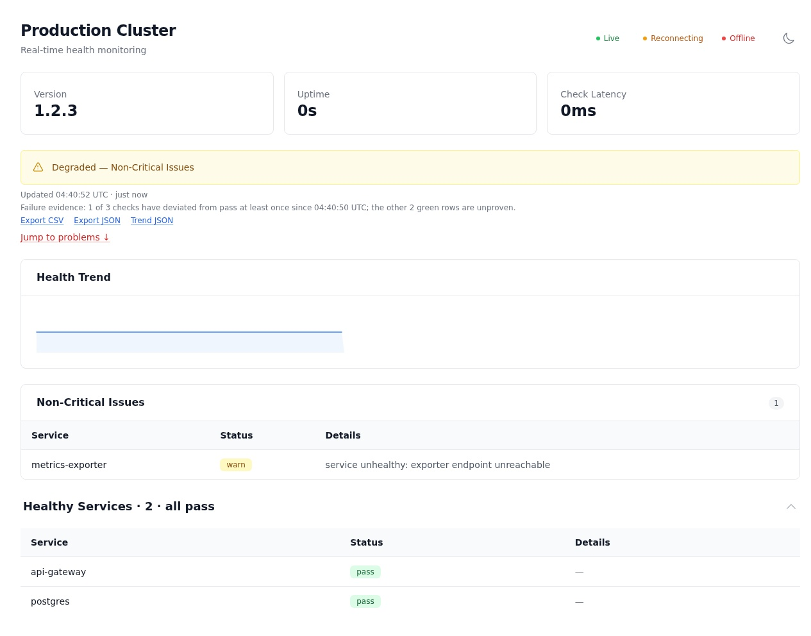
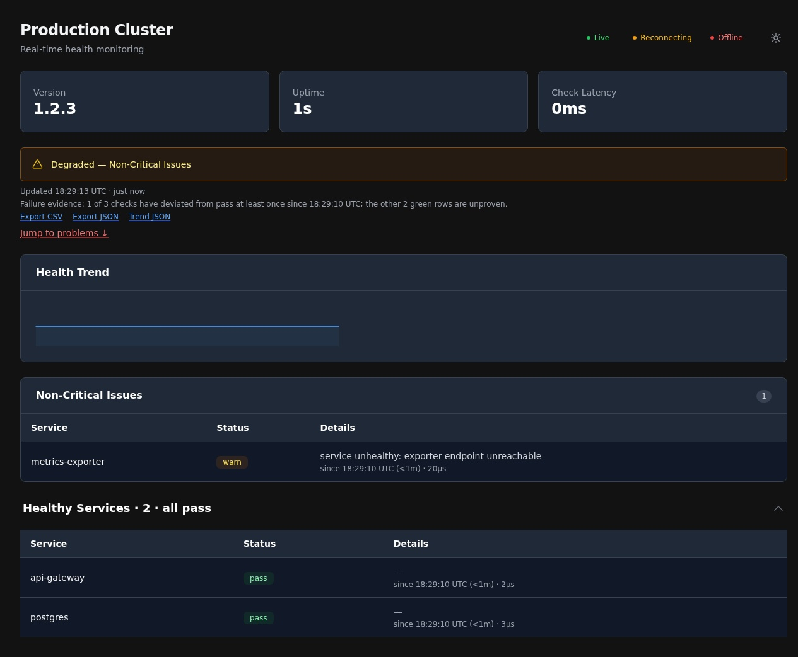

# go-health-dashboard

<p align="center">
<a href="https://pkg.go.dev/github.com/larsartmann/go-health-dashboard"></a>
<a href="LICENSE"></a>
</p>

A real-time health dashboard for [go-health](https://github.com/larsartmann/go-health),
powered by [Datastar](https://data-star.dev) SSE. Drops into your mux with one
call and gives you a live status page with green/yellow/red badges, severity
grouping, and sub-second updates.



## What It Does

- **Browser visits `/health`**: sees a rich dashboard with status banners, service
  tables, and badges — updating in real-time via Datastar SSE.
- **Kubelet hits `/readyz`**: gets the JSON readiness response from go-health.
- **Content negotiation on `/health`**: browsers get the HTML dashboard, `Accept: application/json` gets JSON. Kubelet probes (`/readyz`, `/healthz`, `/startupz`) are JSON-only.

## Why a Separate Repo?

go-health is a **single-dependency** library (`samber/do` only). Pulling in templ,
templ-components, go-datastar, and go-sse as transitive dependencies would destroy
that value proposition. The dashboard lives in its own module so consumers who
only want JSON health probes pay zero dependency cost.

## Quick Start

```go
package main

import (
    "context"
    "net/http"
    "time"

    health "github.com/larsartmann/go-health"
    dashboard "github.com/larsartmann/go-health-dashboard"
    "github.com/samber/do/v2"
)

func main() {
    ctx := context.Background()
    injector := do.New()

    // Register your services with samber/do...
    // do.ProvideNamed(injector, "database", NewDatabase)

    probe := health.New(injector,
        health.WithVersion("1.2.3"),
        health.WithCriticalServices("database"),
        health.WithRefreshInterval(2*time.Second),
    )
    _ = probe.Start(ctx)
    defer probe.Shutdown()

    dash := dashboard.New(probe,
        dashboard.WithTitle("My Service"),
    )
    _ = dash.Start(ctx)
    defer dash.Shutdown()

    mux := http.NewServeMux()
    dash.RegisterRoutes(mux)

    http.ListenAndServe(":8080", mux)
}
```

Open `http://localhost:8080/health` in a browser. Done.

Because go-health already requires a samber/do injector, DI-integrated apps
can swap `dashboard.New` + `dash.Shutdown` for one call:

```go
dash := dashboard.Register(injector, probe, dashboard.WithTitle("My Service"))
```

`Register` stores the Dashboard in the injector, so `do.Shutdown(injector)`
and `do.HealthCheck[*Dashboard](injector)` cascade to it automatically.

## Routes

| Path              | Method | Content-Type                  | What It Does                                                                                                              |
| ----------------- | ------ | ----------------------------- | ------------------------------------------------------------------------------------------------------------------------- |
| `/health`         | GET    | text/html or application/json | HTML dashboard (default) or JSON health response (Accept: application/json). JSON returns 503 when critical services fail |
| `/health/sse`     | GET    | text/event-stream             | SSE endpoint (Datastar patch protocol)                                                                                    |
| `/favicon.svg`    | GET    | image/svg+xml                 | SVG favicon (embedded green-heart icon)                                                                                   |
| `/health/metrics` | GET    | text/plain                    | Prometheus exposition with latency histogram (only when `WithMetrics(true)`)                                              |
| `/health/trend`   | GET    | application/json              | Status history + transitions (only when `WithTrend`)                                                                      |
| `/health/export`  | GET    | application/json or text/csv  | History export, `?format=csv` or `Accept: text/csv` (only when `WithTrend`)                                               |
| `/healthz`        | GET    | application/json              | Liveness probe (always 200, no dependency checks)                                                                         |
| `/readyz`         | GET    | application/json              | Readiness probe (503 when critical services fail)                                                                         |
| `/startupz`       | GET    | application/json              | Startup probe (latched once all critical services pass)                                                                   |

## Options

```go
dash := dashboard.New(probe,
    dashboard.WithTitle("My Service"),                        // Page title
    dashboard.WithPushInterval(5*time.Second),                 // SSE push interval
    dashboard.WithPushMode(dashboard.PushOnChange),            // Only push on change (default)
    // dashboard.WithPushMode(dashboard.PushAlways),            // Push on every tick
    dashboard.WithNonce("abc123"),                             // CSP nonce for script tags
    dashboard.WithNonceExtractor(httputil.NonceFromRequest),   // Per-request nonce (takes precedence; v0.2.0)
    dashboard.WithCSSPath("/static/app.css"),                  // Compiled CSS (replaces Tailwind CDN)
    dashboard.WithHeartbeatInterval(30*time.Second),           // SSE keepalive interval (default 15s)
    dashboard.WithMaxSSEConnections(100),                      // Max concurrent SSE clients (0 = unlimited)
    dashboard.WithRetryInterval(2*time.Second),                // SSE reconnection delay (browser retry field)
    dashboard.WithTrend(60),                                   // Health trend sparkline (samples retained)
    dashboard.WithHideStatCards(),                             // Hide version/uptime/latency cards
    dashboard.WithMetrics(true),                               // Prometheus metrics at /health/metrics
    dashboard.WithMiddleware(myAuthMiddleware),                // Protect dashboard routes (see below)
    dashboard.WithShutdownDrain(5*time.Second),                // Wait for SSE clients on Shutdown
    dashboard.WithMaxConnectionLifetime(10*time.Minute),       // Recycle long-lived SSE streams
    dashboard.WithRateLimit(100, time.Minute),                 // ONE shared bucket for all dashboard routes (429 beyond)
    dashboard.WithDescription("Status page for My Service"),   // Meta description + Open Graph tags
    dashboard.WithPublicMode(),                                // Anonymize check names/errors in HTML + metrics
    dashboard.WithDatastarSrc("/static/datastar.js"),          // Self-hosted Datastar SDK (CSP 'self')
    dashboard.WithBasePath("/admin"),                          // Prefix all routes for sub-path mounting
    dashboard.WithRoutes(dashboard.Routes{
        Dashboard: "/status",
        SSE:       "/status/sse",
        Readiness: "/ready",
        // ...
    }),
)
```

`WithRateLimit` configures a **single shared token bucket** across all
dashboard-owned routes (dashboard HTML, SSE, favicon, metrics, trend,
export) — not one bucket per route. Kubernetes probe endpoints are never
limited.

## Protecting the Dashboard

`WithMiddleware` wraps every dashboard-owned route (dashboard HTML, SSE,
favicon, metrics) with your auth middleware — bring your own (Basic Auth,
bearer tokens, sessions) or use your framework's:

```go
func bearerAuth(next http.Handler) http.Handler {
    return http.HandlerFunc(func(w http.ResponseWriter, r *http.Request) {
        if r.Header.Get("Authorization") != "Bearer "+os.Getenv("DASH_TOKEN") {
            http.Error(w, "unauthorized", http.StatusUnauthorized)
            return
        }
        next.ServeHTTP(w, r)
    })
}

dash := dashboard.New(probe, dashboard.WithMiddleware(bearerAuth))
```

The Kubernetes probe endpoints (`/healthz`, `/readyz`, `/startupz`) are
deliberately NOT wrapped — the kubelet cannot authenticate, and gating them
breaks liveness and readiness gates.

## Prometheus Metrics

Enable `WithMetrics(true)` and scrape `/health/metrics` (text exposition
format 0.0.4, zero extra dependencies):

```
dashboard_health_up 1                           # 1 when overall status is pass
dashboard_health_status 2                       # 2 pass, 1 warn, 0 fail, -1 unknown
dashboard_health_check{check="postgres",status="pass"} 1
dashboard_health_latency_ms 12                  # last check batch duration
dashboard_health_check_duration_seconds_bucket{le="0.01"} 42
dashboard_health_check_duration_seconds_sum 0.42
dashboard_health_check_duration_seconds_count 96
dashboard_health_shutting_down 0
dashboard_sse_connections 3                     # live dashboard viewers
dashboard_pusher_active 1                       # SSE pusher goroutine health
```

The metrics route is middleware-protected when `WithMiddleware` is set.

A Prometheus scrape config matching `deploy/prometheus.yml`:

```yaml
scrape_configs:
  - job_name: go-health-dashboard
    metrics_path: /health/metrics
    scrape_interval: 5s
    static_configs:
      - targets: ["dashboard:8080"]
```

## Health Trend

`WithTrend(n)` retains the last n status samples (one per push interval,
pass=1 / warn=0.5 / fail=0) and renders a sparkline card above the service
tables. The card appears once two samples exist and updates live via the
same SSE stream.

## Monitoring Integrations

The dashboard is designed to feed your existing stack — see
[docs/integrations.md](docs/integrations.md) for validated recipes:

- **Prometheus / Grafana / SigNoz**: `WithMetrics(true)` serves
  `/health/metrics`; alert on `dashboard_health_status` (2=pass, 1=warn, 0=fail)
- **Gatus / Uptime Kuma**: point an HTTP monitor at `/readyz` — 200 means
  serving (warn stays 200 by design), 503 means down or draining
- **Webhooks (push)**: `WithWebhook(url)` POSTs a JSON snapshot on every
  transition — for egress-restricted hosts and custom event ingests:

```go
dash := dashboard.New(probe,
    dashboard.WithWebhook("https://ingest.example.com/health-events"),
    dashboard.WithWebhookHeaders(map[string]string{
        "Authorization": "Bearer " + os.Getenv("INGEST_TOKEN"),
    }),
)
```

## Multi-Service Dashboards (aggregate)

One process embedding several logical services? go-health v0.1.0's
`aggregate` package merges N probes into one surface the dashboard renders
natively (checks namespaced `source/check`, worst-of status):

```go
import "github.com/larsartmann/go-health/aggregate"

agg, _ := aggregate.New(
    aggregate.Source{Name: "api", Probe: apiProbe},
    aggregate.Source{Name: "web", Probe: webProbe},
)
dash := dashboard.New(agg) // Prober interface accepts *health.Probe or *aggregate.Aggregate
```

## How Real-Time Works

The dashboard uses [Datastar](https://data-star.dev) for real-time DOM updates:

1. The HTML page loads the Datastar SDK via a `<script>` tag
2. A `datastar.LiveRegion` div wraps the health content with `data-init="@get('/health/sse')"`
3. The Datastar SDK opens an SSE connection to `/health/sse`
4. A background pusher goroutine reads `probe.CachedResponse()` at the configured interval
5. On each update, the pusher renders the content as a Datastar element patch and broadcasts it
6. The Datastar SDK applies the patch, replacing the inner HTML of the LiveRegion

By default, `PushOnChange` mode only sends updates when the health status actually changes — minimizing SSE traffic for NOC monitors that stay connected for long periods.

The `Updated <time>` stamp in the page header shows the **observation time of
the last trend sample** (not the render time) when `WithTrend` is enabled, so
the page never looks fresher than the underlying data.

`dash.HealthCheck(ctx)` powers samber/do health cascades and returns a small
sentinel family you can branch on:

```go
if err := dash.HealthCheck(ctx); err != nil {
    switch {
    case errors.Is(err, dashboard.ErrPusherNotStarted): // Start never called
    case errors.Is(err, dashboard.ErrPusherShutDown):   // Shutdown called
    case errors.Is(err, dashboard.ErrPusherStale):      // push loop wedged
    }
}
```

## Build

**Requires `GOEXPERIMENT=jsonv2`** (the go-sse dependency uses `encoding/json/v2`).

```bash
# Using Nix (recommended)
nix run .#build
nix run .#test
nix run .#lint

# Manual
GOEXPERIMENT=jsonv2 go build ./...
GOEXPERIMENT=jsonv2 go test ./...
```

The headless-browser tests (runtime CSP verification, screenshot capture)
skip automatically when no Chrome/Chromium is available. Point them at one
with `GO_HEALTH_DASHBOARD_CHROME=/path/to/chromium`.

## Run the Example

The demo server exposes every feature behind environment toggles:

```bash
GOEXPERIMENT=jsonv2 DEMO_TREND=1 DEMO_METRICS=1 DEMO_AUTH=my-token DEMO_RATELIMIT=30/1m DEMO_DRAIN=5s go run ./example
# Open http://localhost:8080/health (bearer token: my-token)
```

All toggles are optional — plain `go run ./example` works too.

| Variable                 | Effect                                                         |
| ------------------------ | -------------------------------------------------------------- |
| `DEMO_TREND=1`           | Health trend sparkline (`WithTrend`)                           |
| `DEMO_METRICS=1`         | Prometheus endpoint at `/health/metrics` (`WithMetrics`)       |
| `DEMO_AUTH=<token>`      | Bearer-token middleware on dashboard routes (`WithMiddleware`) |
| `DEMO_RATELIMIT=n/w`     | Token-bucket rate limit, e.g. `30/1m` (`WithRateLimit`)        |
| `DEMO_DRAIN=5s`          | Graceful SSE drain window on shutdown (`WithShutdownDrain`)    |
| `DEMO_PUBLIC=1`          | Public mode — anonymized check names (`WithPublicMode`)        |
| `DEMO_BASE_PATH=/status` | Mount the dashboard under `/status` (`WithBasePath`)           |
| `PORT`                   | Listen port (default 8080)                                     |

The example includes mock services: one always healthy, one flapping (alternates
pass/fail every 15s), and one always failing. Watch the dashboard update live.

## Status Mapping

| go-health Status | Badge Color      | Alert Banner                     |
| ---------------- | ---------------- | -------------------------------- |
| `pass`           | Green (success)  | "All Systems Operational"        |
| `warn`           | Yellow (warning) | "Degraded — Non-Critical Issues" |
| `fail`           | Red (error)      | "Unhealthy — Critical Failures"  |

## Dependencies

| Dependency                                                          | Purpose                                          |
| ------------------------------------------------------------------- | ------------------------------------------------ |
| [go-health](https://github.com/larsartmann/go-health)               | Health-check Response, Probe, CachedResponse     |
| [templ-components](https://github.com/larsartmann/templ-components) | LiveRegion, SDKScript, Alert, Table, Badge, Card |
| [go-datastar](https://github.com/larsartmann/go-datastar)           | Datastar SSE patch protocol (ElementsFromTempl)  |
| [go-sse](https://github.com/larsartmann/go-sse)                     | SSE transport (Broadcaster, Stream)              |

Tested version matrix (`go.mod` is the live source of truth):

| Dependency       | Version | Note                                                 |
| ---------------- | ------- | ---------------------------------------------------- |
| go-health        | v0.1.1  | `aggregate` package needs v0.1.0+                    |
| templ-components | v1.11.0 | pinned — v1.12.0 busy-script nonce bug (upstream #7) |
| go-datastar      | v0.4.0  | audited SDK bundle; needs CSP `unsafe-eval`          |
| go-sse           | v0.6.0  | requires `GOEXPERIMENT=jsonv2`                       |

## Dark Mode

The dashboard respects the user's OS dark-mode preference and includes a
toggle button for manual switching. The preference is persisted in
`localStorage`.



Dark screenshot captured by `screenshot_dark_test.go` (`SCREENSHOT_OUTPUT_DARK=docs/screenshot-dark.png`).

## Content-Security-Policy

The served HTML is CSP-clean: every inline script carries the configured
nonce, and there are no `<style>` blocks or inline `style=` attributes. With
`WithCSSPath` (compiled CSS, no Tailwind Play CDN) the page needs **no
`style-src 'unsafe-inline'`** — verified at runtime by a headless-Chromium
test under a strict policy.

The Datastar SDK compiles its `data-*` expressions with the `Function`
constructor, so `script-src` needs `'unsafe-eval'` alongside the nonce.
Rather than hand-rolling the header, use the built-in helper, which returns
the exact policy the runtime test verifies:

```go
mux.Handle("GET /health", http.HandlerFunc(func(w http.ResponseWriter, r *http.Request) {
    w.Header().Set("Content-Security-Policy", dashboard.RecommendedCSP(nonce))
    dash.Handler().ServeHTTP(w, r)
}))
```

which produces:

```
default-src 'self';
script-src 'self' 'nonce-<nonce>' 'unsafe-eval';
style-src 'self';
connect-src 'self';
img-src 'self' data:;
object-src 'none';
base-uri 'self';
```

If you keep the Tailwind Play CDN (no `WithCSSPath`), that script injects a
generated `<style>` element at runtime and therefore additionally requires
`style-src 'unsafe-inline'`.

## License

MIT
