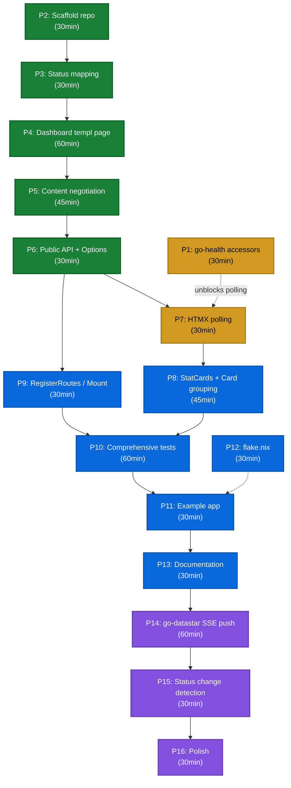

# go-health-dashboard — Execution Plan

**Date:** 2026-08-08 02:46
**Status:** PLANNING
**Module:** `github.com/larsartmann/go-health-dashboard`
**Package:** `dashboard`

---

## What Is This?

A **composition layer** that sits between [`go-health`](https://github.com/larsartmann/go-health) (health-checking SDK) and [`templ-components`](https://github.com/larsartmann/templ-components) (UI rendering). It does HTTP content negotiation: JSON requests get delegated to go-health's existing handlers; HTML requests get a rich browser dashboard with status banners, tables, and badges.

Optionally, real-time updates via [`go-datastar`](https://github.com/larsartmann/go-datastar) + [`go-sse`](https://github.com/larsartmann/go-sse) (SSE push mode).

### Why a Separate Repo?

go-health is a **single-dependency** library (`samber/do` only). Pulling in templ, templ-components, go-datastar, and go-sse as transitive dependencies would destroy that value proposition. The dashboard lives in its own module so consumers who only want JSON health probes pay zero dependency cost.

See [`go-health/docs/content-negotiation-design.md`](https://github.com/larsartmann/go-health/blob/master/docs/content-negotiation-design.md) for the full architecture rationale.

---

## Architecture

```
┌──────────────────────────────────────────────────────────────┐
│  Host Application                                            │
│                                                              │
│  mux.HandleFunc("/health", dashboard.Handler())             │
│                                                              │
│  ┌────────────────────────────────────────────────────────┐  │
│  │  go-health-dashboard (THIS REPO)                       │  │
│  │                                                        │  │
│  │  Accept: application/json → delegate to go-health      │  │
│  │  Accept: text/html → render templ-components dashboard │  │
│  │                                                        │  │
│  │  ┌──────────────┐     ┌─────────────────────────────┐  │  │
│  │  │  go-health   │     │  templ-components           │  │  │
│  │  │  (health)    │     │  (display, feedback, htmx)  │  │  │
│  │  └──────────────┘     └─────────────────────────────┘  │  │
│  └────────────────────────────────────────────────────────┘  │
│                                                              │
│  (optional real-time mode)                                   │
│  ┌────────────────────────────────────────────────────────┐  │
│  │  go-datastar (SSE protocol) → go-sse (transport)       │  │
│  └────────────────────────────────────────────────────────┘  │
└──────────────────────────────────────────────────────────────┘
```

### Planned Package Structure

```
go-health-dashboard/
├── go.mod                         module github.com/larsartmann/go-health-dashboard
├── flake.nix                      Build, test, lint, format (matches go-health pattern)
├── AGENTS.md                      Project context for AI sessions
├── README.md                      Sales page: what, why, quick start
├── doc.go                         Package doc comment
│
├── dashboard.go                   Dashboard struct, New(), Option type, Config
├── dashboard_test.go
├── handlers.go                    Handler() (content negotiation), partialHandler() (HTMX polling)
├── status.go                      Status mapping: health.Status → templ-components types
├── status_test.go
├── routes.go                      Routes struct, DefaultRoutes(), RegisterRoutes()
├── routes_test.go
├── realtime.go                    SSE pusher goroutine (go-datastar mode, optional)
│
├── view.templ                     Full dashboard page (HTML document)
├── view_templ.go                  Generated by `templ generate`
├── partial.templ                  Partial template for HTMX polling (alert + table only)
├── partial_templ.go               Generated by `templ generate`
│
├── example/
│   └── main.go                    Demo server with mock health-check services
│
└── docs/
    └── planning/
        └── 2026-08-08_02-46-go-health-dashboard.md   (THIS FILE)
```

### Dependency Chain

| Dependency | Purpose | Required For |
|---|---|---|
| `github.com/larsartmann/go-health` | Health-check Response, Probe, CachedResponse | All modes |
| `github.com/larsartmann/templ-components` | Alert, Table, Badge, StatCard, Card, PolledRegion | HTML rendering |
| `github.com/a-h/templ` | (transitive via templ-components) Template runtime | HTML rendering |
| `github.com/larsartmann/go-datastar` | ElementsFromTempl, SSE patch protocol | SSE push mode only |
| `github.com/larsartmann/go-sse` | Broadcaster, Stream, Heartbeat | SSE push mode only |

### Prerequisite: go-health API Additions

go-health's `Probe` type currently exposes 10 methods but **lacks cache accessors** needed by the dashboard:

```go
// Needed additions to go-health/probe.go:

// CachedResponse returns the last background-refreshed health Response.
// Falls back to a zero-value Response if no cache exists (live mode).
func (p *Probe) CachedResponse() Response

// RefreshInterval returns the configured background cache refresh interval.
func (p *Probe) RefreshInterval() time.Duration
```

Without `CachedResponse()`, every dashboard page load or HTMX poll would call `Evaluate(ctx)`, re-running ALL dependency health checks. With it, polls read the atomic `p.latest` pointer — lock-free, zero dependency calls.

---

## Status Mapping Design

go-health uses three status values. templ-components has corresponding badge and alert types. The mapping lives in `status.go`:

| `health.Status` | String Value | `display.BadgeType` | `feedback.AlertType` | Display Text |
|---|---|---|---|---|
| `StatusPass` | `"pass"` | `BadgeSuccess` (green) | `FeedbackSuccess` | "All Systems Operational" |
| `StatusWarn` | `"warn"` | `BadgeWarning` (yellow) | `FeedbackWarning` | "Degraded — Non-Critical Issues" |
| `StatusFail` | `"fail"` | `BadgeError` (red) | `FeedbackError` | "Unhealthy — Critical Failures" |

Note: `templ-components`' `display.StatusBadge` has a `statusToBadgeMap` that recognizes `"healthy"`, `"degraded"`, `"unhealthy"` but NOT `"pass"`/`"warn"`/`"fail"`. We map directly to `BadgeType` constants instead of relying on the string map — more type-safe, no cross-library changes needed.

---

## Pareto Breakdown

### 1% that delivers 51%

**One function: `dashboard.Handler()` with content negotiation.**

```
Browser hits /health with Accept: text/html
    → Dashboard renders: feedback.Alert (overall status) + display.Table (one row per check with Badge)
Kubelet hits /health with Accept: */*
    → Delegates to probe.ReadinessHandler() (JSON, zero overhead)
```

This IS the product. A developer drops one handler into their mux and gets a browser-friendly health dashboard.

**Tasks:** P2 (scaffold repo) → P3 (status mapping) → P4 (templ page) → P5 (content negotiation) → P6 (public API)

### 4% that delivers 64%

**HTMX polling auto-refresh.**

Wrap the table in `htmx.PolledRegion` so it auto-refreshes every 2-5 seconds. Reads from `probe.CachedResponse()` — lock-free, zero dependency checks per poll. Turns the dashboard from a static snapshot into a LIVE monitoring view.

**Tasks:** P1 (go-health accessors) → P7 (HTMX polling integration)

### 20% that delivers 80% (complete v0.1.0)

**Production-ready package:**

- StatCards for version, uptime, and total latency
- Card grouping by critical vs non-critical classification
- `RegisterRoutes` / `Mount` helper for easy wiring alongside existing probe endpoints
- Comprehensive test suite
- Example app with mock services for demos
- `flake.nix` matching go-health's pattern
- `AGENTS.md` + `README.md` + `doc.go`

**Tasks:** P8 → P9 → P10 → P11 → P12 → P13

### Remaining 20% to reach 100%

**Real-time SSE push + polish:**

- go-datastar SSE push mode for sub-second updates (NOC monitors)
- Status change detection (only push when status changes)
- Dark mode verification (templ-components ships dark: classes)
- Mobile responsive verification
- Full lint/security pass

**Tasks:** P14 → P15 → P16

---

## Execution Graph



---

## Medium-Granularity Plan (30–100min tasks)

Sorted by tier, then by dependency order within tier.

| # | Task | Tier | Impact | Effort | Depends On | Description |
|---|---|---|---|---|---|---|
| P1 | go-health: Add `CachedResponse()` + `RefreshInterval()` accessors | 4% | Critical | 30min | — | One-liner methods on Probe. Unblocks cache-backed polling. Falls back to Evaluate when no cache exists. |
| P2 | Scaffold repo: directory structure, go.mod, git init | 1% | High | 30min | — | Create `go-health-dashboard/`, go.mod with deps on go-health + templ-components, .gitignore, AGENTS.md skeleton. |
| P3 | Status mapping layer | 1% | High | 30min | P2 | `status.go`: map `health.Status` → `BadgeType`, `AlertType`, display text. Tests for all three mappings. |
| P4 | Dashboard templ page (Alert + Table + Badges) | 1% | Critical | 60min | P3 | `view.templ`: full HTML page using `feedback.Alert` for overall status, `display.Table` with `display.Badge` per check row. Generate with `templ generate`. |
| P5 | Content negotiation handler | 1% | Critical | 45min | P4 | `handlers.go`: parse Accept header, dispatch HTML→render or JSON→delegate to probe handler. Edge cases: wildcards, missing header, q-values. |
| P6 | Public API + functional options | 1% | Critical | 30min | P5 | `dashboard.go`: `Dashboard` struct, `New(probe, opts...)`, `Option` type, `Config` struct, `WithTitle`/`WithRefreshInterval`/`WithRefreshMode`. |
| P7 | HTMX polling integration | 4% | High | 30min | P1, P6 | Wrap table in `htmx.PolledRegion`. Create partial endpoint (`/dashboard/partial`) returning alert+table only (no full page). Reads `probe.CachedResponse()`. |
| P8 | StatCards + Card grouping | 20% | Medium | 45min | P7 | Add `display.StatCard` for version/uptime/latency. Group checks into `display.Card` by critical vs non-critical classification. |
| P9 | RegisterRoutes / Mount helper | 20% | Medium | 30min | P6 | `routes.go`: `Routes` struct, `DefaultRoutes()`, `RegisterRoutes(mux, routes)`. Wires dashboard + probe endpoints in one call. |
| P10 | Comprehensive tests | 20% | High | 60min | P8, P9 | Content negotiation dispatch, HTML output validation, status mapping, options, CachedResponse integration, shutdown state, benchmark. |
| P11 | Example app | 20% | Medium | 30min | P10, P12 | `example/main.go`: mock injector with healthy + failing services, register dashboard routes, demo at `localhost:8080`. |
| P12 | flake.nix | 20% | Medium | 30min | P2 | Copy pattern from go-health. Add `templ generate` to build pipeline. devShell with `templ` CLI. |
| P13 | Documentation | 20% | Medium | 30min | P11 | `README.md` (quick start, screenshot), `AGENTS.md` (architecture, commands, gotchas), `doc.go` (package comment). |
| P14 | go-datastar SSE push mode | 100% | Low* | 60min | P13 | `realtime.go`: SSE pusher goroutine, broadcaster, `ElementsFromTempl` patch, SSE endpoint handler, `WithSSEPush()` option. *Optional — only for NOC monitors needing sub-second updates. |
| P15 | Status change detection | 100% | Low* | 30min | P14 | Track lastStatus in pusher goroutine. Only broadcast when status or check results change. Add `WithPushMode(PushOnChange)` option. |
| P16 | Polish | 100% | Low | 30min | P15 | Verify dark mode (templ-components `dark:` classes), mobile responsive layout, full lint pass (golangci-lint, go vet, govulncheck). Update go-health design doc to link to this repo. |

**Total estimated effort:** ~9.5 hours

---

## Fine-Granularity Breakdown (max 12min per task)

Each medium task is broken into subtasks. Sorted by dependency order within each parent task.

### P1: go-health accessors (30min)

| Sub | Task | Time |
|---|---|---|
| P1.1 | Add `CachedResponse() Response` to Probe — reads `p.latest.Load()`, overlays `shuttingDown`, falls back to `Response{Status: StatusPass}` if nil | 8min |
| P1.2 | Add `RefreshInterval() time.Duration` to Probe — returns `p.refreshInterval` | 3min |
| P1.3 | Write tests: CachedResponse returns cached value when available, zero-value when nil | 10min |
| P1.4 | Update go-health AGENTS.md exported methods list and gotchas | 5min |

### P2: Scaffold repo (30min)

| Sub | Task | Time |
|---|---|---|
| P2.1 | Create directory structure: `example/`, `docs/planning/` | 3min |
| P2.2 | Write `go.mod`: module `github.com/larsartmann/go-health-dashboard`, require go-health + templ-components | 5min |
| P2.3 | Create `.gitignore` (*_templ.go, vendor/, .env, etc.) | 3min |
| P2.4 | `git init` + initial commit with planning doc | 2min |
| P2.5 | Create `AGENTS.md` skeleton (module, package, Go version, commands table) | 8min |
| P2.6 | Create `doc.go` package comment | 5min |

### P3: Status mapping layer (30min)

| Sub | Task | Time |
|---|---|---|
| P3.1 | Define `mapStatusToBadge(health.Status) display.BadgeType` — pass→Success, warn→Warning, fail→Error | 5min |
| P3.2 | Define `mapStatusToAlert(health.Status) feedback.AlertType` — pass→Success, warn→Warning, fail→Error | 5min |
| P3.3 | Define `mapStatusToText(health.Status) string` — pass→"All Systems Operational", warn→"Degraded", fail→"Unhealthy" | 5min |
| P3.4 | Write tests for all three mappings (table-driven, all three statuses) | 8min |

### P4: Dashboard templ page (60min)

| Sub | Task | Time |
|---|---|---|
| P4.1 | Create `view.templ` with HTML document skeleton (head with Tailwind, body with container) | 10min |
| P4.2 | Add `feedback.Alert` component for overall status banner (uses mapStatusToAlert + mapStatusToText) | 8min |
| P4.3 | Add `display.Table` with headers: Service, Status, Error | 10min |
| P4.4 | Add `display.Badge` per check row (uses mapStatusToBadge) — embed in TableCell.Content | 8min |
| P4.5 | Run `templ generate` to produce `view_templ.go` | 3min |
| P4.6 | Write Go wrapper: `renderDashboard(resp health.Response, opts Config) templ.Component` | 8min |
| P4.7 | Verify output renders: spin up test server, check HTML in browser | 5min |

### P5: Content negotiation handler (45min)

| Sub | Task | Time |
|---|---|---|
| P5.1 | Write `acceptsHTML(r *http.Request) bool` — parse Accept header for `text/html` | 8min |
| P5.2 | Write `acceptsJSON(r *http.Request) bool` — parse Accept header for `application/json` | 5min |
| P5.3 | Write `Handler()` method on Dashboard: HTML→render page, JSON→delegate to `probe.ReadinessHandler()` | 8min |
| P5.4 | Handle edge cases: missing Accept header (default JSON), `*/*` wildcard (default HTML for browsers), q-value sorting | 8min |
| P5.5 | Write tests: verify correct dispatch for `text/html`, `application/json`, `*/*`, missing header | 10min |

### P6: Public API + functional options (30min)

| Sub | Task | Time |
|---|---|---|
| P6.1 | Define `Option func(*Config)` type and `Config` struct (Title, RefreshInterval, RefreshMode, Routes) | 5min |
| P6.2 | Implement `WithTitle(string)`, `WithRefreshInterval(time.Duration)`, `WithRefreshMode(RefreshMode)` options | 8min |
| P6.3 | Implement `New(probe *health.Probe, opts ...Option) *Dashboard` — applies options, validates config | 8min |
| P6.4 | Write tests for options: verify config is applied correctly | 5min |

### P7: HTMX polling integration (30min)

| Sub | Task | Time |
|---|---|---|
| P7.1 | Create `partial.templ` — alert + table only (no full HTML document), for PolledRegion to fetch | 10min |
| P7.2 | Wrap dashboard content in `htmx.PolledRegion` in `view.templ` — hits partial endpoint on interval | 8min |
| P7.3 | Add `partialHandler()` method — reads `probe.CachedResponse()`, renders partial template | 10min |

### P8: StatCards + Card grouping (45min)

| Sub | Task | Time |
|---|---|---|
| P8.1 | Add `display.StatCard` for version number | 8min |
| P8.2 | Add `display.StatCard` for uptime duration | 5min |
| P8.3 | Add `display.StatCard` for total latency (ms) | 5min |
| P8.4 | Classify checks into critical/non-critical groups (check status + error presence) | 8min |
| P8.5 | Wrap each group in `display.Card` with appropriate title | 8min |
| P8.6 | Handle edge case: empty checks map (show "No registered services" message) | 8min |

### P9: RegisterRoutes / Mount helper (30min)

| Sub | Task | Time |
|---|---|---|
| P9.1 | Define `Routes` struct: Dashboard, Partial, Liveness, Readiness, Startup string fields | 5min |
| P9.2 | Define `DefaultRoutes()` returning `/health`, `/health/partial`, `/healthz`, `/readyz`, `/startupz` | 3min |
| P9.3 | Implement `RegisterRoutes(mux *http.ServeMux, routes Routes)` — wires dashboard + probe handlers | 8min |
| P9.4 | Write tests: verify all routes registered and respond with correct content types | 10min |

### P10: Comprehensive tests (60min)

| Sub | Task | Time |
|---|---|---|
| P10.1 | Test status mapping (pass/warn/fail → badge/alert/text) — table-driven | 8min |
| P10.2 | Test content negotiation: HTML request renders dashboard, JSON delegates to probe | 8min |
| P10.3 | Test HTML output contains expected elements (alert banner, table rows, badges) | 10min |
| P10.4 | Test options: title applied, refresh interval set, routes customized | 8min |
| P10.5 | Test CachedResponse integration: serves cache when available, Evaluate fallback | 8min |
| P10.6 | Test shutdown state: alert shows "Shutting Down", readiness 503 | 8min |
| P10.7 | Benchmark `Handler()` rendering — measure p99 latency for HTML path | 5min |

### P11: Example app (30min)

| Sub | Task | Time |
|---|---|---|
| P11.1 | Create `example/main.go`: init `do.Injector`, register mock services | 10min |
| P11.2 | Register dashboard + probe routes via `dashboard.RegisterRoutes` | 5min |
| P11.3 | Add mock services: one healthy (always pass), one intermittently failing (critical), one degraded (non-critical) | 8min |
| P11.4 | Add instructions in example README or comments for running the demo | 5min |

### P12: flake.nix (30min)

| Sub | Task | Time |
|---|---|---|
| P12.1 | Copy flake.nix pattern from go-health (flake-parts + treefmt-nix) | 8min |
| P12.2 | Add `templ generate` to pre-build step (run before `go build`) | 8min |
| P12.3 | Add `templ` CLI to devShell `buildInputs` | 5min |
| P12.4 | Verify `nix build`, `nix run .#test`, `nix run .#lint` all pass | 8min |

### P13: Documentation (30min)

| Sub | Task | Time |
|---|---|---|
| P13.1 | Write `README.md`: what it does, why it exists, quick start, screenshot placeholder, content negotiation explanation | 10min |
| P13.2 | Write `AGENTS.md`: architecture, commands table, design decisions, dependency notes, testing patterns, gotchas | 10min |
| P13.3 | Write `doc.go`: package comment with quick-start example | 8min |

### P14: go-datastar SSE push mode (60min)

| Sub | Task | Time |
|---|---|---|
| P14.1 | Define `ssePusher` struct: holds `*sse.Broadcaster[sse.Event]`, `*health.Probe`, interval, lastStatus | 10min |
| P14.2 | Implement `start()` goroutine: tick at `probe.RefreshInterval()`, read `probe.CachedResponse()` | 8min |
| P14.3 | Build Datastar patch: `datastar.ElementsFromTempl(partialComponent, WithSelector("#health-region"), WithMode(MergeInner))` | 10min |
| P14.4 | Broadcast patch: `broadcaster.Broadcast(patch.Event())` to all connected SSE clients | 5min |
| P14.5 | Create `sseHandler()`: `sse.NewStream(w,r)`, `broadcaster.Subscribe()`, forward events, heartbeat goroutine | 10min |
| P14.6 | Add `WithSSEPush()` option: enables SSE pusher, swaps `htmx.PolledRegion` for `datastar.LiveRegion` | 8min |
| P14.7 | Include `datastar.SDKScript` in page `<head>` when SSE mode is active | 5min |

### P15: Status change detection (30min)

| Sub | Task | Time |
|---|---|---|
| P15.1 | Track `lastStatus health.Status` and `lastCheckCount int` in pusher goroutine | 5min |
| P15.2 | Only broadcast when status changes OR any individual check status changes | 8min |
| P15.3 | Add `WithPushMode(PushMode)` option: `PushOnChange` (default) vs `PushAlways` | 8min |

### P16: Polish (30min)

| Sub | Task | Time |
|---|---|---|
| P16.1 | Verify dark mode: templ-components uses `dark:` Tailwind classes — ensure dashboard container applies them | 8min |
| P16.2 | Verify mobile responsive: table should scroll horizontally on narrow screens, StatCards should stack | 5min |
| P16.3 | Run full lint pass: `nix run .#lint`, `nix run .#vet`, `nix run .#vulncheck` — fix any issues | 8min |
| P16.4 | Update go-health `docs/content-negotiation-design.md` decision table: link to this repo | 5min |

---

## Technical Decisions

### 1. Status Mapping: Direct Constants, Not String Map

templ-components' `display.StatusBadge` has a `statusToBadgeMap` that recognizes `"healthy"`, `"degraded"`, `"unhealthy"` but NOT `"pass"`/`"warn"`/`"fail"`. We map directly to `BadgeType` constants (`BadgeSuccess`, `BadgeWarning`, `BadgeError`) instead of adding strings to templ-components' map or translating strings. More type-safe, no cross-library changes.

### 2. Content Negotiation: Accept Header, Not URL Paths

The dashboard lives at the same path as the readiness endpoint (`/health`). The Accept header determines representation. This avoids route proliferation (`/health` vs `/health.html` vs `/health.json`) and follows HTTP semantics.

**Default when no Accept header:** `application/json` (machine-friendly — kubelet doesn't send Accept).
**Default for `*/*`:** `text/html` (browsers send `*/*` as their first Accept value).

### 3. HTMX Polling as Default, SSE as Opt-In

Polling reads the atomic cache pointer — zero dependency checks per poll, sub-millisecond cost. For 1-5 operators watching a dashboard, 2-second polling vs sub-second push is imperceptible. SSE adds connection lifecycle complexity, broadcaster goroutines, and persistent connections. It's available via `WithSSEPush()` but not the default.

### 4. Partial Template for Polling

The HTMX polling endpoint returns only the alert + table (partial HTML), not the full document. This is the standard HTMX pattern — `PolledRegion` swaps the inner HTML of the region, not the entire page.

### 5. Evaluate vs CachedResponse

Initial version (1% tier) can use `probe.Evaluate(ctx)` directly — acceptable for single page loads. Once `CachedResponse()` lands on go-health (P1), the polling endpoint (P7) switches to it — reads `p.latest` atomic pointer, zero dependency calls per poll.

### 6. templ generate in flake.nix

`*_templ.go` files are generated and committed (not gitignored). But `templ generate` must run in the build pipeline before `go build` to ensure generated files match `.templ` sources. The flake.nix runs `templ generate` as a pre-build step.

---

## Dependency Notes

### go-health (`github.com/larsartmann/go-health`)

Must be published to GitHub (or available via `replace` directive in go.mod for local dev). Currently at v0.0.1 (alpha). Needs `CachedResponse()` and `RefreshInterval()` added before P7.

For local development, use a `go.work` workspace:
```bash
cd ~/projects
go work init
go work use ./go-health ./go-health-dashboard
```

### templ-components (`github.com/larsartmann/templ-components`)

Provides `display`, `feedback`, `htmx`, `datastar` sub-packages. Components are `templ.Component` values rendered via `.Render(ctx, w)`. Requires `templ` CLI for generation.

### go-datastar + go-sse (SSE push mode only)

go-datastar depends on go-sse. Both needed only for `WithSSEPush()` mode. `datastar.ElementsFromTempl(component, selector, mode)` renders a templ component to an SSE patch event. `sse.Broadcaster[sse.Event]` fans out to all connected SSE clients.

### Tailwind CSS

templ-components emits Tailwind utility classes. The dashboard page must include the Tailwind CSS runtime (either via CDN `<script>` or compiled CSS). For simplicity, v0.1.0 uses the CDN play script. Production users can swap in compiled CSS.

---

## Quick-Start API Preview

```go
package main

import (
    "net/http"

    "github.com/larsartmann/go-health-dashboard/dashboard"
    health "github.com/larsartmann/go-health"
    "github.com/samber/do/v2"
)

func main() {
    injector := do.New()

    // Register your services with samber/do...
    // do.Provide(injector, "database", NewDatabase)

    probe := health.New(injector,
        health.WithVersion("1.2.3"),
        health.WithRefreshInterval(2*time.Second),
    )
    _ = probe.Start(ctx)

    dash := dashboard.New(probe,
        dashboard.WithTitle("My Service"),
        dashboard.WithRefreshInterval(2*time.Second),
    )

    mux := http.NewServeMux()
    dash.RegisterRoutes(mux, dashboard.DefaultRoutes())

    http.ListenAndServe(":8080", mux)
}
```

Browser visits `http://localhost:8080/health` → sees a live dashboard with green/yellow/red status badges.
Kubelet hits `http://localhost:8080/readyz` → gets JSON readiness response.
