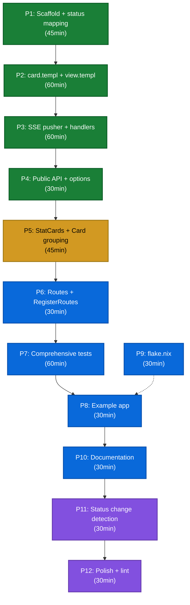

# go-health-dashboard — Execution Plan (v2)

**Date:** 2026-08-08 02:46 (revised 03:10)
**Status:** PLANNING
**Module:** `github.com/larsartmann/go-health-dashboard`
**Package:** `dashboard`

---

## What Is This?

A **composition layer** that combines [`go-health`](https://github.com/larsartmann/go-health) (health-checking SDK), [`templ-components`](https://github.com/larsartmann/templ-components) (UI rendering), and [`go-datastar`](https://github.com/larsartmann/go-datastar) (real-time SSE push) into a browser-friendly health dashboard with real-time updates.

Browser visits `/health` → sees a live dashboard with status banners, tables, badges, and metrics that update in real-time via SSE. Kubelet hits `/readyz` → gets JSON from go-health's existing handlers. No content negotiation, no route collision.

### What Changed from v1

| v1 Problem | v2 Fix |
|---|---|
| P1 planned to add `CachedResponse()` + `RefreshInterval()` to go-health | **Already exists** — both methods shipped. P1 deleted. |
| HTMX polling was the default, SSE was "optional tier 100%" | **go-datastar SSE is the default and only real-time mode.** HTMX polling dropped. |
| Content negotiation on `/health` via Accept headers | **Separate routes.** `/health` is HTML-only; kubelet uses `/readyz`. Zero negotiation. |
| Two-mode architecture (polling + SSE) doubled complexity | **One mode: SSE.** One template, one endpoint type, one test surface. |
| Used deprecated `AlertType` | **Use `FeedbackType`** with `FeedbackSuccess`/`FeedbackWarning`/`FeedbackError` |
| Wrong `datastar.WithMode(MergeInner)` syntax | **Use `datastar.WithModeInner()`** sugar constructor |
| Broadcaster pattern overexplained as architecture | **Internal implementation detail** — one shared ticker fans out to N connections |

---

## Architecture

```
┌──────────────────────────────────────────────────────────────────┐
│  Host Application                                                │
│                                                                  │
│  mux.Handle("/health", dash.Handler())        // HTML dashboard  │
│  mux.Handle("/health/sse", dash.SSEHandler()) // real-time SSE   │
│  mux.Handle("/readyz", probe.ReadinessHandler()) // JSON kubelet │
│                                                                  │
│  ┌────────────────────────────────────────────────────────────┐  │
│  │  go-health-dashboard (THIS REPO)                           │  │
│  │                                                            │  │
│  │  /health      → initial HTML page (templ server-rendered)  │  │
│  │  /health/sse  → SSE stream (go-datastar patches)           │  │
│  │                                                            │  │
│  │  ┌──────────────┐  ┌──────────────────┐  ┌──────────────┐  │  │
│  │  │  go-health   │  │  templ-components │  │  go-datastar │  │  │
│  │  │  Probe       │  │  Alert, Table,    │  │  SSE patches │  │  │
│  │  │  (read-only) │  │  Badge, StatCard  │  │  → go-sse    │  │  │
│  │  └──────────────┘  └──────────────────┘  └──────────────┘  │  │
│  └────────────────────────────────────────────────────────────┘  │
└──────────────────────────────────────────────────────────────────┘
```

### How Real-Time Works

1. Browser loads `/health` → server renders full HTML page with `datastar.SDKScript` in `<head>` and `datastar.LiveRegion` wrapping the health card
2. `datastar.LiveRegion` opens SSE connection to `/health/sse` automatically (`data-init`)
3. Server-side: one shared goroutine ticks at `probe.RefreshInterval()`, reads `probe.CachedResponse()`, renders the health card templ component, and broadcasts an `ElementsFromTempl` patch to all connected clients
4. Datastar client merges the DOM patch — only changed fragments update
5. On status change, the alert banner color flips instantly (green → yellow → red)

### Why go-datastar, Not HTMX Polling

| Criterion | go-datastar SSE | HTMX Polling |
|---|---|---|
| Latency | Sub-second (push on cache refresh) | 2-5s (depends on poll interval) |
| Connection cost | One persistent SSE per browser | One HTTP request per poll cycle |
| DOM efficiency | Patch only changed fragments | Replace entire region every time |
| Ecosystem fit | Purpose-built for templ-components | Generic HTTP pattern |
| Dependencies | +go-datastar (pulls go-sse) | None extra (templ-components only) |
| Code complexity | One endpoint, one template | Two endpoints (page + partial), two templates |
| Proxy compatibility | Needs SSE support (most do) | Works everywhere |

**Decision:** go-datastar SSE is the default. It's one extra dependency (`go-datastar`, which pulls `go-sse`), purpose-built for this ecosystem, and the latency difference matters for monitoring dashboards where you want to see failures the second they happen.

### Why Separate Routes, Not Content Negotiation

Kubelet and browsers are different consumers hitting different paths. Trying to serve both from one endpoint via Accept headers adds parsing complexity for zero benefit:

- Kubelet hits `/readyz` (go-health's existing handler) → JSON, zero overhead
- Browsers hit `/health` (dashboard handler) → HTML + SSE
- No Accept header parsing, no q-values, no wildcard handling
- Each endpoint has one job, one content type, one test path

### Dependency Chain

| Dependency | Purpose | Pulled By |
|---|---|---|
| `github.com/larsartmann/go-health` | `Response`, `Probe`, `CachedResponse()`, `RefreshInterval()` | Direct |
| `github.com/larsartmann/templ-components` | `feedback.Alert`, `display.Table`, `display.Badge`, `display.StatCard`, `display.Card`, `datastar.LiveRegion`, `datastar.SDKScript` | Direct |
| `github.com/larsartmann/go-datastar` | `ElementsFromTempl`, `Response`, `PatchElementsTempl` | Direct |
| `github.com/larsartmann/go-sse` | `Stream`, `Broadcaster[T]`, `Heartbeat` | Transitive (via go-datastar) |
| `github.com/a-h/templ` | Template runtime | Transitive (via templ-components) |

### Composability with go-health: Already Perfect

go-health already exports everything the dashboard needs. **Zero changes to go-health.**

| Dashboard needs | go-health API | Notes |
|---|---|---|
| Cached health snapshot (for SSE push) | `probe.CachedResponse() Response` | Lock-free atomic read, shutdown overlay |
| Live evaluation (for initial page load) | `probe.Evaluate(ctx) Response` | Full check batch with timeout |
| Refresh cadence (for SSE ticker) | `probe.RefreshInterval() time.Duration` | Syncs push rate with cache refresh |
| JSON kubelet handlers | `probe.ReadinessHandler()` etc. | Unchanged, registered separately |
| Data model | `Response{Status, Checks, Version, ...}` | Shared types, no adapter needed |

The dashboard takes a `*health.Probe` and reads from it. It never mutates probe state, never calls `Start()` or `Shutdown()`, never touches the injector. Pure consumer.

---

## Planned Package Structure

```
go-health-dashboard/
├── go.mod
├── flake.nix
├── AGENTS.md
├── README.md
├── doc.go
│
├── dashboard.go               Dashboard struct, New(probe, opts...), Option, Config
├── dashboard_test.go
├── handlers.go                Handler() (HTML page), SSEHandler() (real-time stream)
├── handlers_test.go
├── status.go                  health.Status → FeedbackType, BadgeType, display text
├── status_test.go
├── routes.go                  Routes, DefaultRoutes(), RegisterRoutes()
├── routes_test.go
├── pusher.go                  Internal: shared ticker → broadcaster → all SSE connections
│
├── view.templ                 Full HTML page (head + body with LiveRegion + health card)
├── view_templ.go              Generated
├── card.templ                 Health card component (alert + statcards + check table)
├── card_templ.go              Generated
│
├── example/
│   └── main.go                Demo server with mock services
│
└── docs/
    └── planning/
        └── 2026-08-08_02-46-go-health-dashboard.md
```

**Key difference from v1:** No `partial.templ`. The `card.templ` component serves double duty — it's rendered server-side for the initial page load AND sent as a Datastar SSE patch for real-time updates. One template, two delivery paths. This is the `ElementsFromTempl` pattern: render a templ component to an HTML string, wrap it in an SSE patch, send it.

---

## Status Mapping

| `health.Status` | `feedback.FeedbackType` | `display.BadgeType` | Display Text |
|---|---|---|---|
| `StatusPass` | `FeedbackSuccess` (green) | `BadgeSuccess` | "All Systems Operational" |
| `StatusWarn` | `FeedbackWarning` (yellow) | `BadgeWarning` | "Degraded — Non-Critical Issues" |
| `StatusFail` | `FeedbackError` (red) | `BadgeError` | "Unhealthy — Critical Failures" |

Note: `feedback.AlertType` is deprecated — use `feedback.FeedbackType`.

---

## Pareto Breakdown

### 1% that delivers 51%

**One SSE-pushed health card on `/health`.**

```
Browser loads /health
    → Server renders full HTML page: datastar.SDKScript + datastar.LiveRegion + health card
    → LiveRegion opens SSE to /health/sse
    → Server goroutine ticks at probe.RefreshInterval()
    → Reads probe.CachedResponse() (lock-free atomic read)
    → Renders card.templ → ElementsFromTempl patch
    → Broadcasts to all connected browsers
    → Datastar client merges DOM patch — status badge flips color instantly
```

**Tasks:** P1 → P2 → P3 → P4

### 4% that delivers 64%

**StatCards for version/uptime/latency + Card grouping by critical/non-critical.**

Turn the bare health card into a dashboard with metrics and organized check groups.

**Tasks:** P5

### 20% that delivers 80% (complete v0.1.0)

**Production-ready package:**

- `RegisterRoutes` helper for easy wiring
- Comprehensive test suite
- Example app with mock services
- `flake.nix` with templ generate
- `AGENTS.md` + `README.md` + `doc.go`

**Tasks:** P6 → P7 → P8 → P9 → P10

### Remaining 20% to reach 100%

**Polish:**

- Status change detection (only push patches when something changes)
- Dark mode verification
- Mobile responsive verification
- Full lint/security pass
- Cross-link from go-health design doc

**Tasks:** P11 → P12

---

## Execution Graph



---

## Medium-Granularity Plan (30–60min tasks)

| # | Task | Tier | Impact | Effort | Depends On | Description |
|---|---|---|---|---|---|---|
| P1 | Scaffold repo + status mapping | 1% | Critical | 45min | — | Directory structure, go.mod, .gitignore, `status.go` with FeedbackType/BadgeType/text mappings + tests |
| P2 | card.templ + view.templ | 1% | Critical | 60min | P1 | `card.templ`: feedback.Alert + display.Table with Badge per row. `view.templ`: HTML page with datastar.SDKScript + LiveRegion wrapping card |
| P3 | SSE pusher + handlers | 1% | Critical | 60min | P2 | `pusher.go`: shared ticker reads CachedResponse, renders card.templ via ElementsFromTempl, broadcasts via sse.Broadcaster. `handlers.go`: Handler() (HTML page) + SSEHandler() (stream connection) |
| P4 | Public API + options | 1% | Critical | 30min | P3 | `dashboard.go`: Dashboard struct, New(probe, opts...), WithTitle, WithCSSPath |
| P5 | StatCards + Card grouping | 4% | High | 45min | P4 | Add display.StatCard for version/uptime/latency. Group checks into display.Card by critical/non-critical |
| P6 | Routes + RegisterRoutes | 20% | Medium | 30min | P4 | `routes.go`: Routes struct, DefaultRoutes(), RegisterRoutes(mux, routes) wiring /health + /health/sse + kubelet endpoints |
| P7 | Comprehensive tests | 20% | High | 60min | P5, P6 | Status mapping, HTML output validation, SSE patch format, options, CachedResponse integration, shutdown state, benchmark |
| P8 | Example app | 20% | Medium | 30min | P7, P9 | `example/main.go`: mock injector with healthy + failing services, register routes, demo at :8080 |
| P9 | flake.nix | 20% | Medium | 30min | P1 | Copy go-health pattern, add templ generate to pre-build, templ CLI in devShell |
| P10 | Documentation | 20% | Medium | 30min | P8 | README.md (quick start), AGENTS.md (architecture), doc.go (package comment) |
| P11 | Status change detection | 100% | Low | 30min | P10 | Track last response hash in pusher, skip broadcast when unchanged. Saves bandwidth for idle dashboards |
| P12 | Polish | 100% | Low | 30min | P11 | Dark mode verification, mobile responsive, full lint/vet/vulncheck pass |

**Total estimated effort:** ~7.5 hours (2h less than v1 due to eliminated P1, HTMX polling, content negotiation)

---

## Fine-Granularity Breakdown (max 12min per task)

### P1: Scaffold repo + status mapping (45min)

| Sub | Task | Time |
|---|---|---|
| P1.1 | Create directory structure: `example/`, `docs/` | 3min |
| P1.2 | Write `go.mod`: module `github.com/larsartmann/go-health-dashboard`, require go-health + templ-components + go-datastar | 5min |
| P1.3 | Create `.gitignore` (*_templ.go during dev, vendor/, .env) | 3min |
| P1.4 | Define `mapStatusToBadge(health.Status) display.BadgeType` in `status.go` | 5min |
| P1.5 | Define `mapStatusToFeedback(health.Status) feedback.FeedbackType` | 5min |
| P1.6 | Define `mapStatusToText(health.Status) string` | 5min |
| P1.7 | Write table-driven tests for all three mappings | 8min |
| P1.8 | Create `doc.go` package comment | 5min |

### P2: card.templ + view.templ (60min)

| Sub | Task | Time |
|---|---|---|
| P2.1 | Create `card.templ`: `Card(resp health.Response) templ.Component` — renders feedback.Alert (overall status) | 10min |
| P2.2 | Add display.Table to card: headers Service, Status, Error; one TableRow per check | 10min |
| P2.3 | Add display.Badge per row using mapStatusToBadge — embed in TableCell.Content | 8min |
| P2.4 | Create `view.templ`: full HTML document with `<head>` (title, Tailwind CDN, datastar.SDKScript) | 10min |
| P2.5 | Add datastar.LiveRegion wrapping `@Card(resp)` in view.templ body | 8min |
| P2.6 | Run `templ generate` | 3min |
| P2.7 | Write Go wrapper functions to pass Config + Response into templates | 8min |

### P3: SSE pusher + handlers (60min)

| Sub | Task | Time |
|---|---|---|
| P3.1 | Define `pusher` struct in `pusher.go`: holds `*health.Probe`, `*sse.Broadcaster[sse.Event]`, stop channel | 8min |
| P3.2 | Implement `pusher.start(ctx)`: ticker at `probe.RefreshInterval()`, reads `probe.CachedResponse()` | 10min |
| P3.3 | Render card via `datastar.ElementsFromTempl(cardComponent, datastar.WithSelectorID("health-card"), datastar.WithModeInner())` | 10min |
| P3.4 | Broadcast patch: `broadcaster.Broadcast(patch.Event())` | 3min |
| P3.5 | Implement `SSEHandler()`: `sse.NewStream(w, r)`, subscribe to broadcaster, heartbeat goroutine (15s), forward events | 10min |
| P3.6 | Implement `Handler()`: reads `probe.CachedResponse()`, renders `view.templ` full page | 8min |

### P4: Public API + options (30min)

| Sub | Task | Time |
|---|---|---|
| P4.1 | Define `Option func(*Config)` and `Config` struct (Title, CSSPath) | 5min |
| P4.2 | Implement `WithTitle(string)` and `WithCSSPath(string)` options | 5min |
| P4.3 | Implement `New(probe *health.Probe, opts ...Option) *Dashboard` — creates pusher, broadcaster | 10min |
| P4.4 | Write tests for options application | 5min |

### P5: StatCards + Card grouping (45min)

| Sub | Task | Time |
|---|---|---|
| P5.1 | Add display.StatCard for version in card.templ | 8min |
| P5.2 | Add display.StatCard for uptime | 5min |
| P5.3 | Add display.StatCard for total latency | 5min |
| P5.4 | Split checks into critical/non-critical groups in Go (pass both to template) | 8min |
| P5.5 | Wrap each group in display.Card with title ("Critical Services" / "Non-Critical Services") | 8min |
| P5.6 | Handle edge case: empty checks map → "No registered services" message | 8min |

### P6: Routes + RegisterRoutes (30min)

| Sub | Task | Time |
|---|---|---|
| P6.1 | Define `Routes` struct: Dashboard, SSE, Liveness, Readiness, Startup string fields | 5min |
| P6.2 | Define `DefaultRoutes()`: `/health`, `/health/sse`, `/healthz`, `/readyz`, `/startupz` | 3min |
| P6.3 | Implement `RegisterRoutes(mux *http.ServeMux, routes Routes)` — wires dashboard SSE + probe handlers | 10min |
| P6.4 | Write tests: all routes respond with correct content types | 10min |

### P7: Comprehensive tests (60min)

| Sub | Task | Time |
|---|---|---|
| P7.1 | Test status mapping (pass/warn/fail → feedback/badge/text) — table-driven | 8min |
| P7.2 | Test HTML page contains expected elements (alert banner, table rows, badges, SDKScript, LiveRegion) | 10min |
| P7.3 | Test SSE handler: opens stream, receives patch events with correct event type | 10min |
| P7.4 | Test CachedResponse integration: pusher reads cache, not Evaluate | 8min |
| P7.5 | Test shutdown state: alert shows "Shutting Down", status badge is red | 8min |
| P7.6 | Test options: title applied to page, CSS path overrides default | 5min |
| P7.7 | Benchmark Handler() HTML rendering — p99 latency | 5min |

### P8: Example app (30min)

| Sub | Task | Time |
|---|---|---|
| P8.1 | Create `example/main.go`: init do.Injector, register mock services via do.ProvideNamed | 10min |
| P8.2 | Create probe + dashboard, call RegisterRoutes | 5min |
| P8.3 | Add mock services: one healthy, one intermittently failing (critical), one degraded (non-critical) | 8min |
| P8.4 | Add comments with run instructions | 5min |

### P9: flake.nix (30min)

| Sub | Task | Time |
|---|---|---|
| P9.1 | Copy flake.nix pattern from go-health (flake-parts + treefmt-nix) | 8min |
| P9.2 | Add `templ generate` to pre-build step | 8min |
| P9.3 | Add `templ` CLI to devShell buildInputs | 5min |
| P9.4 | Verify `nix build`, `nix run .#test`, `nix run .#lint` all pass | 8min |

### P10: Documentation (30min)

| Sub | Task | Time |
|---|---|---|
| P10.1 | Write `README.md`: what, why, quick start, architecture diagram | 10min |
| P10.2 | Write `AGENTS.md`: architecture, commands, design decisions, gotchas | 10min |
| P10.3 | Write `doc.go`: package comment with quick-start example | 8min |

### P11: Status change detection (30min)

| Sub | Task | Time |
|---|---|---|
| P11.1 | Hash the Response (status + check count + check statuses) in pusher | 10min |
| P11.2 | Skip broadcast when hash matches last hash | 5min |
| P11.3 | Always broadcast first event to new connections (initial render) | 10min |

### P12: Polish (30min)

| Sub | Task | Time |
|---|---|---|
| P12.1 | Verify dark mode: templ-components dark: classes render correctly | 8min |
| P12.2 | Verify mobile responsive: table scrolls, StatCards stack | 5min |
| P12.3 | Run `nix run .#lint`, `nix run .#vet`, `nix run .#vulncheck` — fix issues | 8min |
| P12.4 | Update go-health `docs/content-negotiation-design.md` to link to this repo | 5min |

---

## Technical Decisions

### 1. go-datastar SSE as the Only Real-Time Mode

No HTMX polling fallback. One real-time mechanism, one template, one endpoint type. If someone needs polling, they wrap the JSON endpoint themselves — the dashboard is SSE-first by design.

### 2. Separate Routes, Not Content Negotiation

`/health` is HTML-only. `/readyz` is JSON-only. No Accept header parsing. Different consumers, different routes, zero ambiguity.

### 3. One Template, Two Delivery Paths

`card.templ` renders the health card. It's used for:
- Initial page load: rendered server-side inside `view.templ`'s HTML document
- SSE patches: rendered via `datastar.ElementsFromTempl(cardComponent, ...)` and pushed as DOM patches

No separate partial template. The card IS the partial.

### 4. Shared Ticker via Broadcaster

One goroutine ticks at `probe.RefreshInterval()` and broadcasts to all SSE connections. This avoids N connections each independently reading the cache. The broadcaster is an internal implementation detail, not an architecture decision the user configures.

### 5. Status Mapping: Direct Constants

Map `health.Status` directly to `feedback.FeedbackType` and `display.BadgeType` constants. Not strings, not StatusBadge's string map. Type-safe, no cross-library changes.

### 6. No go-health Changes Required

go-health already exports `CachedResponse()`, `RefreshInterval()`, and `Evaluate()`. The dashboard is a pure consumer. Zero patches needed.

---

## Quick-Start API Preview

```go
package main

import (
    "context"
    "net/http"
    "time"

    "github.com/larsartmann/go-health-dashboard/dashboard"
    health "github.com/larsartmann/go-health"
    "github.com/samber/do/v2"
)

func main() {
    injector := do.New()
    // Register services with samber/do...

    probe := health.New(injector,
        health.WithCriticalServices("database", "redis"),
        health.WithVersion("1.2.3"),
        health.WithRefreshInterval(2*time.Second),
    )
    _ = probe.Start(context.Background())
    defer probe.Shutdown()

    dash := dashboard.New(probe, dashboard.WithTitle("My Service"))

    mux := http.NewServeMux()
    dash.RegisterRoutes(mux, dashboard.DefaultRoutes())
    // Registers: /health (HTML), /health/sse (SSE),
    //            /healthz, /readyz, /startupz (JSON from go-health)

    http.ListenAndServe(":8080", mux)
}
```

Browser: `http://localhost:8080/health` → live dashboard, updates every 2s via SSE.
Kubelet: `http://localhost:8080/readyz` → JSON, served from go-health's cache.
