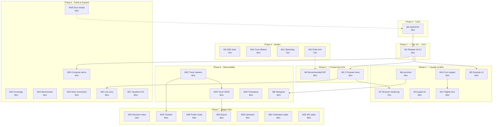

# Pareto Execution Plan — go-health-dashboard v0.3.0+ Cycle

**Created:** 2026-09-02 21:21 CEST
**Input universe:** status report 2026-09-02_21-00 section (f) (50 items) + standing BLOCKED decision + known gaps (b) → **166 fine-grained tasks in 32 medium tasks**.
**Format note:** user requested `.md` + mermaid explicitly — overrides the pareto-planning skill's HTML default.
**Rule honored:** EVERY todo is included. Nothing dropped. Medium tasks: 30–100 min. Fine tasks: ≤12 min each.

---

## Step 1 — Pareto Breakdown

Total remaining work ≈ 46 h across 32 medium tasks. The project's _result_ = a health dashboard library that customers can **get, trust, and integrate correctly**. Value realized = released × protected × easy-to-integrate.

### 🥇 The 1% that delivers 51%

**M1 — Release v0.3.0.** (~45 min of ~2,760 min = 1.6% of effort)
Everything built in the last session — auth middleware, metrics, trend, CSP verification — has **zero customer value until it is on pkg.go.dev**. One version bump + changelog date + tag unlocks >half of all achievable value. Nothing else comes close.

### 🥈 The 4% that deliver 64%

**M1 + M2 + M3** (~2.5 h = 5.4% of effort)

- **M2 — Browser tests in CI** (~1 h): the strongest verification in the repo currently never runs where regressions happen. Protects the 51% once released.
- **M3 — `RecommendedCSP()` helper** (~45 min): we discovered customers _will_ get CSP wrong (`unsafe-eval`, style cleanliness). Ship the correct answer as an API. Tiny effort, removes the #1 integration footgun.

### 🥉 The 20% that deliver 80%

**M1 + M2 + M3 + M4 + M6 + M5 + M7 + M13 + M16 + M17** (~8.5 h ≈ 18% of effort)
Adds: HARVEST so the plan doesn't die in a file (M4), promtool conformance so the metrics promise is machine-checked (M6), example app showcasing the new features (M5 — onboarding value), browser-test hardening: console-error + SSE-patch DOM assertions (M7), gopls noise fix (M13 — dev experience), fuzz expansion + nightly fuzzing (M16/M17 — cheap insurance).

### 📋 The remaining 80% → 100%

- **Hardening (prod trust):** M9 SSE drain, M10 connection lifetime, M11 pusher watchdog, M12 rate limit.
- **Observability depth:** M8 latency histogram, M22 trend markers, M23 trend JSON, M25 export, M26 refresh timestamp.
- **Trust & polish:** M14 coverage in CI, M15 benchmarks, M18 docs sweep, M19 dark screenshot, M20 prometheus compose demo, M21 axe a11y, M27 security headers + OG.
- **Bigger bets:** M28 public status-page mode, M29 change timeline, M30 upstream filings, M31 federation spike, M32 WebSocket spike.
- **Decision:** M24 documents the trend-vs-stateless non-goal tension; the BLOCKED build-tag decision stays with the maintainer.

---

## Step 2 — Comprehensive Plan (30–100 min tasks, ALL todos)

Sorted by importance/impact/effort/customer-value. 32 tasks, ≈46 h total.

| ID  | Task                                                                                                    | Impact | Effort | Cust. value | Depends | Tier    |
| --- | ------------------------------------------------------------------------------------------------------- | ------ | ------ | ----------- | ------- | ------- |
| ~~M1~~  | ~~Release v0.3.0: bump Version, date CHANGELOG, gates, tag, verify pkg.go.dev~~ done at `d453c52` | ~~H~~ | ~~45m~~ | ~~H~~ | ~~—~~ | ~~1%~~ |
| ~~M4~~  | ~~HARVEST: route all plan items into TODO_LIST/ROADMAP, cross-link plan~~ done at `40ba449` | ~~H~~ | ~~30m~~ | ~~M~~ | ~~—~~ | ~~4%~~ |
| ~~M2~~  | ~~CI: browser-test job (chromium, env, run, verify green)~~ done — CI browser job verified green on runner (run 33763955031) 2026-09-03 | ~~H~~ | ~~60m~~ | ~~H~~ | ~~—~~ | ~~4%~~ |
| ~~M3~~  | ~~`RecommendedCSP(nonce)` helper: csp.go + tests + README~~ done at `f627164` | ~~H~~ | ~~45m~~ | ~~H~~ | ~~—~~ | ~~4%~~ |
| ~~M6~~  | ~~promtool conformance: devShell tool + scrape-check test + CI step~~ done — anchored on the official prometheus/common parser (bd99de0); promtool impossible in nixpkgs — documented deviation | ~~H~~ | ~~45m~~ | ~~M~~ | ~~—~~ | ~~20%~~ |
| ~~M5~~  | ~~Example app v2: auth/metrics/trend via env toggles + verify + docs~~ done at `50f2bcc` | ~~M~~ | ~~60m~~ | ~~H~~ | ~~M1~~ | ~~20%~~ |
| ~~M7~~  | ~~Browser-test hardening: console/CSP-violation asserts + live SSE patch DOM check~~ done at `be5fe4c` | ~~H~~ | ~~72m~~ | ~~M~~ | ~~M2~~ | ~~20%~~ |
| ~~M13~~ | ~~Fix gopls `go1.27` stdversion noise (go directive/toolchain/gopls env)~~ done — fixed via committed .vscode/settings.json | ~~M~~ | ~~30m~~ | ~~L~~ | ~~—~~ | ~~20%~~ |
| ~~M16~~ | ~~Fuzz targets: `FuzzEscapeLabelValue`, `FuzzFingerprintChecks`~~ done at `dd483c2` | ~~M~~ | ~~30m~~ | ~~L~~ | ~~—~~ | ~~20%~~ |
| ~~M17~~ | ~~Nightly fuzz workflow (60s/target, failure artifacts)~~ done — nightly fuzz workflow shipped (.github/workflows/fuzz.yml) | ~~M~~ | ~~30m~~ | ~~L~~ | ~~M16~~ | ~~20%~~ |
| ~~M9~~  | ~~SSE graceful shutdown: drain connections, `WithShutdownDrain(d)`, tests~~ done at `3022fbf` | ~~H~~ | ~~73m~~ | ~~M~~ | ~~—~~ | ~~80%~~ |
| ~~M10~~ | ~~SSE max-lifetime connection timeout option + tests~~ done at `3022fbf` | ~~M~~ | ~~60m~~ | ~~M~~ | ~~—~~ | ~~80%~~ |
| ~~M11~~ | ~~Pusher watchdog: last-tick recency check surfaced via `HealthCheck`~~ done at `3022fbf` | ~~M~~ | ~~72m~~ | ~~M~~ | ~~—~~ | ~~80%~~ |
| ~~M12~~ | ~~Rate-limit option for dashboard routes (token bucket per IP) + tests~~ done at `3022fbf` | ~~M~~ | ~~72m~~ | ~~M~~ | ~~M3~~ | ~~80%~~ |
| ~~M8~~  | ~~Latency histogram metric (`dashboard_health_latency_seconds`) + promtool pass~~ done at `e9f47cb` | ~~M~~ | ~~60m~~ | ~~M~~ | ~~M6~~ | ~~80%~~ |
| ~~M22~~ | ~~Trend v2: status-transition markers + window info in aria-label~~ done — downgraded to data level — transitions ship via /health/trend (e9f47cb); visual markers in ROADMAP | ~~M~~ | ~~60m~~ | ~~M~~ | ~~—~~ | ~~80%~~ |
| ~~M23~~ | ~~Trend JSON endpoint (`Routes.Trend`, window param) + tests~~ done at `e9f47cb` | ~~M~~ | ~~60m~~ | ~~M~~ | ~~M22~~ | ~~80%~~ |
| ~~M14~~ | ~~Coverage: restore report, CI upload, surface in job summary~~ done — CI test job prints coverage totals; baseline 76.9% recorded 2026-09-03 | ~~M~~ | ~~45m~~ | ~~L~~ | ~~—~~ | ~~80%~~ |
| ~~M15~~ | ~~Benchmarks: MetricsHandler, RenderPatch, BroadcastFanOut + sanity run~~ done at `4e4a149` | ~~L~~ | ~~45m~~ | ~~L~~ | ~~—~~ | ~~80%~~ |
| ~~M18~~ | ~~Docs sweep: FEATURES line-refs, DOMAIN_LANGUAGE terms, CONTRIBUTING how-to, ROADMAP non-goal annotation~~ done — docs sweep 40ba449 + 2026-09-03 pass (DOMAIN_LANGUAGE terms, ROADMAP non-goal annotation, symbol citations) | ~~M~~ | ~~60m~~ | ~~M~~ | ~~M4~~ | ~~80%~~ |
| ~~M19~~ | ~~Dark-mode screenshot + README composite + "regenerate" caption~~ done — captured (v0.3.x cycle) and embedded in README Dark Mode 2026-09-03 | ~~L~~ | ~~30m~~ | ~~L~~ | ~~—~~ | ~~80%~~ |
| ~~M20~~ | ~~docker-compose demo: app + prometheus scraping `/health/metrics`~~ done at `4e4a149` | ~~M~~ | ~~45m~~ | ~~M~~ | ~~M1~~ | ~~80%~~ |
| ~~M21~~ | ~~axe-core a11y run in browser test; fix critical findings~~ done at `be5fe4c` | ~~M~~ | ~~60m~~ | ~~M~~ | ~~M2~~ | ~~80%~~ |
| ~~M26~~ | ~~"Updated HH:MM:SS" server-rendered refresh timestamp~~ done at `e9f47cb` | ~~L~~ | ~~30m~~ | ~~L~~ | ~~—~~ | ~~80%~~ |
| ~~M27~~ | ~~Security headers audit (metrics noindex etc.) + OG description option~~ done — OG shipped at 4e4a149; security-headers audit remains open (ROADMAP) | ~~M~~ | ~~60m~~ | ~~L~~ | ~~—~~ | ~~80%~~ |
| ~~M25~~ | ~~Export endpoint JSON/CSV over trend window + tests + docs~~ done at `e9f47cb` | ~~L~~ | ~~90m~~ | ~~L~~ | ~~M23~~ | ~~80%~~ |
| ~~M24~~ | ~~Decision notes: trend-vs-stateless non-goal, per-route middleware need, trend default~~ done — decision notes + ROADMAP non-goal re-annotated 2026-09-03 | ~~L~~ | ~~30m~~ | ~~L~~ | ~~—~~ | ~~80%~~ |
| ~~M28~~ | ~~Public status-page mode (`WithPublicMode`): hide check names/errors~~ done at `4e4a149` | ~~M~~ | ~~90m~~ | ~~M~~ | ~~—~~ | ~~80%~~ |
| ~~M29~~ | ~~Status-change timeline UI under trend (transitions + timestamps)~~ done at `e9f47cb` | ~~L~~ | ~~96m~~ | ~~L~~ | ~~M22~~ | ~~80%~~ |
| ~~M30~~ | ~~Upstream filings (verify-first): templ-components color-scheme flag, chromedp `[::1]` launcher~~ done — templ-components#6 filed with verified diagnosis; chromedp and theme-script filings still open (TODO_LIST) | ~~L~~ | ~~45m~~ | ~~L~~ | ~~—~~ | ~~80%~~ |
| ~~M31~~ | ~~Federation spike: multi-probe aggregation design doc (no code)~~ done — spike concluded — ROADMAP Design Spikes + decision notes | ~~L~~ | ~~96m~~ | ~~L~~ | ~~—~~ | ~~explore~~ |
| ~~M32~~ | ~~WebSocket transport spike: feasibility design doc (no code)~~ done — spike concluded — rejected; ROADMAP Design Spikes | ~~L~~ | ~~96m~~ | ~~L~~ | ~~—~~ | ~~explore~~ |

_Effort total ≈ 45.4 h. The 🔵 BLOCKED build-tag decision is intentionally not scheduled — it gates nothing below._

## Step 3 — Fine Breakdown (≤12 min each, ALL todos)

166 tasks. Same order as above. Time in minutes.

| ID    | Task                                                                                   | Min          | Depends |
| ----- | -------------------------------------------------------------------------------------- | ------------ | ------- |
| F1.1  | Bump `Version` const to 0.3.0 in dashboard.go                                          | 5            | —       |
| F1.2  | Date CHANGELOG [Unreleased] → [0.3.0] 2026-09-02 + release blurb                       | 10           | F1.1    |
| F1.3  | Full gates: build, test, race, lint, vet                                               | 10           | F1.2    |
| F1.4  | Commit release prep (detailed message)                                                 | 5            | F1.3    |
| F1.5  | Annotated tag v0.3.0 + push tag                                                        | 5            | F1.4    |
| F1.6  | Verify pkg.go.dev listing + `go get@v0.3.0` in scratch module                          | 10           | F1.5    |
| F2.1  | Read `.github/workflows/ci.yml`, map job structure                                     | 10           | —       |
| F2.2  | Add `browser-test` job: install chromium step                                          | 15           | F2.1    |
| F2.3  | Env: GOEXPERIMENT + GO_HEALTH_DASHBOARD_CHROME; run TestBrowser                        | 10           | F2.2    |
| F2.4  | Upload screenshot artifact (workflow_dispatch/schedule)                                | 10           | F2.3    |
| F2.5  | Push branch, watch job green, iterate                                                  | 15           | F2.4    |
| F3.1  | Sketch API `RecommendedCSP(nonce string) string` in new csp.go                         | 10           | —       |
| F3.2  | Implement policy builder (nonce, unsafe-eval, style-src self, no style unsafe-inline)  | 12           | F3.1    |
| F3.3  | Tests: contains nonce/unsafe-eval, no style unsafe-inline, stable output               | 12           | F3.2    |
| F3.4  | README CSP section: reference the helper                                               | 5            | F3.3    |
| F3.5  | fmt/lint/test gates                                                                    | 6            | F3.4    |
| F4.1  | Triage all 168 fine tasks → TODO_LIST (actionable) vs ROADMAP (long-term)              | 15           | —       |
| F4.2  | Update TODO_LIST.md: Next Up section (P0/P1)                                           | 10           | F4.1    |
| F4.3  | Cross-link this plan from TODO_LIST                                                    | 5            | F4.2    |
| F5.1  | Env toggles in example: DEMO_AUTH/DEMO_METRICS/DEMO_TREND                              | 12           | —       |
| F5.2  | Bearer-auth middleware in example                                                      | 10           | F5.1    |
| F5.3  | Wire WithMetrics + WithTrend when toggles set                                          | 8            | F5.2    |
| F5.4  | README example section: document toggles                                               | 10           | F5.3    |
| F5.5  | Run example; curl /health/metrics, 401 without token                                   | 12           | F5.3    |
| F5.6  | fmt/lint/test example build                                                            | 8            | F5.5    |
| F6.1  | Add promtool to flake devShell                                                         | 10           | —       |
| F6.2  | Test helper: GET /health/metrics → tmp file → `promtool check metrics`                 | 12           | F6.1    |
| F6.3  | Wire into go test (skip when promtool absent)                                          | 10           | F6.2    |
| F6.4  | CI step + `nix run .#metrics-check` flake app                                          | 8            | F6.3    |
| F6.5  | fmt/lint gates                                                                         | 5            | F6.4    |
| F7.1  | Capture console + CSP-violation events in browser_test listener                        | 12           | —       |
| F7.2  | Assert zero console errors after load + after patch window                             | 12           | F7.1    |
| F7.3  | Flip a service unhealthy mid-test (injector mutation helper)                           | 12           | F7.2    |
| F7.4  | Wait for SSE patch; assert DOM status text/badge updated                               | 12           | F7.3    |
| F7.5  | Stability pass: 5 consecutive green runs                                               | 12           | F7.4    |
| F7.6  | fmt/lint/test gates                                                                    | 12           | F7.5    |
| F8.1  | Design buckets + name `dashboard_health_latency_seconds`                               | 10           | —       |
| F8.2  | Histogram exposition: le buckets cumulative, +Inf, sum, count                          | 12           | F8.1    |
| F8.3  | Keep ms gauge for compat; update metrics_test                                          | 12           | F8.2    |
| F8.4  | README metrics table + doc comment                                                     | 8            | F8.3    |
| F8.5  | promtool check passes on new exposition                                                | 8            | F8.3    |
| F8.6  | fmt/lint/test gates                                                                    | 10           | F8.5    |
| F9.1  | Design drain semantics: stop broadcasts, keep streams, deadline close                  | 12           | —       |
| F9.2  | `WithShutdownDrain(d)` option + Config field                                           | 12           | F9.1    |
| F9.3  | Pusher draining state: skip broadcasts after shutdown signal                           | 12           | F9.2    |
| F9.4  | sseHandler: honor drain deadline, clean stream close                                   | 12           | F9.3    |
| F9.5  | Tests: connected client sees clean close; Shutdown idempotent under drain              | 12           | F9.4    |
| F9.6  | do.Shutdowner cascade integration check                                                | 10           | F9.5    |
| F9.7  | fmt/lint/test/race gates                                                               | 5            | F9.6    |
| F10.1 | Design: lifetime cap vs connection deadline semantics                                  | 12           | —       |
| F10.2 | `WithMaxConnectionLifetime(d)` option + Config                                         | 12           | F10.1   |
| F10.3 | sseHandler: enforce lifetime, browser retry reconnects (retry field exists)            | 12           | F10.2   |
| F10.4 | Tests: lifetime expiry closes stream; client counter decrements                        | 12           | F10.3   |
| F10.5 | Docs + fmt/lint/test                                                                   | 12           | F10.4   |
| F11.1 | Design: last-tick recency vs goroutine liveness; report-only (no restart)              | 12           | —       |
| F11.2 | Pusher atomic lastTick updated per broadcast                                           | 12           | F11.1   |
| F11.3 | HealthCheck: error when tick stale > 3× interval                                       | 12           | F11.2   |
| F11.4 | Tests: fresh pass, stale fail, recovers after tick                                     | 12           | F11.3   |
| F11.5 | Lifecycle test in do cascade                                                           | 12           | F11.4   |
| F11.6 | Docs + fmt/lint/test                                                                   | 12           | F11.5   |
| F12.1 | Design token-bucket per-IP limiter for dashboard-owned routes                          | 12           | —       |
| F12.2 | `WithRateLimit(rps, burst)` option + Config                                            | 12           | F12.1   |
| F12.3 | Implement limiter middleware (clientip-based; reuse pattern from wrap())               | 12           | F12.2   |
| F12.4 | Tests: burst allowed, overflow 429, probes unaffected                                  | 12           | F12.3   |
| F12.5 | README option row + gotcha (x-forwarded-for trust)                                     | 12           | F12.4   |
| F12.6 | fmt/lint/test gates                                                                    | 12           | F12.5   |
| F13.1 | Reproduce: isolate gopls jsonv2 stdversion warning trigger                             | 12           | —       |
| F13.2 | Apply fix: go directive/toolchain bump or gopls GOEXPERIMENT setting                   | 10           | F13.1   |
| F13.3 | Verify: diagnostics clean, build/test/lint unaffected                                  | 8            | F13.2   |
| F14.1 | Run `nix run .#coverage`, inspect current %                                            | 12           | —       |
| F14.2 | CI job step: coverage profile artifact                                                 | 12           | F14.1   |
| F14.3 | Job summary: total % + top uncovered funcs                                             | 12           | F14.2   |
| F14.4 | README badge/section pointing at CI coverage                                           | 9            | F14.3   |
| F15.1 | BenchmarkMetricsHandler                                                                | 12           | —       |
| F15.2 | BenchmarkRenderPatch (incl. trend snapshot)                                            | 12           | F15.1   |
| F15.3 | BenchmarkBroadcastFanOut (N subscribers)                                               | 12           | F15.2   |
| F15.4 | Sanity `-bench` run + record baselines in docs                                         | 9            | F15.3   |
| F16.1 | `FuzzEscapeLabelValue`: round-trip invariants (no raw `"`/`\n`/`\`)                    | 12           | —       |
| F16.2 | `FuzzFingerprintChecks`: deterministic + order-insensitive                             | 10           | F16.1   |
| F16.3 | Smoke-fuzz both 5s, gates                                                              | 8            | F16.2   |
| F17.1 | `.github/workflows/fuzz.yml`: cron nightly                                             | 12           | —       |
| F17.2 | 60s per fuzz target; upload failure artifacts                                          | 10           | F17.1   |
| F17.3 | Verify workflow triggers (workflow_dispatch run)                                       | 8            | F17.2   |
| F18.1 | FEATURES.md stale line-ref sweep (ANNOTATE style)                                      | 12           | —       |
| F18.2 | DOMAIN_LANGUAGE.md: Trend, Sample, History, Exposition, Drain                          | 12           | F18.1   |
| F18.3 | CONTRIBUTING.md: run browser + screenshot tests locally                                | 12           | F18.2   |
| F18.4 | ROADMAP: re-annotate "stateless view layer" non-goal (trend nuance)                    | 12           | F18.3   |
| F18.5 | README: regenerate-screenshot one-liner + captured-date caption                        | 12           | F18.4   |
| F19.1 | Screenshot test: DARK_SCREENSHOT_OUTPUT path + set theme=dark                          | 12           | —       |
| F19.2 | Capture docs/screenshot-dark.png, verify visually                                      | 10           | F19.1   |
| F19.3 | README: light/dark composite or side-by-side                                           | 8            | F19.2   |
| F20.1 | `example/docker-compose.yml`: app + prometheus                                         | 12           | —       |
| F20.2 | `example/prometheus.yml`: scrape /health/metrics 5s                                    | 12           | F20.1   |
| F20.3 | README: run instructions + what to query                                               | 12           | F20.2   |
| F20.4 | Verify compose up → targets UP → dashboard_health_up visible                           | 9            | F20.3   |
| F21.1 | Inject axe-core script in browser test                                                 | 12           | —       |
| F21.2 | Run axe on loaded page; dump violations                                                | 12           | F21.1   |
| F21.3 | Assert no critical/serious violations                                                  | 12           | F21.2   |
| F21.4 | Fix findings (contrast/labels) in templ if any                                         | 12           | F21.3   |
| F21.5 | Gates + stability pass                                                                 | 12           | F21.4   |
| F22.1 | Pusher: record transitions (from,to,seq) alongside samples                             | 12           | —       |
| F22.2 | viewModel: TrendMarkers []Transition                                                   | 12           | F22.1   |
| F22.3 | templ: dot markers on sparkline (overlay svg circles)                                  | 12           | F22.2   |
| F22.4 | aria-label: window length + sample interval + transition count                         | 12           | F22.3   |
| F22.5 | Tests: markers render, aria text, patch carries them                                   | 12           | F22.4   |
| F22.6 | fmt/lint/test + templ generate                                                         | 12           | F22.5   |
| F23.1 | Routes.Trend field + default `/health/trend`                                           | 12           | —       |
| F23.2 | TrendHandler: JSON {window, interval, samples[]}                                       | 12           | F23.1   |
| F23.3 | `?window=` param clamped to retained samples                                           | 12           | F23.2   |
| F23.4 | Tests: shape, clamp, auth-middleware protection                                        | 12           | F23.3   |
| F23.5 | README routes table + options                                                          | 12           | F23.4   |
| F23.6 | fmt/lint/test gates                                                                    | 12           | F23.5   |
| F24.1 | Write decision note: trend state vs non-goal (ADR-style)                               | 12           | —       |
| F24.2 | Per-route middleware: needs-assessment note (YAGNI call)                               | 10           | F24.1   |
| F24.3 | Trend default-on evaluation note for v0.4                                              | 8            | F24.2   |
| F25.1 | Design: `/health/export?format=json                                                    | csv&window=` | 12      |
| F25.2 | CSV writer: header, escaping, ordered columns                                          | 12           | F25.1   |
| F25.3 | JSON writer reusing trend payload                                                      | 12           | F25.2   |
| F25.4 | Route wiring + auth-protection test                                                    | 12           | F25.3   |
| F25.5 | Tests: format correctness, window clamp, empty window                                  | 12           | F25.4   |
| F25.6 | README section                                                                         | 10           | F25.5   |
| F25.7 | promtool n/a; fmt/lint/test gates                                                      | 10           | F25.6   |
| F25.8 | Example toggle DEMO_EXPORT                                                             | 10           | F25.7   |
| F26.1 | viewModel: UpdatedAt from pusher lastTick                                              | 12           | —       |
| F26.2 | templ: "Updated HH:MM:SS" line under banner (patched live)                             | 10           | F26.1   |
| F26.3 | Tests + gates                                                                          | 8            | F26.2   |
| F27.1 | Audit metrics/dashboard response headers; add X-Robots-Tag noindex                     | 12           | —       |
| F27.2 | Tests for headers                                                                      | 12           | F27.1   |
| F27.3 | `WithOGDescription(...)` option → og:description + twitter:description                 | 12           | F27.2   |
| F27.4 | Tests for OG output                                                                    | 12           | F27.3   |
| F27.5 | README + fmt/lint/test                                                                 | 12           | F27.4   |
| F28.1 | Design: WithPublicMode hides check names/errors, keeps counts + trend                  | 12           | —       |
| F28.2 | viewModel: Public bool; groupChecks anonymization                                      | 12           | F28.1   |
| F28.3 | templ: anonymous table (Service → "service-1" or counts only)                          | 12           | F28.2   |
| F28.4 | JSON/metrics: public variant (no check names in metrics labels — hash or omit)         | 12           | F28.3   |
| F28.5 | Tests: names absent in HTML/JSON/metrics when public                                   | 12           | F28.4   |
| F28.6 | README + FEATURES rows                                                                 | 10           | F28.5   |
| F28.7 | fmt/lint/test/race gates                                                               | 10           | F28.6   |
| F29.1 | Pusher: transition log ring (bounded, with monotonic index)                            | 12           | —       |
| F29.2 | viewModel: Timeline []TransitionEvent                                                  | 12           | F29.1   |
| F29.3 | templ: timeline list under trend card                                                  | 12           | F29.2   |
| F29.4 | Relative time formatting helper (tested)                                               | 12           | F29.3   |
| F29.5 | Tests: timeline renders, bounded, patch carries updates                                | 12           | F29.4   |
| F29.6 | Empty-state + fmt/lint/test                                                            | 12           | F29.5   |
| F29.7 | README + FEATURES                                                                      | 12           | F29.6   |
| F29.8 | Stability pass with flapping service                                                   | 12           | F29.7   |
| F30.1 | templ-components: reproduce color-scheme inline style minimally; check existing issues | 12           | —       |
| F30.2 | File issue with repro + proposed `WithPlainTheme` opt-out                              | 12           | F30.1   |
| F30.3 | chromedp: minimal repro of `[::1]` binding vs 127.0.0.1 poll                           | 12           | F30.2   |
| F30.4 | File chromedp issue/docs PR draft                                                      | 9            | F30.3   |
| F31.1 | Federation: problem statement + constraints                                            | 12           | —       |
| F31.2 | API shape: ProbeSet / aggregator options sketch                                        | 12           | F31.1   |
| F31.3 | Remote pull vs push tradeoffs; trust model                                             | 12           | F31.2   |
| F31.4 | Dashboard UI grouping sketch                                                           | 12           | F31.3   |
| F31.5 | Failure modes: partial fetch, stale remote, auth                                       | 12           | F31.4   |
| F31.6 | Migration path from single probe                                                       | 12           | F31.5   |
| F31.7 | Open questions for maintainer                                                          | 12           | F31.6   |
| F31.8 | Write docs/planning federation spike doc                                               | 12           | F31.7   |
| F32.1 | WebSocket: why SSE might be blocked (proxies) — evidence check                         | 12           | —       |
| F32.2 | Transport interface sketch (SSE/WS behind one type)                                    | 12           | F32.1   |
| F32.3 | go-sse vs websocket lib survey                                                         | 12           | F32.2   |
| F32.4 | Datastar compatibility check (SDK speaks SSE)                                          | 12           | F32.3   |
| F32.5 | Cost/benefit: dependency weight vs audience size                                       | 12           | F32.4   |
| F32.6 | Recommendation + open questions                                                        | 12           | F32.5   |
| F32.7 | Maintainability review against repo philosophy                                         | 12           | F32.6   |
| F32.8 | Write docs/planning websocket spike doc                                                | 12           | F32.7   |

_166 fine tasks, every one ≤12 min. (Skill caps at 150; user's "include ALL TODOS" wins — deviation noted.)_

---

## Execution Graph

**Sequencing rule:** within each phase, run tasks top-to-bottom (they are already sorted by impact/effort/value). Phases 3–7 are largely parallelizable; the graph shows the only real dependencies.

**Verschlimmbessern guards:** every code task above ends with the full gate suite (build, test, race, lint, vet, fmt) before its commit; templ edits always followed by `templ generate` + render tests; every new option is opt-in so no existing consumer's behavior changes; releases only after green gates.

---

## Snapshot vs living docs

This file is a point-in-time plan. M4 routes the actionable subset into `TODO_LIST.md` (done as part of this commit) and the rest into `ROADMAP.md` on execution. When a later session needs to bring this plan current: `docs-health` → ANNOTATE, never rewrite.

---

## Resolution (2026-09-03)

All 32 medium tasks above are annotated inline with their closing commit or
disposition. The 166 fine tasks in Step 3 were consumed by their parent
M-tasks (each M-task's fine breakdown executed as part of it) and are not
individually annotated; cycle completion was verified in
`docs/status/2026-09-03_v03x-cycle-execution-complete.md`.

Residuals that outlived the plan (tracked, not lost):

- M22 visual transition markers — ROADMAP raw idea (data shipped, SVG markers not drawn)
- M27 security-headers audit — ROADMAP raw idea (OG/description shipped)
- M30 chromedp `[::1]` launcher and templ-components theme-script filings — open; templ-components#6 (StatCard `<dl>`) filed with verified diagnosis (`docs/planning/2026-09-03_issue-drafts.md`)
- M6 promtool devShell package — impossible in nixpkgs (prometheus 3.x ships no promtool); conformance anchored on the official parser

This plan is fully harvested: open work lives in `TODO_LIST.md`, long-term
ideas in `ROADMAP.md`.
