# Integration over Federation — Cross-Repo Execution Plan

**Date**: 2026-09-04 00:14
**Scope**: `go-health` + `go-health-dashboard` (one project, two modules)
**Strategy**: Do not fight Uptime Kuma, Gatus, SigNoz, Grafana, statuspage.io — feed them. Ship the composition primitive in-process; export status transitions outbound; document the semantic mapping once.

---

## Context

The dashboard renders one `*health.Probe`. Real deployments (see `~/projects/SystemNix`:
`gatus-config.nix`, 2283 lines of hand-maintained endpoints; `_signoz-alerts.nix` with
vacuous-rule guards) re-encode go-health semantics by hand in every monitoring tool:
which endpoint means what, that `warn` = degraded-not-paging, 503-on-shutdown. That
semantic mapping is where the incidents live (1076+ lost ingests to one case bug; an
11-day healthz blackout). The library owns these semantics programmatically — this plan
exports them once.

**Decisions made (from strategy discussion):**

1. **Federation is dead.** Remote pulling duplicates Kuma/Gatus/Grafana. Never build it here.
2. **Composition lives in go-health** (probe domain): an `aggregate` package merges N
   in-process probes into one `Response`. The dashboard consumes it via a new narrow
   `Prober` interface (structural typing keeps `New(*health.Probe)` callers compiling).
3. **Push beats pull for egress-restricted hosts**: `WithWebhook` fires a JSON snapshot
   on status change, reusing the pusher's change detection. Zero runtime deps.
4. **The cookbook is the product**: `docs/integrations.md` encodes Gatus/SigNoz/Kuma
   recipes validated against go-health semantics — written once, consumed by all.

---

## Pareto Breakdown

### 1% → 51% of result

| Task | Why it is the 1% |
|---|---|
| `docs/integrations.md` cookbook (Gatus + SigNoz recipes) | SigNoz/Gatus work **today** against the existing endpoints with zero code. Documenting the validated semantic mapping is the entire "integrate, don't compete" product. |

### 4% → 64% of result (the 1% plus)

| Task | Increment |
|---|---|
| `WithWebhook` + `WithWebhookHeaders` (dashboard) | Push path: transitions reach PapDashboard-style ingests / n8n / custom receivers without Gatus's fragile `[PLACEHOLDER]` templates. ~90 lines, `net/http` only. |

### 20% → 80% of result (the 4% plus)

| Task | Increment |
|---|---|
| go-health `aggregate` package | In-process multi-service page: N probes → one `Response` (worst-of, namespaced checks). Probe-domain primitive, useful far beyond the dashboard. |
| dashboard `Prober` interface | Unlocks the aggregate (and test stubs) without breaking `*health.Probe` callers. |
| go-health v0.1.0 release + dashboard dep bump | Makes the aggregate consumable without `replace` directives. |
| Cross-repo AGENTS.md/CHANGELOG/README updates | Future sessions inherit the decisions; users discover the features. |

### Remaining 80% → 100% (explicitly out of scope or deferred)

| Item | Status | Reason |
|---|---|---|
| `WithGrouping(BySource)` view option | Deferred (next cycle) | View polish on an unreleased aggregate; severity grouping already works with namespaced keys. |
| `/health/monitor.json` manifest endpoint | Rejected for now | Paths/metric names are conventional; a manifest is permanent public API for marginal value. |
| `go-health-otel` OTLP module | Deferred | Prometheus surface already reaches SigNoz via OTel collector. New module, never core deps. |
| SystemNix `lib/go-health.nix` generator | Sibling repo, next session | Consumes the cookbook; not this codebase. |
| statuspage.io / PagerDuty adapters | Never in core | Consumer-land payload mappers over the generic webhook. |
| Remote federation / public status-page mode | Never | Dead per strategy; `WithPublicMode` covers anonymization. |

---

## Comprehensive Plan (30–100 min tasks, sorted by impact/effort/customer-value)

| # | Task | Repo | Est. | Impact | Effort | Value | Depends on |
|---|---|---|---|---|---|---|---|
| 1 | Write this plan file with execution graph | dashboard | 45min | High | Low | High | — |
| 2 | go-health `aggregate` package (types, merge, handlers) | go-health | 60min | High | Med | High | 1 |
| 3 | go-health `aggregate` test suite (construction, merge matrix, handlers, race) | go-health | 45min | High | Med | High | 2 |
| 4 | go-health docs (CHANGELOG, AGENTS.md, README) + release v0.1.0 (tag + push) | go-health | 60min | High | Med | High | 3 |
| 5 | dashboard `Prober` interface (`New`, `Register`, `resolvePushInterval`, field) | dashboard | 30min | High | Low | High | 4 |
| 6 | dashboard `WithWebhook`/`WithWebhookHeaders` + notifier + pusher hook | dashboard | 60min | High | Med | High | 5 |
| 7 | dashboard tests: webhook behavior, stub prober, aggregate e2e | dashboard | 45min | High | Med | High | 6 |
| 8 | `docs/integrations.md` cookbook (Gatus, SigNoz, Kuma, webhook schema) | dashboard | 45min | High | Low | **Highest** | 6 |
| 9 | README + AGENTS.md cross-repo documentation | both | 30min | Med | Low | Med | 7,8 |
| 10 | Full verification, detailed commits, push both repos | both | 45min | High | Low | High | 9 |

## Micro Plan (≤12 min tasks, ALL todos, execution order)

| # | Task | Est | Verify by |
|---|---|---|---|
| A1 | Plan file with mermaid graph (this document) | 12m | exists, graph renders |
| B1 | `aggregate.go`: `Source`, `Aggregate`, `New` + validation (empty, dup names) | 12m | compiles |
| B2 | `worstOf` + merged `CachedResponse` (namespaced checks, shutdown, latency max) | 12m | compiles |
| B3 | `RefreshInterval` (max) + `StartupComplete` (AND latch) | 6m | compiles |
| B4 | `LivenessHandler` (200 pass) + `ReadinessHandler` (merged, 503 on fail) | 12m | compiles |
| B5 | `StartupHandler` (503 until all complete) + `RegisterRoutes` | 12m | compiles |
| B6 | Tests: construction (empty/dup/single-source) | 12m | `go test` |
| B7 | Tests: merge matrix (fail>warn>pass, namespacing, shutdown overlay, latency/refresh) | 12m | `go test` |
| B8 | Tests: handlers (200/503, startup latch, GET body shape) | 12m | `go test` |
| B9 | Build + test + race (GOEXPERIMENT=jsonv2, GOWORK=off) | 12m | all green |
| B10 | vet + lint (go-health flake apps) | 6m | clean |
| B11 | CHANGELOG `[Unreleased]`, AGENTS.md, README section | 12m | docs accurate |
| B12a | Load go-release skill; pre-release verification | 12m | checklist done |
| B12b | Cut v0.1.0 in CHANGELOG, annotated tag, push + tags | 12m | tag on origin |
| B12c | Verify module proxy / `go get` resolves v0.1.0 | 12m | dashboard can bump |
| C1 | `Prober` interface; switch `Dashboard.probe`, `New`, `resolvePushInterval`, `di.Register` | 12m | compiles |
| C2 | Build + existing dashboard tests stay green (source compatibility proof) | 6m | all green |
| C3 | Stub-prober test: `New` accepts non-`*health.Probe` | 12m | test passes |
| D1 | `webhook.go`: payload types, public-mode masking, POST with headers + timeout | 12m | compiles |
| D2 | `Config.Webhook*` fields + `WithWebhook` + `WithWebhookHeaders` | 12m | compiles |
| D3 | Pusher hook: change-only fire, async goroutine, no loop blocking | 12m | compiles |
| D4 | Tests: fires on change (body, content-type, auth header) via httptest | 12m | test passes |
| D5 | Tests: silent when unchanged; public-mode masking | 12m | test passes |
| D6 | E2E test: 2 injectors → probes → `aggregate.New` → `dashboard.New` render | 12m | namespaced checks in HTML |
| D7 | `go get go-health@v0.1.0`; build + full suite + race | 12m | all green |
| D8 | vet + lint (dashboard flake apps) | 6m | clean |
| E1a | Cookbook: Gatus section (endpoint YAML + Nix, warn-vs-fail conditions) | 12m | accurate recipes |
| E1b | Cookbook: SigNoz section (PromQL rules, target=0 trap) | 12m | accurate recipes |
| E1c | Cookbook: Kuma + webhook payload schema + security notes | 12m | accurate recipes |
| E2 | Dashboard README integrations section + both AGENTS.md updates | 12m | docs accurate |
| F1 | `git status`/`git diff` review both repos (no replace directives, no secrets) | 6m | clean diff |
| F2 | Detailed commits (go-health first, then dashboard) | 6m | history readable |
| F3 | Push both repos | 6m | origin up to date |
| F4 | Final verification: fresh resolve of published deps, full suites | 12m | reproducible |

---

## Execution Graph

```mermaid
graph TD
    A1[A1: Plan file] --> B1
    B1[B1: aggregate types + New] --> B2[B2: merge CachedResponse]
    B2 --> B3[B3: RefreshInterval + StartupComplete]
    B3 --> B4[B4: liveness + readiness handlers]
    B4 --> B5[B5: startup handler + RegisterRoutes]
    B5 --> B6[B6: construction tests]
    B6 --> B7[B7: merge tests]
    B7 --> B8[B8: handler tests]
    B8 --> B9[B9: build + test + race]
    B9 --> B10[B10: vet + lint]
    B10 --> B11[B11: go-health docs]
    B11 --> B12a[B12a: release verification]
    B12a --> B12b[B12b: tag v0.1.0 + push]
    B12b --> B12c[B12c: proxy resolves v0.1.0]
    B12c --> C1[C1: dashboard Prober interface]
    C1 --> C2[C2: existing tests green]
    C2 --> C3[C3: stub-prober test]
    C3 --> D1[D1: webhook notifier]
    D1 --> D2[D2: WithWebhook options]
    D2 --> D3[D3: pusher hook]
    D3 --> D4[D4: webhook fire tests]
    D4 --> D5[D5: unchanged + masking tests]
    D5 --> D6[D6: aggregate e2e test]
    D6 --> D7[D7: bump dep + full suite]
    D7 --> D8[D8: vet + lint]
    D8 --> E1a[E1a: Gatus recipes]
    E1a --> E1b[E1b: SigNoz recipes]
    E1b --> E1c[E1c: Kuma + webhook schema]
    E1c --> E2[E2: README + AGENTS.md]
    E2 --> F1[F1: diff review]
    F1 --> F2[F2: commits]
    F2 --> F3[F3: push]
    F3 --> F4[F4: final verification]
```



---

## Design Contracts (frozen before code)

### go-health `aggregate`

```go
package aggregate // github.com/larsartmann/go-health/aggregate

type Source struct { Name string; Probe *health.Probe }

func New(sources ...Source) (*Aggregate, error)
// Errors: no sources; duplicate source names.

func (a *Aggregate) CachedResponse() health.Response
// Merge-on-read: N atomic loads, worst-of status (fail > warn > pass),
// checks namespaced "source/check", ShuttingDown = any (forces overall fail,
// mirroring Probe.classify), TotalLatencyMs = max, Version/Uptime = zero
// (scalars do not survive a merge).

func (a *Aggregate) RefreshInterval() time.Duration // max of sources (0 = live)
func (a *Aggregate) StartupComplete() bool          // AND of source latches
func (a *Aggregate) LivenessHandler() http.HandlerFunc  // 200 pass, empty checks
func (a *Aggregate) ReadinessHandler() http.HandlerFunc // 503 on fail/shutdown, 200 on warn
func (a *Aggregate) StartupHandler() http.HandlerFunc   // 503 until all sources complete
func (a *Aggregate) RegisterRoutes(mux *http.ServeMux, routes health.Routes)
```

### dashboard `Prober`

```go
type Prober interface {
    CachedResponse() health.Response
    RefreshInterval() time.Duration
    LivenessHandler() http.HandlerFunc
    ReadinessHandler() http.HandlerFunc
    StartupHandler() http.HandlerFunc
}
```

`*health.Probe` and `*aggregate.Aggregate` both satisfy it. `New(probe Prober, ...)`
stays source-compatible with every existing caller.

### dashboard webhook

```go
WithWebhook(url string)                          // fire on transitions
WithWebhookHeaders(map[string]string)            // e.g. Authorization: Bearer ...
```

Payload (snake_case, mirroring go-health JSON conventions), change-only (any
status/fingerprint delta, independent of PushMode), one goroutine per fire with a
10s client timeout (cannot block or leak from the push loop), best-effort:
failed deliveries are dropped, not retried — upstream tools own alert thresholds.

```json
{"status":"warn","shutting_down":false,
 "checks":{"api/db":{"status":"fail","error":"connection refused"}},
 "changed_at":"2026-09-04T00:30:00Z"}
```

Public mode masks names to `check-N` (sorted, same scheme as metrics) and drops
error strings. Never log the URL (may contain secrets).

## Verification Commands

```bash
# go-health
cd ~/projects/go-health && GOEXPERIMENT=jsonv2 GOWORK=off go build ./... && GOEXPERIMENT=jsonv2 GOWORK=off go test ./... -count=1
GOEXPERIMENT=jsonv2 GOWORK=off go test -race ./... -count=1

# dashboard
cd ~/projects/go-health-dashboard && nix run .#build && nix run .#test && nix run .#test-race && nix run .#lint
```
