# v0.6.0 Release & Hardening Cycle — Pareto Execution Plan

**Date**: 2026-09-04 22:27 CEST
**Scope**: go-health-dashboard (input universe: TODO_LIST.md + ROADMAP.md Themes 1–5
+ the 2026-09-04 audits: docs-health pass, dependency-pin defense, go-health deep dive)
**Format note**: skill default is styled HTML; the user explicitly requested
`.md` with a mermaid graph — Markdown used, override flagged.
**Verschlimmbesserung rule in force**: every phase ends with the full gate suite;
no UI-dependency movement without the browser suite; no interface changes without
a recorded decision; version const bumps only in the tag commit.

---

## Context (where we stand)

- v0.5.0 shipped and proxy-verified; master carries the CI-hardening batch
  (version-guard, coverage floor + artifact, concurrency, pins, fuzz
  issue-on-failure), the sentinels, the file split, and today's
  `SanitizeResponse` choke-point fix — **none of it observed on a real runner**.
- templ-components is **pinned at v1.11.0** (v1.12.0 re-introduces the
  busy-script `nonce=""` regression, upstream #7); the pin is enforced by
  convention, not mechanically.
- GitHub Releases pages exist only for v0.1.0.
- TODO_LIST has 4 open rows; ROADMAP Themes 3–5 hold ~45 routed raw ideas;
  3 questions are BLOCKED on user decisions.

---

## Pareto Breakdown

### 1% → 51% of result

| Task | Why it is the 1% |
| --- | --- |
| **Push master and cut v0.6.0** (watch CI, re-head CHANGELOG, bump `Version` in the tag commit, tag + push, proxy-verify) | Two days of shipped value (CI hardening, sentinels, sanitize fix, docs) sit unreleased; the push *activates* the version-guard/floor/concurrency jobs for their first real run, converts "locally validated" into "verified", and unblocks the GitHub-Releases and pin-lift work. One push; half the open risk gone. |

### 4% → 64% of result (the 1% plus)

| Task | Increment |
| --- | --- |
| GitHub Releases pages for v0.2.0–v0.6.0 | Users and dependabot-grade tooling see releases; CHANGELOG becomes browsable. |
| Upstream templ-components#7 PR (LiveRegion nonce guard) | Removes the standing pin constraint — the single biggest blocker to ever taking a UI-dep bump again. |
| Mechanical guards: CI pin-guard for templ-components, FEATURES-count drift guard | Today's two dep collisions and two count drifts were caught by humans; make them impossible to miss. |

### 20% → 80% of result (the 4% plus)

| Task | Increment |
| --- | --- |
| Chrome/Chromium in the flake devShell | The strongest tests in the repo (browser suite) finally run locally; every later browser task gets cheap. |
| Fuzz cluster: CSV exporter, `RecommendedCSP`, webhook payload | The three newest parse/emit surfaces get the repo's existing fuzz pattern. |
| Browser a11y/security additions: keyboard-nav smoke, metrics-under-strict-CSP, golden screenshots | Closes the "unit suite cannot see CSP/a11y regressions" class that caused today's pin incident. |
| `docs/release-checklist.md` | Institutionalizes the release ritual the last three cycles learned by scar tissue. |
| ADR: options/handlers/history split + sentinel family | The architecture decisions of the last cycle, recorded once. |
| Coverage >80% + floor to 78%; `actionlint`, `templ generate` drift check, `nix flake check` in CI; gopls investigation; AGENTS prune to ~18 KB | Pipeline quality: catch drift mechanically, shrink the known-noise surface. |

### Remaining 80% → 100% (explicit backlog, all routed in ROADMAP Themes 3–5)

Introspection endpoint · 429 JSON body + drain Retry-After · webhook delivery
metrics · PushMode TTL · timeline age cap · per-check latency series · NDJSON
export · embedded Datastar SDK helper · aggregate/webhook demo modes ·
aggregate browser test · 20-source load test · `Routes()` accessor + `BasePath`
post-resolution · self-monitoring decision · tag signing + Keep-a-Changelog
compare links · cookbook probe-option combos · `InstanceID` UI decision ·
public-mode leak scanner · `WithGrouping(BySource)`.

**BLOCKED (need user, out of plan)**: build-tag gating for SSE · fingerprint
format stability · webhook hardening (HMAC + `"schema"` version).

---

## Comprehensive Plan (30–100 min tasks, sorted by impact/effort/value)

| #  | Task                                                                                     | Est   | Impact | Effort | Value | Depends |
| -- | ---------------------------------------------------------------------------------------- | ----- | ------ | ------ | ----- | ------- |
| R1 | Push master; watch every CI job's first real run; triage anything red                     | 30min | High   | Low    | **Highest** | gates green |
| R2 | Cut v0.6.0: re-head CHANGELOG, bump `Version` in the same commit, tag, push, proxy-verify | 45min | High   | Low    | High  | R1      |
| R3 | GitHub Releases pages v0.2.0–v0.6.0 from CHANGELOG sections                               | 25min | Med    | Low    | Med   | R2      |
| G1 | CI pin-guard: fail while templ-components ≠ v1.11.0 (until #7 lands)                      | 30min | High   | Low    | High  | R1      |
| G2 | CI docs drift-guard: FEATURES test count vs `rg -c` recount                               | 30min | Med    | Low    | Med   | R1      |
| G4 | Chrome/Chromium in the flake devShell; run the browser suite locally once                 | 30min | High   | Med    | High  | R1      |
| U1 | templ-components#7 PR: busy-script nonce guard + goldens                                  | 60min | High   | Med    | High  | —       |
| R4 | `docs/release-checklist.md` + CONTRIBUTING link                                           | 30min | Med    | Low    | Med   | R2      |
| G3 | CI jobs: `actionlint`, `templ generate` drift check, `nix flake check`                    | 45min | Med    | Low    | Med   | R1      |
| T1 | Fuzz target: CSV exporter                                                                 | 45min | Med    | Med    | Med   | —       |
| T2 | Fuzz target: `RecommendedCSP` (injection attempts)                                        | 45min | Med    | Med    | Med   | —       |
| T3 | Fuzz target: webhook payload marshal                                                      | 45min | Med    | Med    | Med   | —       |
| T4 | Keyboard-navigation a11y smoke in the browser suite                                       | 60min | Med    | Med    | Med   | G4      |
| T5 | Browser-test the metrics endpoint under strict CSP                                        | 45min | Med    | Med    | Med   | G4      |
| D1 | ADR: options/handlers/history split + error-sentinel family                               | 45min | Med    | Low    | Med   | —       |
| U2 | templ-components#6 PR: StatCard `<dl>` structure + goldens                                | 60min | Med    | Med    | Med   | —       |
| U3 | After U1 lands upstream: bump templ-components, drop pin + pin-guard, browser-validate, re-land go-datastar v0.5.0 decision   | 45min | High | Med | High | U1, G4 |
| T6 | Coverage >80% (profile, add tests); raise CI floor to 78%                                 | 90min | Med    | High   | Med   | R1      |
| D2 | Investigate the gopls stdversion warnings; fix or document dismissal                      | 45min | Low    | Med    | Low   | —       |
| D3 | AGENTS.md prune pass toward ~18 KB (grow-and-prune rule)                                  | 60min | Low    | Med    | Low   | —       |
| D4 | Cookbook: probe-side option combos (`WithGETOnly`, hooks, throttle, `InstanceID`)         | 45min | Low    | Low    | Low   | —       |
| D5 | Tag signing + Keep-a-Changelog compare links                                              | 30min | Low    | Low    | Low   | R2      |
| F1 | Introspection endpoint (JSON: routes, limits, modes)                                      | 60min | Med    | Med    | Med   | R2      |
| F2 | 429 JSON body + Retry-After on drain-window 503s                                          | 60min | Med    | Med    | Med   | R2      |
| F3 | Webhook delivery metrics (counters + duration, behind `WithMetrics`)                      | 60min | Med    | Med    | Med   | R2      |
| F4 | PushOnChange TTL + timeline age cap                                                       | 60min | Low    | Med    | Low   | R2      |
| F5 | Per-check latency series + NDJSON export                                                  | 60min | Low    | Med    | Low   | R2      |
| F6 | Embedded Datastar SDK serving helper (`WithCSSPath` analog)                               | 60min | Med    | Med    | Med   | R2      |
| F7 | Example aggregate/webhook demo modes + aggregate browser test                             | 60min | Med    | Med    | Med   | G4, R2  |
| F8 | Load test: 20-source aggregate under concurrent SSE + scrape                              | 60min | Low    | Med    | Low   | F7      |
| F9 | `Routes()` accessor + `BasePath` resolved after all options                               | 60min | Low    | Med    | Low   | R2      |
| F10| Self-monitoring decision doc (Dashboard in its own health table?)                         | 30min | Low    | Low    | Low   | —       |
| F11| `WithGrouping(BySource)` per-service cards                                                | 90min | Med    | High   | Med   | R2      |
| F12| Public-mode leak-scanner test + `InstanceID` UI decision                                  | 45min | Low    | Med    | Low   | R2      |

**Deferred / blocked (not in this cycle)**: build-tag gating (user), fingerprint
stability (user), webhook HMAC + schema version (user), `go-health-otel` (sibling
repo), SystemNix `lib/go-health.nix` (sibling repo), statuspage adapters (never
in core).

---

## Micro Plan (≤12 min tasks, ALL todos, execution order)

| ID   | Task                                                                                  | Est | Verify by |
| ---- | ------------------------------------------------------------------------------------- | --- | --------- |
| R1.1 | `git fetch` + `git status` — confirm clean tree, pins intact (`rg 'templ-components v' go.mod` → v1.11.0) | 3m  | clean, pins |
| R1.2 | Full local gate: build, `-race`, vet, lint, `nix flake check`                          | 10m | all green |
| R1.3 | `git push` master                                                                      | 1m  | origin sync |
| R1.4 | Watch Build/Test/Browser/Lint/Version-guard jobs on the runner; triage reds            | 12m | 5/5 green |
| R1.5 | Watch coverage floor + artifact upload first execution                                 | 4m  | artifact present |
| R2.1 | Re-head CHANGELOG `[Unreleased]` → `[0.6.0] - <today>` + blurb + Compatibility section | 10m | header + notes |
| R2.2 | Bump `const Version = "0.6.0"` in dashboard.go                                         | 2m  | `rg Version` |
| R2.3 | Update FEATURES Released row + README version matrix                                   | 5m  | rows current |
| R2.4 | Full gates after re-head                                                               | 5m  | all green |
| R2.5 | Commit `chore(release): v0.6.0` (detailed message)                                     | 2m  | commit exists |
| R2.6 | Annotated tag v0.6.0 + `push --follow-tags`                                            | 2m  | version-guard green |
| R2.7 | Proxy check: `go list -m github.com/larsartmann/go-health-dashboard@v0.6.0`            | 4m  | resolves |
| R3.1 | Draft release notes v0.2.0–v0.5.0 from CHANGELOG sections                              | 10m | notes drafted |
| R3.2 | `gh release create` v0.2.0, v0.3.0, v0.3.1, v0.4.0, v0.5.0                             | 5m  | pages exist |
| R3.3 | `gh release create v0.6.0` with notes                                                  | 5m  | page exists |
| R3.4 | Verify rendered pages + links                                                          | 5m  | render ok |
| R4.1 | Write `docs/release-checklist.md` (reconcile → changelog → version → tag → push → proxy → CI watch → GH release) | 20m | file complete |
| R4.2 | Link checklist from CONTRIBUTING                                                       | 3m  | link resolves |
| R4.3 | Commit `docs: release checklist`                                                       | 2m  | commit |
| G1.1 | Add `scripts/check-ui-pins.sh` (fail unless templ-components == v1.11.0)               | 10m | script exits 0/1 correctly |
| G1.2 | Wire into ci.yml Test job                                                              | 5m  | job step green |
| G1.3 | Test the failure path once (temporarily bump a version)                                | 5m  | step fails loudly |
| G1.4 | Commit + note removal condition (after #7 lands)                                       | 2m  | comment in ci.yml |
| G2.1 | Add FEATURES-count drift check to CI test job (`rg -c` vs grep in FEATURES)            | 10m | step green |
| G2.2 | Failure-path check (edit count, expect red, revert)                                    | 5m  | fails loudly |
| G2.3 | Commit                                                                                  | 2m  | commit |
| G3.1 | Add `actionlint` step for both workflow files                                          | 10m | green |
| G3.2 | Add `templ generate` drift check (generate, fail if diff)                              | 10m | green |
| G3.3 | Add `nix flake check` job                                                              | 10m | green |
| G3.4 | Commit                                                                                  | 2m  | commit |
| G4.1 | Add chromium input to flake devShell + set `GO_HEALTH_DASHBOARD_CHROME` default         | 12m | shell has chrome |
| G4.2 | Run the browser suite locally (`go test -run TestBrowser`)                              | 10m | suite green |
| G4.3 | Commit                                                                                  | 2m  | commit |
| U1.1 | Sync templ-components sibling repo; create branch `fix/live-region-nonce-guard`        | 5m  | branch exists |
| U1.2 | Reproduce `nonce=""` from `live_region.templ:66/81` with a failing test/golden          | 10m | red test |
| U1.3 | Add empty-nonce guard (mirror ThemeScript's pattern)                                   | 12m | test green |
| U1.4 | Regenerate goldens + add regression unit test                                          | 12m | goldens stable |
| U1.5 | Upstream CHANGELOG `[Unreleased]` entry referencing #7                                 | 5m  | entry exists |
| U1.6 | Upstream gates: tests + lint                                                           | 6m  | green |
| U1.7 | Open PR referencing #7 with repro + rendered HTML before/after                          | 10m | PR open |
| U2.1 | Branch `fix/statcard-dl-structure`                                                     | 3m  | branch |
| U2.2 | Reproduce axe `definition-list` violation                                              | 8m  | audit red |
| U2.3 | Restructure StatCard `<dl>` (div wraps dt+dd pair or flex on `<dl>`)                   | 12m | markup valid |
| U2.4 | Update/add goldens                                                                     | 12m | goldens pass |
| U2.5 | Axe audit green locally (or CI)                                                        | 10m | audit green |
| U2.6 | Upstream CHANGELOG entry referencing #6                                                | 5m  | entry |
| U2.7 | Gates + open PR referencing #6                                                         | 10m | PR open |
| U3.1 | After U1 merge + release: check the released templ-components version                  | 5m  | version known |
| U3.2 | `go get` new templ-components + go-datastar v0.5.0 decision re-run                     | 10m | go.mod updated |
| U3.3 | Full unit suite + browser suite (CSP invariants) locally                               | 12m | all green |
| U3.4 | Remove pin-guard (G1) + axe tolerance scope note (U2-dependent)                        | 8m  | guards retired |
| U3.5 | CHANGELOG entries: pin lift + bundle validation notes                                  | 10m | entries |
| T1.1 | Sketch `FuzzCSVExport` invariants (round-trip, no raw newlines, deterministic header)  | 12m | compiles |
| T1.2 | Implement + seed corpus (empty, one sample, unicode status, 10k samples)               | 12m | seed run pass |
| T1.3 | 60s fuzz run clean; wire into fuzz.yml                                                 | 10m | workflow step |
| T2.1 | Sketch `FuzzRecommendedCSP` (nonce injection, base64 alphabet, script/style dirs)      | 12m | compiles |
| T2.2 | Implement + seeds (quotes, semicolons, newlines, `nonce-` prefix games)                | 12m | seeds pass |
| T2.3 | 60s fuzz run clean; wire into fuzz.yml                                                 | 10m | workflow step |
| T3.1 | Sketch `FuzzWebhookPayload` (marshal invariants: valid JSON, masking holds)            | 12m | compiles |
| T3.2 | Implement + seeds (public/non-public, garbage errors, huge names)                      | 12m | seeds pass |
| T3.3 | 60s fuzz run clean; wire into fuzz.yml                                                 | 10m | workflow step |
| T4.1 | Extend browser harness: focus walk helper (tab through links/toggle)                   | 12m | helper works |
| T4.2 | Assert visible focus outline + logical order                                           | 12m | assertions pass |
| T4.3 | Wire into the a11y test; run suite                                                     | 10m | green |
| T4.4 | Commit                                                                                  | 2m  | commit |
| T5.1 | Extend harness: fetch `/health/metrics` inside the strict-CSP page                     | 12m | fetch executes |
| T5.2 | Assert no console errors and scrape parses                                             | 10m | green |
| T5.3 | Commit                                                                                  | 2m  | commit |
| T6.1 | Coverage profile; list functions < 50%                                                 | 10m | hotspot list |
| T6.2–T6.7 | Write tests for the top gaps (2 per 12min block: options edge cases, webhook retry path, trend transitions, export CSV corner, sanitize paths) | 6×12m | coverage climbs |
| T6.8 | Push total >80%; raise CI floor to 78%                                                 | 10m | floor green |
| D1.1 | Write `docs/adr/0001-dashboard-file-split.md` (context/decision/consequences)          | 12m | ADR complete |
| D1.2 | Write `docs/adr/0002-error-sentinel-family.md`                                         | 12m | ADR complete |
| D1.3 | Cross-link from AGENTS.md; commit                                                      | 6m  | links resolve |
| D2.1 | Reproduce gopls warnings with the committed env; isolate trigger                       | 12m | repro notes |
| D2.2 | Try gopls/toolchain fix; else document dismissal in AGENTS gotcha                      | 12m | warnings gone or documented |
| D2.3 | Update ROADMAP item; commit                                                            | 5m  | item closed |
| D3.1 | AGENTS inventory: mark temporal/pollution candidates                                   | 10m | prune list |
| D3.2–D3.4 | Prune in three 12min blocks (merge gotchas, drop resolved incidents, tighten prose) | 3×12m | size → ~18 KB |
| D3.5 | `nix flake check` + commit                                                             | 5m  | green |
| D4.1 | Cookbook: `WithGETOnly` + `WithAllowedMethods` + `WithTimeout` recipe                   | 12m | section |
| D4.2 | Cookbook: `WithEvaluationHook`/`WithHealthRecorder` integration recipe                 | 12m | section |
| D4.3 | Cookbook: `WithLiveThrottle` + `WithInstanceID` behind load balancers                  | 12m | section |
| D5.1 | Enable signed tags (git config how-to in release checklist)                            | 8m  | signed tag |
| D5.2 | Add Keep-a-Changelog compare links to CHANGELOG footer                                 | 10m | links render |
| F1.1 | Design + `WithIntrospection()` option + default route decision                         | 12m | option compiles |
| F1.2 | Handler: JSON {routes, limits, modes, versions}                                        | 12m | endpoint works |
| F1.3 | Tests + docs (README routes table)                                                     | 12m | green |
| F2.1 | 429 JSON body (`{"retry_after": …}`) behind content negotiation                        | 12m | test |
| F2.2 | Retry-After header on drain-window 503s                                                | 12m | test |
| F2.3 | README/CHANGELOG entries                                                               | 6m  | docs |
| F3.1 | `dashboard_webhook_deliveries_total{result}` counter                                   | 12m | metric appears |
| F3.2 | Delivery duration histogram; tests                                                     | 12m | metric + test |
| F3.3 | Cookbook security note update; docs                                                    | 6m  | docs |
| F4.1 | `PushOnChangeTTL(n)` re-assert option                                                  | 12m | option + test |
| F4.2 | Timeline card age cap (`maxAge`)                                                       | 12m | test |
| F4.3 | Docs + CHANGELOG                                                                       | 6m  | docs |
| F5.1 | Per-check latency series in metrics                                                    | 12m | series + test |
| F5.2 | NDJSON export format (`?format=ndjson`)                                                | 12m | endpoint + test |
| F5.3 | Docs + CHANGELOG                                                                       | 6m  | docs |
| F6.1 | `WithDatastarEmbedded()` serving `go-datastar/static`                                  | 12m | handler works |
| F6.2 | CSP docs update (script-src 'self' path)                                               | 8m  | docs |
| F6.3 | Tests + CHANGELOG                                                                      | 8m  | green |
| F7.1 | Example `DEMO_AGGREGATE=1` mode (two probes + aggregate)                               | 12m | demo runs |
| F7.2 | Example `DEMO_WEBHOOK=1` mode (httptest receiver printing payloads)                    | 12m | demo runs |
| F7.3 | Aggregate-page browser test (CSP-clean)                                                | 12m | green |
| F7.4 | Docs + CHANGELOG                                                                       | 6m  | docs |
| F8.1 | Load-test harness (20 sources, concurrent SSE + scrape)                                | 12m | harness runs |
| F8.2 | Run + record numbers in docs/research note                                             | 8m  | numbers recorded |
| F9.1 | `Routes()` accessor method + tests                                                     | 12m | test |
| F9.2 | Store `BasePath` field; resolve routes after all options                               | 12m | ordering tests pass |
| F9.3 | Deprecation note for ordering footgun; CHANGELOG                                       | 6m  | docs |
| F10.1| Empirically test whether a registered Dashboard lands in its own table                 | 12m | repro recorded |
| F10.2| Decision doc (feature vs filter) in ROADMAP                                            | 8m  | decision recorded |
| F11.1| `WithGrouping(BySource)` option + view-model grouping                                  | 12m | compiles |
| F11.2| Per-service cards rendering + tests                                                    | 12m | green |
| F11.3| Aggregate browser test + docs                                                          | 10m | green |
| F12.1| Leak-scanner test (grep rendered HTML for registered names in public mode)             | 12m | test green |
| F12.2| `InstanceID` UI decision + (if yes) StatCard                                           | 8m  | decision + code |
| F12.3| CHANGELOG                                                                              | 5m  | docs |

---

## Execution Graph

```mermaid
graph TD
    R1[R1: Push master + watch CI first real run] --> R2[R2: Cut v0.6.0]
    R1 --> G1[G1: CI pin-guard]
    R1 --> G2[G2: FEATURES drift guard]
    R1 --> G3[G3: actionlint + templ drift + flake job]
    R1 --> G4[G4: Chrome in devShell]
    R2 --> R3[R3: GitHub Releases v0.2.0-v0.6.0]
    R2 --> R4[R4: release-checklist.md]
    U1[U1: templ-components#7 nonce-guard PR]
    U2[U2: templ-components#6 StatCard PR]
    U1 --> U3[U3: pin lift + browser-validate + re-land deps]
    G4 --> T4[T4: keyboard-nav a11y smoke]
    G4 --> T5[T5: metrics under strict CSP]
    G4 --> F7[F7: aggregate/webhook demo + browser test]
    R1 --> T1[T1: CSV fuzz]
    R1 --> T2[T2: RecommendedCSP fuzz]
    R1 --> T3[T3: webhook fuzz]
    R1 --> T6[T6: coverage >80% + floor 78%]
    R2 --> F1[F1: introspection endpoint]
    R2 --> F2[F2: 429 JSON + drain Retry-After]
    R2 --> F3[F3: webhook delivery metrics]
    R2 --> F4[F4: TTL + timeline age cap]
    R2 --> F5[F5: per-check latency + NDJSON]
    R2 --> F6[F6: embedded SDK helper]
    R2 --> F9[F9: Routes accessor + BasePath resolution]
    R2 --> F11[F11: WithGrouping BySource]
    R2 --> F12[F12: leak scanner + InstanceID]
    F7 --> F8[F8: 20-source load test]
    R2 --> D5[D5: tag signing + compare links]
    D1[D1: ADR split + sentinels]
    D2[D2: gopls investigation]
    D3[D3: AGENTS prune]
    D4[D4: cookbook option combos]
    F10[F10: self-monitoring decision]
    R4 --> DONE([Cycle complete])
    U3 --> DONE
    F11 --> DONE
```

---

## Verschlimmbesserung Guards (non-negotiable)

1. **Never push a red tree** — R1.2 runs the full gate before R1.3.
2. **`Version` const and the tag land in the same commit** — version-guard enforces it; the checklist documents it.
3. **No UI-dependency movement without the browser suite** — U3 requires G4 locally or a green Browser job.
4. **No `Prober` interface changes** without a recorded decision (StartupComplete stays out until decided).
5. **Guards before bumps**: G1/G2 exist precisely so the next dependency sweep cannot land silently.
6. **Historical docs are annotate-only** — never rewrite archived reports/plans.
7. **Blocked stays blocked**: the three user decisions are not smuggled into tasks.
