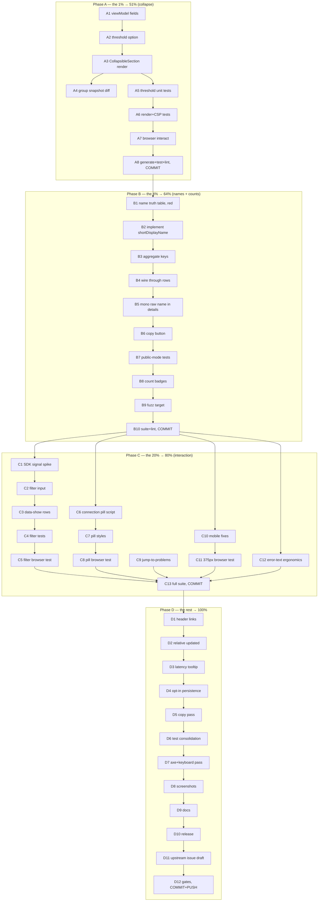

# Pareto Plan — Health Dashboard UI/UX (make `/admin/health` worth glancing at)

| | |
| --- | --- |
| **Date** | 2026-09-09 19:21 (CEST, via CLI) |
| **Subject** | `go-health-dashboard` rendered UI — `view.templ` (page shell, StatCards, LiveRegion), `dashboardContent` (alert → updated stamp → trend card → status-changes timeline → group tables), consumed live at `cv.home.lan/admin/health` |
| **Evidence base** | Live render (60 rows, all `pass`, all details `—`, one "Healthy Services" table of full Go type names); `view.templ` full read; `status.go` grouping (`failing → warning → healthy`, alphabetical); templ-components v1.11.0 component inventory (`collapsible_section`, `count_badge`, `relative_time`, `empty_state`, `tooltip`, `copy_button`, `page_header`); `go-health` `Check{Status, Error}` wire shape |
| **Goal** | Maximize operator signal-per-glance using the existing design system — NO visual redesign, NO dependency bumps, NO CSP regressions |
| **Anti-Verschlimmbesserung guardrails** | UI deps pinned (templ-components v1.11.0, go-datastar v0.4.0, `scripts/check-ui-pins.sh`); zero inline `<style>`/`style=` (`TestRender_NoInlineStyles`); every script carries nonce (`TestRender_AllScriptsCarryNonce`); browser suite green required for any render change (`startHeadlessChrome`, axe); public-mode masking intact; JSON content negotiation untouched; LiveRegion semantics preserved |

---

## 1. What the UI already gets right (do not touch)

- **Severity-first information architecture** — groups render failing → warning → healthy (`status.go:159-214`); the live page shows only "Healthy Services" *because everything is passing*, not because ordering is missing.
- **Real-time via Datastar SSE** with polite LiveRegion, `aria-busy` wiring, CSP-clean patches (`TestSSE_PatchContentHasNoInlineStyles`).
- **Dark mode, keyboard a11y, axe-audited markup, empty state** ("No registered services"), sparkline trend with pinned 0..1 scale, status-changes timeline.
- **SSE reconnection semantics** (initial-state-on-connect means no stale UI).

The problem is not the chassis. The problem is that the **default render for a healthy system is a wall of 60 identical rows of raw Go type names** — maximum pixels, zero signal. An operator cannot answer "is anything wrong?" faster than the alert banner already does, and the table actively hides the answer to "what exactly is monitored?"

## 2. Pareto breakdown

| Tier | Work | Result share | Why |
| --- | --- | --- | --- |
| **1%** | Collapse the healthy group behind a native `
` summary ("Healthy Services · 57 · all pass") | **51%** | The single change that converts the page from a wall into a dashboard. Green becomes one glanceable line; failures stay expanded above it by existing grouping. Uses upstream `display.CollapsibleSection` (native `
`, a11y + motion-reduce built in) — no new JS, CSP-clean, patch-safe (server re-derives open state per render; patches are rare under `PushOnChange`) |
| **4%** | 1% **+** human-readable service names (short display name; full type preserved as secondary line/tooltip + copy button) **+** count badges in group titles | **64%** | Names are the reading surface. `*github.com/LarsArtmann/CV/internal/features/healthdash/handlers.Handlers` → `handlers.Handlers` (module path dropped, `*` dropped, full name one hover/copy away) makes the table scannable and the full fidelity recoverable |
| **20%** | 4% **+** client-side filter box **+** live connection pill (live/reconnecting/offline) **+** "jump to problems" link **+** mobile table stacking | **80%** | The interaction layer: find-one-of-60, trust-the-stream, one-click triage on failure, and a page that works on a phone |
| **Remaining 20%** | Relative "Updated" stamp, latency-card tooltip, export/trend header links, per-row error expansion polish, collapse persistence (opt-in), empty-state copy, docs/screenshots, release | **100%** | Polish, discoverability of already-built endpoints (`/health/export`, `/health/trend`), and the documentation debt every UI change owes |

**Explicitly upstream (out of scope here):** per-check "since"/duration column requires `go-health.Check` to grow fields (currently `Status`+`Error` only) — file upstream, adopt later. Any templ-components/go-datastar bump requires the UI-pin ceremony (green browser suite) — deliberately not part of this plan.

---

## 3. Comprehensive plan (30–100 min tasks, impact order)

| #  | Task | Tier | Impact | Effort | Customer value | Depends on |
| -- | ---- | ---- | ------ | ------ | -------------- | ---------- |
| T1 | **Healthy-group collapse**: wrap healthy group table in `CollapsibleSection` (collapsed default when rows ≥ threshold), count in summary; failing/warning groups untouched | 1% | ★★★★★ | 60min | Instant is-it-ok glance | — |
| T2 | **Collapse policy option**: `WithHealthyGroupCollapse(threshold int)` + `WithHealthyGroupExpanded()` escape hatch; default threshold 8; wire through `Config` → `viewModel.HealthyCollapsed` | 1% | ★★★★ | 45min | Consumers keep control | T1 |
| T3 | **Display-name shortening**: `shortDisplayName(raw)` strips leading `*`, module path (`github.com/host/…`), keeps last two path segments + type; unit-table for 12 real-world shapes (CV list, aggregate `source/check` keys, public-mode interaction) | 4% | ★★★★★ | 90min | Scannable table | — |
| T4 | **Full-fidelity disclosure**: raw name as `title` attr + monospace second line in Details cell + `copy_button` for the full name; public mode keeps masking (short name also anonymized there) | 4% | ★★★★ | 60min | Trust without noise | T3 |
| T5 | **Group count badges**: `count_badge` in group titles ("Critical Failures · 2") | 4% | ★★★ | 30min | Magnitude at a glance | — |
| T6 | **Client-side filter**: search input above groups; filters rows by raw+short name via Datastar signals (`data-model`, `data-on-input`, `data-show`); hidden entirely when JS unavailable; CSP-safe (SDK already loaded by default) | 20% | ★★★★ | 100min | Find one of 60 in one keystroke | T4 |
| T7 | **Live connection pill**: header badge live/reconnecting/offline from Datastar SDK events with vanilla-JS fallback (`datastar-fetch` error events); nonce-carried inline script; respects motion-reduce | 20% | ★★★★ | 90min | Trust the stream | — |
| T8 | **Jump-to-problems**: when failing/warning groups exist, alert banner gains anchor link scrolling to first non-healthy group; hidden when all pass | 20% | ★★★ | 45min | One-click triage | — |
| T9 | **Mobile table stacking**: verify + fix table rendering ≤640px (name wraps, columns stack per templ-components table semantics); add 375px-viewport browser test | 20% | ★★★★ | 90min | Phone operators exist | — |
| T10 | **Error-text ergonomics**: failing rows show wrapped (not truncated) error text in mono; `relative_time` not applicable (no timestamps) — instead ensure long errors don't blow row height (max-height + expand) | 20% | ★★★ | 60min | Root cause visible without devtools | T4 |
| T11 | **Header discoverability**: links row under the updated stamp — Export CSV/JSON (`Routes.Export`), Trend JSON (`Routes.Trend`), Metrics (`Routes.Metrics`) — only when configured | rest | ★★★ | 45min | Endpoints people forgot exist | — |
| T12 | **Updated-stamp upgrade**: absolute → "Updated 16:43:44 UTC (2m ago)" via `relative_time` + keep absolute in `title` | rest | ★★ | 30min | Freshness felt | — |
| T13 | **Latency card honesty**: "Check Latency" → tooltip "Duration of the most recent probe batch (all services, cached every refresh interval)"; label stays short | rest | ★★ | 30min | Metric means something | — |
| T14 | **Collapse persistence (opt-in)**: `StorageKey` on the healthy CollapsibleSection guarded by an option (default off — patches re-close by design); verify against CSP + `TestRender_NoInlineStyles` | rest | ★★ | 60min | Preference sticks | T1, T2 |
| T15 | **Empty/degraded copy pass**: empty state, all-pass summary line, shutting-down banner text; sentence case, active voice ("3 services failing" not "Errors occurred") | rest | ★★ | 30min | Words that help | — |
| T16 | **Test debt for everything above**: unit (grouping/collapse/names), render assertions (nonce, no-inline-style, patches), browser suite (axe, mobile viewport, collapse interact, filter interact, pill states), fuzz target for `shortDisplayName` | rest | ★★★★★ | 100min | No Verschlimmbesserung | all |
| T17 | **Docs + release**: README options table, FEATURES, CHANGELOG entry, fresh screenshots (light+dark, env-guarded), version bump, release checklist | rest | ★★★ | 60min | Discoverability, honest docs | T16 |

## 4. Micro-task breakdown (≤12 min each, execution order)

Phase A = the 1% (ship this first, alone). Phase B = the 4%. Phase C = the 20%. Phase D = the rest. `nix run .#test` after every task marked ✅; `nix run .#lint` before commit.

| #   | Micro-task | Task | Min |
| --- | ---------- | ---- | --- |
| A1  | Add `HealthyCollapsed` + `HealthyCount` to `viewModel`; derive in `buildViewModel` (healthy rows ≥ threshold → collapsed) | T1/T2 | 12 |
| A2  | Add `Config.HealthyGroupCollapseThreshold` (default 8; 0 = always expanded) + `WithHealthyGroupCollapse(th)` option + doc comment | T2 | 12 |
| A3  | Render healthy group via `display.CollapsibleSection` (`Collapsed: vm.HealthyCollapsed`), summary = "All N services pass"; keep `display.Table` untouched inside | T1 | 12 |
| A4  | Failing/warning groups: assert render path unchanged (snapshot diff) | T1 | 8 |
| A5  | Unit: threshold boundary (7/8/9 rows), option overrides, collapsed flag in viewModel | T2 | 12 |
| A6  | Render test: collapsed `
` without `open` when healthy≥threshold; `open` present otherwise; nonce + no-inline-style assertions still pass ✅ | T1 | 12 |
| A7  | Browser test: click summary → table visible; SSE patch after toggle → state re-derived (documented behavior) | T1 | 12 |
| A8  | `templ generate` + full suite + lint ✅ — **commit Phase A** | all | 12 |
| B1  | Write the 12-case `shortDisplayName` truth table (CV names, aggregate `src/check`, single-word, empty, public-mode) as a Go table test first (red) | T3 | 12 |
| B2  | Implement `shortDisplayName`: trim `*`, drop `github.com/host/…` module prefix, keep last ≤2 segments + type name | T3 | 12 |
| B3  | Green the table; handle aggregate `source/check` keys (slash-preserving) | T3 | 12 |
| B4  | Wire `checkRow.Display` through `groupChecks`/`rowsToTableRows`; row shows short name, `title` attr = raw name | T3/T4 | 12 |
| B5  | Details cell: full raw name in mono `text-xs` second line (wrap anywhere, `break-all`) | T4 | 12 |
| B6  | Add `copy_button` for raw name (verify component nonce/a11y contract) | T4 | 12 |
| B7  | Public-mode: anonymized short display (extend existing `anonymizeViewModel` tests) ✅ | T4 | 12 |
| B8  | `count_badge` in the three group titles (only when >0) ✅ | T5 | 12 |
| B9  | Fuzz target `FuzzShortDisplayName` (no panic, never returns empty, deterministic) added to seed suite ✅ | T3 | 12 |
| B10 | `templ generate` + suite + lint ✅ — **commit Phase B** | all | 12 |
| C1  | Spike: confirm Datastar SDK `data-on-input`/`data-model-search` signal names on the pinned v0.4.0 bundle (grep embedded static SDK) | T6 | 12 |
| C2  | Filter input markup (`type="search"`, label, `data-model` query signal, `aria-controls` to table region); hidden via `<noscript>` inverse? → render only when `DatastarSrc != ""` | T6 | 12 |
| C3  | Row-level `data-show` expression matching short+raw name case-insensitively; empty-result row ("No services match '<q>'") | T6 | 12 |
| C4  | Unit/render tests for filter markup presence/absence; CSP assertions ✅ | T6 | 12 |
| C5  | Browser test: type filter → rows narrow; clear → all back; axe re-run on filtered state | T6 | 12 |
| C6  | Connection pill markup: `` default; script listens for SDK/fetch error events → `reconnecting`/`offline`; nonce-carried, idempotent attach pattern (copy theme-toggle's guard) | T7 | 12 |
| C7  | Pill CSS via classes only (no `style=`): green/amber/red dot + label; `motion-reduce` safe | T7 | 8 |
| C8  | Browser test: server up → pill "live"; kill SSE route (404) → pill "offline"; restore → "live" ✅ | T7 | 12 |
| C9  | Jump-to-problems: anchor ids on group cards; alert renders `<a href="#group-failing">2 failing · jump</a>` when non-healthy groups exist; hidden otherwise ✅ | T8 | 12 |
| C10 | Mobile: run browser suite at 375×667; capture table overflow; apply stacking/wrap fixes via classes; `scroll` containment for code-ish cells | T9 | 12 |
| C11 | Mobile browser test (375px viewport) with name+details assertions ✅ | T9 | 12 |
| C12 | Error text: failing row details cell renders full error, `max-h` + expand control, `break-words` ✅ | T10 | 12 |
| C13 | `templ generate` + full suite + browser suite + lint ✅ — **commit Phase C** | all | 12 |
| D1  | Header links row (Export/Trend/Metrics) behind route-presence ✅ | T11 | 12 |
| D2  | `relative_time` for Updated stamp + absolute in `title` ✅ | T12 | 12 |
| D3  | Latency StatCard tooltip (component `tooltip`) with honest copy ✅ | T13 | 12 |
| D4  | Opt-in `StorageKey` persistence behind `WithPersistCollapse()`; verify CSP-clean + patch interplay ✅ | T14 | 12 |
| D5  | Copy pass: empty state, all-pass summary, shutting-down banner (sentence case, active voice) ✅ | T15 | 12 |
| D6  | Consolidate all new unit tests; kill duplicated assertions; coverage floor holds ✅ | T16 | 12 |
| D7  | Browser suite full pass: axe (zero new violations), keyboard-only pass over new controls ✅ | T16 | 12 |
| D8  | Screenshots: light+dark, healthy+degraded fixtures, `SCREENSHOT_OUTPUT` env flow ✅ | T17 | 12 |
| D9  | README options table + "reading the dashboard" section; FEATURES/CHANGELOG entries | T17 | 12 |
| D10 | Version bump + release checklist (`docs/release-checklist.md`); `nix flake check` ✅ | T17 | 12 |
| D11 | Upstream prep: draft go-health issue for `Check.Since`/`Duration` (verify-before-filing: re-read `types.go`, cite wire shape) | T17 | 12 |
| D12 | Final: `nix run .#build && nix run .#test-race && nix run .#lint && nix run .#vulncheck` ✅ — **commit + push** | all | 12 |

(A1–D12: 39 micro-tasks ≈ 7.5h focused work; Phases A and B alone ≈ 2.5h and carry 64% of the value.)

## 5. Execution graph

## 6. Verification strategy (the anti-Verschlimmbesserung contract)

1. **Every phase ends green**: `nix run .#build && nix run .#test` (+ lint; race at D12). Browser tests go through `startHeadlessChrome` (serialized), axe must report zero new violations, keyboard-only pass over new interactive elements.
2. **CSP invariants are load-bearing**: after each render-touching task, `TestRender_NoInlineStyles` + `TestRender_AllScriptsCarryNonce` + `TestSSE_PatchContentHasNoInlineStyles` must pass; the browser suite serves under strict CSP and asserts runtime DOM cleanliness.
3. **Patches are rare by design** (`PushOnChange`): collapse state is server-derived; the documented behavior "an SSE patch re-applies the default collapse state" is asserted in A7, not accidentally discovered.
4. **Public mode re-tested** after the name work (B7): short names must pass through the same anonymization as raw ones.
5. **No dependency movement**: `scripts/check-ui-pins.sh` stays green; if a component needs an upstream fix, that becomes a pinned-bump task with its own browser-suite ceremony — never a silent sweep.

## 7. Deliverables

- Phase A PR/commit: collapsed healthy group (the 51%).
- Phase B commit: readable names + counts (to 64%).
- Phase C commit: filter, connection pill, jump link, mobile (to 80%).
- Phase D commit: polish, docs, release (to 100%), plus the drafted upstream `go-health` check-metadata issue.
