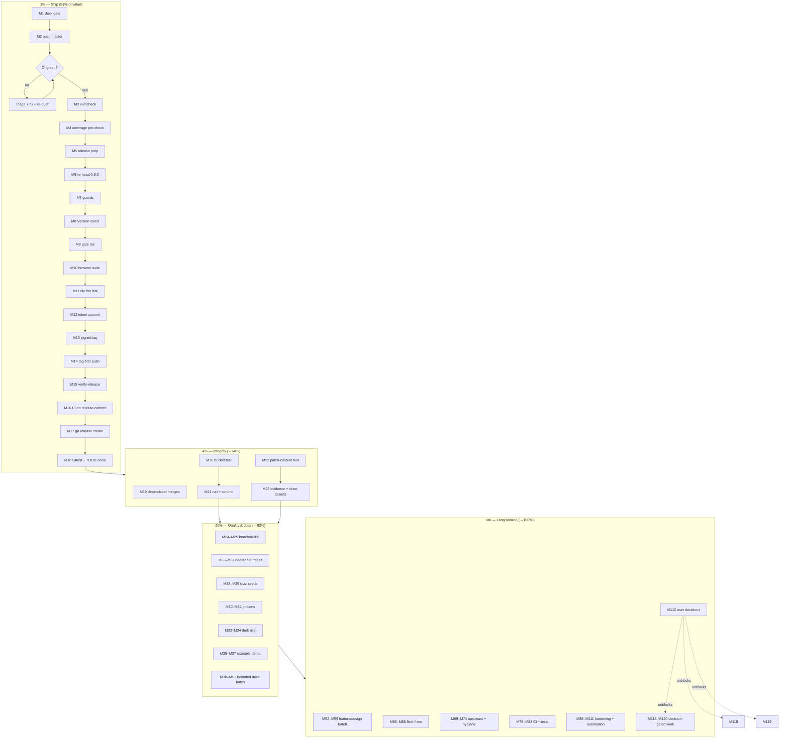

# Pareto Plan — v0.9.0 Release & Full-Backlog Execution

**Date**: 2026-09-17 09:04 CEST
**Input**: `TODO_LIST.md` (24 Next Up + 10 Blocked rows), ROADMAP raw ideas, open items from the
2026-09-16/17 status reports, and the docs-health audit's findings (same morning).
**Goal**: ship the three sessions of verified-but-invisible work (v0.9.0), then spend the released
momentum on the trust/test batch, then the long tail — without Verschlimmbessern anything.
**Format note**: the pareto-planning skill's canonical output is a styled HTML report; the user
explicitly requested `.md` with a mermaid/d2 graph at a `.md` path, so Markdown was used (same
override pattern as the status reports).

---

## Anti-Verschlimmbesserung guardrails (load-bearing — read before executing)

| # | Guardrail | Why it exists |
| - | --------- | ------------- |
| G1 | Desk gate first: `bash scripts/pre-push-checks.sh` BEFORE any edits (gate 0) | The v0.8.0→v0.8.1 incident: the FEATURES drift guard is its check #1 |
| G2 | `nix fmt` AFTER the last `templ generate`; never pipe gates (`cmd > log; rc=$?`) | v0.7.0 fumble d-2; v0.8.0 near-miss false green |
| G3 | `Version` const + tag in the SAME commit; tag-first push; CI green BEFORE `gh release create` | version-guard job; the v0.8.0 red-CI release page |
| G4 | No UI-dependency movement without the full browser suite + same-change guard-pin update | Six unguarded sweeps caught by `scripts/check-ui-pins.sh` |
| G5 | CSP invariants after ANY render touch: `TestRender_NoInlineStyles`, `TestRender_AllScriptsCarryNonce`, `TestSSE_PatchContentHasNoInlineStyles`, then the browser suite | The suite exists because the unit suite cannot see CSP/runtime regressions |
| G6 | Commit beats the daemon: verify batch → `git add` + commit in the same tool-call chain | v0.7.0 (`ebf52d0`), 2026-09-16 ×2, 2026-09-17 ×2 — five documented instances |
| G7 | Docs-health conventions: done items go to CHANGELOG never TODO_LIST; historical docs are annotate-only; harvest cites report + code | The split-brain class |
| G8 | Don't "fix" the deliberate non-fixes (go-auto-upgrade samber/lo suggestions, jscpd test scaffolding, go-humanize-linter); don't unskip the three BuildFlow gates (fleet-blocked); WebSocket stays rejected; probes stay JSON-only | Recorded non-goals in ROADMAP/AGENTS |
| G9 | Screenshots/browser tests only via the env-guarded suite (`startHeadlessChrome` serialized); fuzz via `GOEXPERIMENT=jsonv2 go test -fuzz … -fuzztime 60s .` | Platform gotchas |
| G10 | JSON `/health` contract stays go-health-shaped (byte-stable); HTML-only evidence stays HTML-only pending the posture decision | Documented wire-stability decisions |

---

## Step 1 — Pareto breakdown

**1% → 51%: SHIP WHAT IS ALREADY BUILT.** Three sessions of verified work (per-check metadata UI +
duration gauge, erraudit hardening, buildflow green run, full docs audit) sit in `[Unreleased]` and
unpushed commits. Two actions deliver ~all of it: **push master** and **cut v0.9.0**. Nothing else on
this board creates user value faster.

**4% → 64%: 1% + RELEASE INTEGRITY.** The release is only as trustworthy as its gate: vulncheck on the
bumped tree, the coverage pre-check vs the CI floor, the three green dependabot PRs (CI hygiene), the
histogram regression test, and regenerated screenshots that actually show the feature being released.

**20% → 80%: + THE QUALITY-AND-TRUST BATCH.** The tests that lock behavior against regression
(patch-content, goldens, aggregate transit, fuzz seeds, dark axe) and the bounded docs that stop the
same questions recurring (SECURITY.md, Upgrading, CONTRIBUTING guards, CHANGELOG audit, dep-bump
checklist, DOMAIN_LANGUAGE terms).

**Remaining 20% → 100%: THE LONG TAIL.** Design-gated features (timeline-from-Since → stable-group
collapse, per-source staleness), evidence evolution (blocked on the posture decision), fleet fixes
(BuildFlow DAG, structure-linter pin, branching-flow scoping), upstream filings, CI automation, and the
ten user-decision rows. Sorted; several cannot start without decisions (g).

---

## Step 2 — Comprehensive plan (27 tasks, 30–100 min, ALL todos)

| # | Tier | Task | Time | Impact | Risk | Value | Depends |
| - | ---- | ---- | ---- | ------ | ---- | ----- | ------- |
| C1 | 1% | Push master (desk gate → push → watch CI green) | 10min | ★★★★★ | Low | High | — |
| C2 | 1% | Cut v0.9.0: re-head CHANGELOG, blurb, `Version = "0.9.0"`, gates, fmt, commit, signed tag, tag-first push, `verify-release.sh`, CI green, `gh release create` | 60min | ★★★★★ | Med | High | C1, G1–G3 |
| C3 | 4% | `nix run .#vulncheck` on the v0.2.0 tree (before the cut, per checklist) | 5min | ★★★★ | Low | Med | — |
| C4 | 4% | Local coverage pre-check (`nix run .#coverage`) vs the 78% floor | 10min | ★★★ | Low | Med | — |
| C5 | 4% | Merge the three green dependabot PRs (#13/#12/#4), then confirm CI on master | 15min | ★★★ | Low | Med | C1 |
| C6 | 4% | Regenerate README screenshots (light + dark) showing per-check metadata; eyeball both PNGs | 30min | ★★★★ | Low | High | C2 (tag content) or post-cut |
| C7 | 4% | Histogram bucket-count regression test (`len(buckets) == len(latencyBucketBounds)`) | 15min | ★★★ | Low | Med | — |
| C8 | 20% | Patch-content test: SSE patch payload carries the metadata line (content-level, not just CSP-clean) | 30min | ★★★★ | Low | High | — |
| C9 | 20% | Benchmark the per-tick stamping loop (`BenchmarkHandler_HTMLRendering` before/after) + record in research doc | 30min | ★★★ | Low | Med | — |
| C10 | 20% | Integration test: metadata transits the aggregate path (stub aggregate + detailed sources → rendered row) | 45min | ★★★ | Low | Med | — |
| C11 | 20% | Fuzz seeds for `formatCheckDuration`/`formatStateAge` (negative, huge, sub-µs) + one 60s fuzz run | 30min | ★★★ | Low | Med | — |
| C12 | 20% | Golden fixtures: public-mode + dark + zero-proven-warning wording lock | 45min | ★★★★ | Med | High | G5 |
| C13 | 20% | Dark-mode axe pass (structural a11y in dark) | 30min | ★★★ | Low | Med | — |
| C14 | 20% | Example server: `NewWithDetailedCheck`-style source so the demo shows durations (+ footer Version + shutdown-path exercise) | 45min | ★★★ | Low | High | — |
| C15 | 20% | SECURITY.md with a vulnerability-reporting contact | 15min | ★★★ | Low | High | — |
| C16 | 20% | README "Upgrading" section (v0.7.0 `WithBasePath` behavior change migration note) | 20min | ★★★ | Low | Med | — |
| C17 | 20% | CONTRIBUTING: document the four guard scripts (changelog lint, pins, drift guard, desk gate) | 20min | ★★★ | Low | Med | — |
| C18 | 20% | CHANGELOG historical audit: relocate misplaced `[0.1.0-alpha]` bullets, verify every section against its tag | 30min | ★★ | Low | Med | — |
| C19 | 20% | Dep-bump verification checklist, written down (AGENTS section or `scripts/verify-dep-bump.sh`) | 30min | ★★★ | Low | Med | — |
| C20 | 20% | DOMAIN_LANGUAGE: evidence/proven/unproven/observation-window + bootstrap/stacking/contrast terms | 20min | ★★ | Low | Low | — |
| C21 | 20% | ROADMAP: define v1.0 criteria (API freeze / consumer count / compat policy) | 20min | ★★★ | Low | Med | — |
| C22 | 20% | Evidence tooltips cite `Check.Since` alongside the observed last non-pass | 45min | ★★★ | Med | Med | G5 |
| C23 | tail | Design: timeline fed by `Check.Since` + stable-group "stable for 6h" collapse (design doc first: restart semantics) | 60min | ★★★ | Low | Med | — |
| C24 | tail | Fleet: BuildFlow generator-before-nix ordering + result-cache config keys + unskip ritual | 100min | ★★★★ | Med | Med | their repo |
| C25 | tail | Fleet: go-structure-linter release + pin bump → flip `flat` preset → remove repo skip | 60min | ★★★ | Med | Low | their repo |
| C26 | tail | Fleet: branching-flow nolint support + rule exclusions + severity revisit → unskip + re-triage 43 findings | 100min | ★★★ | Med | Low | their repo |
| C27 | tail | User-decision gates batch: tag protection, branch protection, daemon protocol, worktrees, push cadence, CV adoption, copy affordance, build-tag gating, fingerprint stability, evidence posture, pin-guard KEEP, AGENTS prune mandate | 30min | ★★★★ | — | High | user (g) |

**Everything else from the board is folded into the micro plan below** (upstream filings, CI
automation, boundary tests, race-stress, benches, leak-scanner, keyboard smoke, client_golang spike,
watchdog gauge, rate-limit headers, SSE counters, Register auto-start, tag grouping, reconcile
items…) — nothing dropped, nothing silently de-scoped.

## Step 3 — Micro plan (≤12 min each, ALL todos, execution order)

| # | Task | Min | C-task |
| - | ---- | --- | ------ |
| M1 | `git status` clean-check + `bash scripts/pre-push-checks.sh` (desk gate; assert all green) | 5 | C1 |
| M2 | Push master (`git push`); open the Actions run; confirm 7 jobs green | 5 | C1 |
| M3 | `nix run .#vulncheck`; record result (expect: no vulnerabilities) | 5 | C3 |
| M4 | `nix run .#coverage`; compare vs 78% floor; note delta | 10 | C4 |
| M5 | Reconcile TODO_LIST release rows → v0.9.0 cut plan; re-read checklist §1–§3 | 10 | C2 |
| M6 | CHANGELOG: re-head `[Unreleased]` → `[0.9.0] - <today>` + 3–5 line blurb + fresh empty `[Unreleased]` | 10 | C2 |
| M7 | `bash scripts/check-changelog.sh` + pin guard + FEATURES count check (guards after edits) | 5 | C2 |
| M8 | Bump `const Version = "0.9.0"` in dashboard.go; update FEATURES Released row; verify with `rg` | 5 | C2 |
| M9 | Full gate tail: build → test-race → lint → vet → flake check (teed, no pipes) | 12 | C2 |
| M10 | Browser suite (`nix develop -c go test -run TestBrowser`) — render unchanged but release ritual | 12 | C2 |
| M11 | `nix fmt` (after the last generate); re-run flake check | 5 | C2 |
| M12 | Commit `chore(release): v0.9.0 — per-check metadata` immediately (G6); verify daemon didn't race | 5 | C2 |
| M13 | Signed annotated tag `git tag -a v0.9.0 -m "…"`; `git tag -v` check | 5 | C2 |
| M14 | Push TAG first, then master; confirm version-guard green on the master run | 5 | C2 |
| M15 | `bash scripts/verify-release.sh v0.9.0` (teed; poll loops for slow surfaces) | 12 | C2 |
| M16 | CI-green confirmation on the release commit (full SHA in `gh run list --commit`) | 5 | C2 |
| M17 | Extract `[0.9.0]` notes → `gh release create v0.9.0 --title v0.9.0 --notes-file …` (Latest) | 10 | C2 |
| M18 | `gh release list` + `gh api …/releases/latest` sanity: v0.9.0 is Latest; TODO_LIST release rows closed | 5 | C2 |
| M19 | Merge dependabot #13, #12, #4 (`gh pr merge`); confirm CI on master after | 10 | C5 |
| M20 | Histogram regression test: write `TestLatencyHistogram_BucketCountMatchesBounds` | 12 | C7 |
| M21 | Run new test + full suite; commit intent (`test: …`) | 5 | C7 |
| M22 | Patch-content test: capture an SSE patch body in a test, assert the metadata line present | 12 | C8 |
| M23 | Extend to evidence strip line + since text (one test, three assertions); run; commit | 12 | C8 |
| M24 | Benchmark run: `go test -bench BenchmarkHandler_HTMLRendering -benchmem` (before-numbers already recorded) | 10 | C9 |
| M25 | Stamp-loop micro-bench if numbers warrant; append results to `docs/research/2026-09-10_benchmarks.md`; commit | 12 | C9 |
| M26 | Aggregate metadata integration test: stub aggregate + `DetailedHealthRecorder` sources | 12 | C10 |
| M27 | Assert rendered row carries since/duration through `aggregate`; run; commit | 12 | C10 |
| M28 | Fuzz seeds: add hostile cases to `fuzz_test.go` seed corpus for the two formatters | 12 | C11 |
| M29 | `go test -fuzz FuzzShortDisplayName -fuzztime 60s` + FingerprintChecks run; record; commit | 12 | C11 |
| M30 | Golden: public-mode fixture builder (`-golden-update` flow with `WithPublicMode` page) | 12 | C12 |
| M31 | Golden: dark-mode fixture + zero-proven warning state fixture; review diffs line-by-line | 12 | C12 |
| M32 | `rg 'title=""'` + CSP asserts on new goldens; run suite; commit | 5 | C12 |
| M33 | Dark-mode axe: extend `TestBrowser_Accessibility` to toggle dark and re-run axe | 12 | C13 |
| M34 | Fix any serious/critical findings (or document tolerance with evidence); commit | 12 | C13 |
| M35 | Example: wire a `DetailedHealthRecorder`-backed service into `example/main.go` | 12 | C14 |
| M36 | Example: render `dashboard.Version` in a footer line; exercise shutdown log via SIGTERM | 12 | C14 |
| M37 | Example README rows update (new toggle if any); commit | 10 | C14 |
| M38 | SECURITY.md: reporting contact, supported versions, 90-day disclosure note | 12 | C15 |
| M39 | Link SECURITY.md from README (Badges/Support section); commit | 5 | C15 |
| M40 | README "Upgrading": v0.7.0 WithBasePath note + fingerprint note + v0.2.0 metadata note | 12 | C16 |
| M41 | Review pass + link sweep; commit | 8 | C16 |
| M42 | CONTRIBUTING: "Guard scripts" section (what each checks, why it fails, how to run locally) | 12 | C17 |
| M43 | CONTRIBUTING: desk-gate + release-checklist pointer; commit | 8 | C17 |
| M44 | CHANGELOG audit: diff each historical section against its tag's actual content | 12 | C18 |
| M45 | Relocate the misplaced `[0.1.0-alpha]` bullets; verify section ordering; changelog lint; commit | 12 | C18 |
| M46 | Dep-bump checklist: draft the fixed list (build, test, race, lint, buildflow, vulncheck, coverage, bench, docs) | 12 | C19 |
| M47 | Land as AGENTS.md dependency-note bullet OR `scripts/verify-dep-bump.sh` (pick per fleet answer); commit | 12 | C19 |
| M48 | DOMAIN_LANGUAGE: evidence terms (proven/unproven/observation window) | 12 | C20 |
| M49 | DOMAIN_LANGUAGE: bootstrap/stacking/contrast terms; commit | 8 | C20 |
| M50 | ROADMAP: v1.0 criteria section (freeze, consumers, compat policy) | 12 | C21 |
| M51 | Cross-link from README ("Stability" note); commit | 8 | C21 |
| M52 | Evidence tooltips: extend `badgeEvidenceTitle` to include `Check.Since` when present | 12 | C22 |
| M53 | Update evidence tests + goldens; browser suite; commit | 12 | C22 |
| M54 | Timeline-from-Since design doc: restart semantics, aggregates, reset behavior | 12 | C23 |
| M55 | Stable-group collapse design (ages from Since) + ROADMAP update; commit | 12 | C23 |
| M56 | Per-source staleness design note (Since-based, aggregate worst-of) | 12 | — |
| M57 | `/health/export` since/duration: design note (wire-stability tradeoffs) | 12 | — |
| M58 | deploy/ audit: inventory Grafana/monitoring assets; note gauge-panel gap | 10 | — |
| M59 | Grafana panel JSON for the duration gauge (if assets exist) | 12 | — |
| M60 | Fleet (their repo): BuildFlow DAG ordering change + regression test | 12 | C24 |
| M61 | Fleet: result-cache keys include project config files | 12 | C24 |
| M62 | Fleet: templ-generate skip-if-unchanged option | 12 | C24 |
| M63 | Fleet: findings-gate semantics doc + history verdict field | 12 | C24 |
| M64 | Fleet: after B-land, re-verify both skipped tools here; delete the three skip entries; TODO rows closed | 12 | C24 |
| M65 | Fleet: go-structure-linter release with `LoadProjectConfig` in `Lint()` | 12 | C25 |
| M66 | Fleet: bump BuildFlow pin; flip `presets: [flat]` effective; remove repo skip + TODO row | 12 | C25 |
| M67 | Fleet: branching-flow `//nolint` in phantom/boolblind; rule exclusions schema | 12 | C26 |
| M68 | Fleet: severity defaults revisit; unskip here; re-triage the 43 findings | 12 | C26 |
| M69 | templ upstream: verify current templ output vs gofumpt; file issue or AGENTS pin-note | 12 | — |
| M70 | erraudit filings: `strings.Cut` FP (with suppression-workaround note) | 12 | — |
| M71 | erraudit filings: `nolint-audit ./...` silent no-op; binary-freshness check idea | 12 | — |
| M72 | `~/go/bin` prune: audit each tool vs repo HEAD; rebuild or remove; rotate `/tmp/bf-*.log` | 12 | — |
| M73 | BuildFlow on-demand steps once: `-s gitleaks` + `-s codespell`; record | 12 | — |
| M74 | `buildflow timings --regressions` baseline of the 2026-09-16 fixes | 10 | — |
| M75 | CI: actionlint both workflow files; fix findings | 12 | — |
| M76 | CI: `nix flake check` job + Go version matrix (two latest 1.26.x) | 12 | — |
| M77 | CI: auto-draft GitHub Release from CHANGELOG section on tag push | 12 | — |
| M78 | CI: upload browser screenshots as artifacts (+ dark-degraded capture variant) | 12 | — |
| M79 | CI: Dependabot config grouping the templ-components family modules | 10 | — |
| M80 | Boundary tests: `WithTrend(1)`, export `Accept: text/csv;q=0.8`, retry large values | 12 | — |
| M81 | Boundary tests: `WithBasePath` edges (`""`, `"/"`, trailing slash, `/a/b`) + sub-ms retry validation | 12 | — |
| M82 | Race-stress: 50 concurrent SSE clients vs `SubscriberCount` consistency | 12 | — |
| M83 | Webhook delivery-ordering test under concurrent transitions | 12 | — |
| M84 | Heartbeat-goroutine leak test on Shutdown/broadcaster close | 12 | — |
| M85 | Benchmarks: `renderPatch` retry-stamping overhead + `BenchmarkHealthCheck` | 12 | — |
| M86 | Mutation-test spot check on `fingerprintChecks` (survives ⇒ assertions real) | 12 | — |
| M87 | Public-mode leak-scanner test (grep rendered HTML for registered service names) | 12 | — |
| M88 | Keyboard-navigation a11y smoke (tab order, visible focus on new controls) | 12 | — |
| M89 | Browser test: metrics endpoint under strict CSP | 12 | — |
| M90 | Browser: `WithRetryInterval` × max-connection-lifetime interplay | 12 | — |
| M91 | Browser-suite startup latency: measure serialized launches vs the 45s timeout | 12 | — |
| M92 | Load test: env knobs beyond 20×3 fixture; re-run with evidence enabled; record | 12 | — |
| M93 | Fuzz targets batch 1: CSV exporter + `RecommendedCSP` injection | 12 | — |
| M94 | Fuzz targets batch 2: introspection marshal + view-model `buildData` + evidence text | 12 | — |
| M95 | Spike: `client_golang` bridge (recommendation: stay zero-deps unless demand) | 12 | — |
| M96 | Feature: watchdog gauge `dashboard_pusher_last_tick_seconds` (report-only stays) | 12 | — |
| M97 | Feature: rate-limit `X-RateLimit-*` response headers | 12 | — |
| M98 | Feature: connection-limit 503 Retry-After + `dashboard_sse_connections_opened/closed_total` | 12 | — |
| M99 | Feature: optional slog request-logging middleware (`WithRequestLogger`) | 12 | — |
| M100 | Feature: per-route stricter CSP option for `/health` | 12 | — |
| M101 | Lifecycle: `Register` auto-start via do container (design + spike) | 12 | — |
| M102 | Grouping: custom tags/labels design note (severity + source + tags) | 12 | — |
| M103 | Unit-test the version-guard grep logic (script drift protection) | 12 | — |
| M104 | Example build smoke in CI (`go build ./example` + flag parse) | 10 | — |
| M105 | doc.go: webhook+public-mode combo example; `WithBasePath` example | 12 | — |
| M106 | Amend the bisect-wall audit (new daemon scars since 2026-09-04) | 12 | — |
| M107 | Nightly job: verify a GitHub Release page exists for every tag | 12 | — |
| M108 | Test guarding CHANGELOG compare links (one per version heading) | 12 | — |
| M109 | Coverage push >80% (targeted tests), then raise the CI floor | 12 | — |
| M110 | Spike: deprecate `WithNonce` in favor of `WithNonceExtractor` (deprecation policy draft) | 12 | — |
| M111 | Reconcile: ROADMAP mirror-check (TODO_LIST ↔ Themes agree); docs-health HARVEST of this plan | 12 | — |
| M112 | User-decision batch: answers to g-questions; update BLOCKED rows + ROADMAP Open Questions | 30* | C27 |
| M113 | AGENTS.md prune pass (dedicated; move decision narratives to docs/decisions/) | 12×N | C27 |
| M114 | CV-side adoption: bump CV go.mod + deploy + verify live page (after pipeline answer) | 12×N | C27 |
| M115 | Copy affordance: implement chosen design (Datastar clipboard action or keep title-attr) | 12×N | C27 |
| M116 | Build-tag gating: implement the accepted option (gate / fork / accept-doc-only) | 12×N | C27 |
| M117 | Fingerprint stability: version or re-document per decision | 12 | C27 |
| M118 | Evidence posture: implement machine contract / persistence per decision | 12×N | C27 |
| M119 | Webhook HMAC (`WithWebhookSecret` → `X-Signature`) + `"schema":1` (after appetite decision) | 12×N | C27 |
| M120 | Incident annotations (deferred — only with product thought; keep parked otherwise) | 12 | — |

\* starred = spans multiple micro-sessions; the 12-min slice is the first step. Fleet items (M60–M68)
execute in their own repos per the guardrail G8.

## Step 4 — Execution graph

**Parallelism**: after P0's push (M2), P1's test tasks (M20–M29) and P2's docs batch (M38–M51) are
independent of the release chain and can interleave while tag propagation/CI runs. The release chain
(M5–M18) is strictly serial. Nothing in P2/P3 may land on the release tag's commit (G3 ordering).

## Deliberate non-goals during execution (G8 — do NOT "fix")

- go-auto-upgrade's samber/lo suggestions (zero-runtime-deps policy); jscpd test-scaffolding findings;
  go-humanize-linter suggestions; the three BuildFlow skip gates until the fleet fixes land (M60–M68);
  WebSocket transport (spike rejected); Accept-negotiation on kubelet probes; HTMX (removed by design);
  database-backed history (non-goal — the trend ring is bounded view state); annotating/rewriting
  archived history beyond inline dispositions.

## Bookkeeping

- This plan is a point-in-time snapshot: `TODO_LIST.md` stays the living source. On execution, closed
  items move to CHANGELOG (docs-health rules); on plan staleness, docs-health ANNOTATE — never rewrite.
- New tasks surfaced while executing land in TODO_LIST first, then here only if the plan is re-issued.
