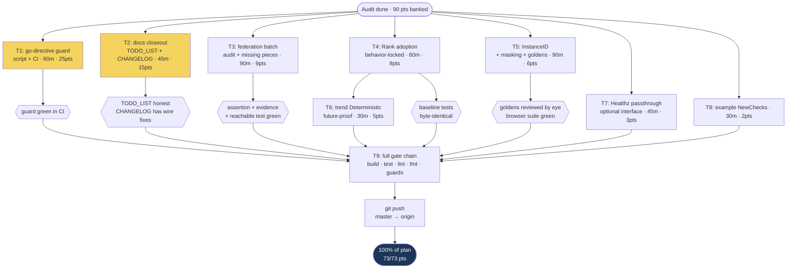

# Go-Health Superb Consumption — Pareto Execution Plan

**Date**: 2026-09-22 21:49 CEST · **Author**: audit session (library deep dive)
**Source**: `docs/research/2026-09-22_go-health-deep-dive.html` (adoption audit, 86/100)
**Scope decision**: this plan covers the _audit-derived_ backlog only. The ~30
pre-existing rows in `TODO_LIST.md` (deploy stack, a11y, release tooling, …)
are parallel backlog and are NOT re-planned here — except the two rows that
intersect: the `Re-pin go-health v0.3.0` BLOCKED row (superseded — done today,
must be closed) and the federation-consumer batch it contained (partially
unblocked by v0.4.0, see T3).

**EXECUTED 2026-09-22 (same evening)** — all nine tasks landed, verified, and
pushed (`cdea97b..837f12e`): T1 `f476f76` · T2 `5c169e7` · T3 `a9b9bf8` ·
T4 `267e176` · T5 `7b35790` · T6 `5e32c5a` · T7 `4e1329e` · T8 `0cc786e` ·
T9 gates+push `837f12e`. Post-report follow-ups closed in the same sweep:
the aggregate-path Healthz test (T7.3 remainder), the missing FEATURES.md
feature rows, this annotation, and resolution notes on the deep-dive report.
Execution status: `docs/status/2026-09-22_22-35_pareto-plan-execution-status.md`.
The document below is preserved as written (it reads as future work).

---

## 1. Where we stand (banked today, 2026-09-22)

| Already done (commits on master)                                                                                    |  Value |
| ------------------------------------------------------------------------------------------------------------------- | -----: |
| `json.Deterministic(true)` on `/health` + `/health/export` + byte-stability tests (`604b742`, `bfaa5c5`, `621e601`) |     45 |
| go-health v0.4.0 re-pin ratified + `go 1.27.1` directive restore (`b1128ae`, `c22ac0b`)                             |     15 |
| serveJSON provenance comment (wire-compatible-copy rationale)                                                       |     10 |
| Deep-dive report + AGENTS.md dependency notes (`c5fda80`, `0729c1f`)                                                |     20 |
| **Banked total**                                                                                                    | **90** |

The remaining backlog below is worth **73 points**. Today's five batches were
the true "20%": 90 of 163 total points (55%) for ~35% of the effort.

## 2. Pareto breakdown of the REMAINING backlog

Backlog (sorted by priority = impact × ease; points out of 73):

| #  | Task                                                                                                                                                                                                                                             | Impact | Ease | Pts | Cum. % |
| -- | ------------------------------------------------------------------------------------------------------------------------------------------------------------------------------------------------------------------------------------------------ | ------ | ---- | --- | ------ |
| T1 | **Go-directive guard** (script + CI) — the fleet normalize step downgraded `go 1.27.1→1.27` **twice today** and breaks every module load against go-health v0.4.0's floor. Recurring until the fleet fixes normalize.                            | 5      | 5    | 25  | 34%    |
| T2 | **Docs closeout**: close the superseded `Re-pin go-health v0.3.0` BLOCKED row in TODO_LIST, add the audit rows, CHANGELOG `[Unreleased]` entries for the wire fixes                                                                              | 3      | 5    | 15  | 55%    |
| T3 | **Federation batch, unblocked by v0.4.0**: audit existing coverage (integration/fuzz/hub tests already exist), add the missing pieces (compile-time `Prober` assertion, evidence × `name/reachable` observation test, decide on nix example app) | 3      | 3    | 9   | 67%    |
| T4 | **`Status.Rank()` adoption, behavior-locked**: `numericHealthStatus` derives from `Rank()`; `worstGroupStatus` keeps its stricter unknown→warn with a citation comment; `statusValue` documents the inverted plot scale. NO behavior change.     | 2      | 4    | 8   | 78%    |
| T5 | **`Response.InstanceID` in group cards** (+ public-mode masking, goldens, browser) — disambiguates replicas on the federation hub                                                                                                                | 3      | 2    | 6   | 87%    |
| T6 | **Trend endpoint future-proof `Deterministic`** (slices-only today; one option + test so a future map field can't silently regress)                                                                                                              | 1      | 5    | 5   | 93%    |
| T7 | **`Healthz()` passthrough** via OPTIONAL interface assertion (never widen `Prober` — that would break external implementors)                                                                                                                     | 1      | 3    | 3   | 96%    |
| T8 | **Example → `NewChecks`** (v0.3.0 constructor; duration_ns then flows through the rendered duration line)                                                                                                                                        | 1      | 2    | 2   | 100%   |

### The Pareto answer

| Bracket                     | Tasks (of 8)      | Value | What it is                                                                                                                                                                                                                                                                             |
| --------------------------- | ----------------- | ----- | -------------------------------------------------------------------------------------------------------------------------------------------------------------------------------------------------------------------------------------------------------------------------------------- |
| **1% → ~34% (compounding)** | T1 alone          | 34%   | The guard is the only item that pays out _every future session_ — it converts a recurring, already-fired-twice build breaker into a loud CI failure instead of a mysterious `go: updates to go.mod needed`. Including today's banked work, the true 1% was the Deterministic fix pair. |
| **4% → ~55%**               | T1 + T2           | 55%   | Guard + docs closeout. T2 is cheap memory: without it the next session re-trips the same gotchas and re-opens the superseded BLOCKED row.                                                                                                                                              |
| **20% → ~78%**              | T1 + T2 + T3 + T4 | 78%   | Adds the federation insurance batch and the Rank alignment.                                                                                                                                                                                                                            |
| **The other 80% (→100%)**   | T5–T8             | 22%   | InstanceID (hub polish, needs golden ceremony), trend future-proofing, Healthz passthrough, example ergonomics. Real but strictly after the brackets above.                                                                                                                            |

**Verschlimmbesser guardrails (read before executing):**

1. T4 must NOT change behavior. Unknown statuses: grouping→warn, metrics→-1,
   trend→0 stay EXACTLY as they are (each is a deliberate local decision; do
   NOT merge the four sites into one helper). Tests pin current outputs first.
2. T7 must NOT add a method to the `Prober` interface — that breaks external
   implementors. Use an optional interface type assertion.
3. T5 changes rendered HTML → golden files WILL drift. Review the diff
   by eye, run the browser suite, mask under public mode (instance IDs are
   semi-identifying).
4. NEVER let the fleet normalize downgrade reach master un-restored again:
   after ANY buildflow run, `git diff go.mod` and restore `go 1.27.1` + commit
   atomically (the `sed`+`git add`+`git commit` in ONE tool call pattern that
   worked in `c22ac0b`).
5. Never run Go tooling while a buildflow run is active (torn go.mod/templ
   state); check `pgrep -fa buildflow` first.

---

## 3. Level-1 plan (30–100 min tasks, all of them)

| #  | Task (30–100 min)                                                                                                    | Files / surface                                                                            | Est    | Pts |
| -- | -------------------------------------------------------------------------------------------------------------------- | ------------------------------------------------------------------------------------------ | ------ | --- |
| T1 | Go-directive guard: `scripts/check-go-directive.sh` (modeled on `check-ui-pins.sh`), CI wiring, AGENTS.md cross-link | `scripts/`, `.github/workflows/ci.yml`, `AGENTS.md`                                        | 60 min | 25  |
| T2 | Docs closeout: TODO_LIST row surgery + CHANGELOG `[Unreleased]` wire-fix entries + AGENTS.md status-line touch       | `TODO_LIST.md`, `CHANGELOG.md`, `AGENTS.md`                                                | 45 min | 15  |
| T3 | Federation batch audit + missing pieces (assertion, evidence × `name/reachable` test, example-app decision)          | root tests, `evidence_integration_test.go`, maybe `flake.nix`                              | 90 min | 9   |
| T4 | `Status.Rank()` adoption, behavior-locked, four sites                                                                | `status.go`, `metrics.go`, `history.go` + their tests                                      | 60 min | 8   |
| T5 | `InstanceID` surfacing: viewModel → templ → masking → goldens → browser                                              | `status.go`, `view.templ`, `view_templ.go` (gen), `publicmode_test.go`, `testdata/golden/` | 90 min | 6   |
| T6 | Trend `Deterministic` future-proof + test                                                                            | `trend.go`, `trend_endpoints_test.go`                                                      | 30 min | 5   |
| T7 | `Healthz()` passthrough (optional interface) + tests                                                                 | `routes.go`, `handlers.go`, new test                                                       | 45 min | 3   |
| T8 | Example → `NewChecks` + verify `duration_ns` reaches the rendered line                                               | `example/main.go`                                                                          | 30 min | 2   |
| T9 | Final gate chain (`nix run .#test`, `lint`, `fmt`, pin+directive guards) + push                                      | —                                                                                          | 30 min | —   |

**Total: ~7.5 h / 73 pts.**

## 4. Level-2 plan (≤12 min micro-tasks, all of them)

| #    | Micro-task                                                                                                                                                                         | Files / command                           | Min         |
| ---- | ---------------------------------------------------------------------------------------------------------------------------------------------------------------------------------- | ----------------------------------------- | ----------- |
| T1.1 | Write `scripts/check-go-directive.sh`: assert `grep -Px '^go 1\.27\.1$' go.mod`, error message pointing at the fleet gotcha                                                        | `scripts/check-go-directive.sh`           | 10          |
| T1.2 | Wire into CI Build+Test job next to `check-ui-pins.sh`                                                                                                                             | `.github/workflows/ci.yml`                | 8           |
| T1.3 | Negative test: `sed` downgrade in a scratch worktree, expect script exit 1, restore                                                                                                | scratch worktree                          | 10          |
| T1.4 | Positive run: `nix develop -c bash scripts/check-go-directive.sh`                                                                                                                  | devShell                                  | 5           |
| T1.5 | AGENTS.md gotcha: add "enforced by check-go-directive.sh in CI" to the buildflow-trap bullet                                                                                       | `AGENTS.md`                               | 5           |
| T1.6 | Commit (single intent commit, atomic)                                                                                                                                              | `git add … && git commit`                 | 5           |
| T2.1 | TODO_LIST: close `Re-pin go.mod to go-health v0.3.0` BLOCKED row → moved to CHANGELOG as done via v0.4.0                                                                           | `TODO_LIST.md`                            | 8           |
| T2.2 | TODO_LIST: add 4 audit rows (Rank, InstanceID, Healthz passthrough, guard — guard gets ✅ if T1 already landed)                                                                    | `TODO_LIST.md`                            | 10          |
| T2.3 | TODO_LIST: retitle the federation BLOCKED row → unblocked remainder, link T3                                                                                                       | `TODO_LIST.md`                            | 8           |
| T2.4 | CHANGELOG `[Unreleased]` Fixed: two `json.Deterministic` entries + test names                                                                                                      | `CHANGELOG.md`                            | 10          |
| T2.5 | CHANGELOG `[Unreleased]` Dependencies: v0.4.0 re-pin + go-directive floor note                                                                                                     | `CHANGELOG.md`                            | 8           |
| T2.6 | Commit docs closeout                                                                                                                                                               | git                                       | 3           |
| T3.1 | Coverage audit: list which federation-batch items already exist (`rg federation` across tests, `aggregate_sse_test.go`, `cmd/health-hub/main_test.go`)                             | read-only                                 | 12          |
| T3.2 | Add compile-time assertion `var _ dashboard.Prober = (*healthfederation.Federation)(nil)` (root or hub test)                                                                       | new/existing test file                    | 8           |
| T3.3 | Evidence test: a `name/reachable` fail row counts as a non-pass observation in the evidence strip                                                                                  | `evidence_integration_test.go`            | 12          |
| T3.4 | Seam spot-check: unreachable-remote error string through metrics label escaping + webhook payload                                                                                  | test                                      | 12          |
| T3.5 | Decide + record: dedicated `federation` example app w/ nix app vs existing `health-hub` as the example (likely: hub suffices — record decision in TODO_LIST row)                   | `TODO_LIST.md`                            | 10          |
| T3.6 | Run federation/hub/evidence tests; commit                                                                                                                                          | `nix develop -c go test …`                | 12          |
| T4.1 | Pin current behavior: run `status`/`metrics`/`history` tests, note outputs (baseline before touching anything)                                                                     | `nix develop -c go test -run 'TestStatus  | TestMetrics |
| T4.2 | `numericHealthStatus` → derive from `health.Status.Rank()` (unknown stays −1), cite Rank in doc comment                                                                            | `metrics.go:193-201`                      | 8           |
| T4.3 | `worstGroupStatus`: keep switch; replace fail-first comment with Rank citation; explicit "deliberately stricter than Rank's unknown→pass"                                          | `status.go:373-390`                       | 8           |
| T4.4 | `statusValue`: doc comment citing Rank inversion (fail=0 ⇔ plot 1; NOT a Rank re-encode — plot scale, not ordering)                                                                | `status.go:232-243`                       | 6           |
| T4.5 | Re-run baseline tests — outputs byte-identical (behavior lock)                                                                                                                     | same as T4.1                              | 8           |
| T4.6 | Commit                                                                                                                                                                             | git                                       | 5           |
| T5.1 | Add `InstanceID` to `checkGroup`/`viewModel` + `buildViewModel` wiring (group-level, from namespaced prefix if aggregate — investigate; else response-level header line)           | `status.go`                               | 12          |
| T5.2 | Render in group card detail (only when non-empty) + `go tool templ generate`                                                                                                       | `view.templ`, gen files                   | 12          |
| T5.3 | Public-mode masking: `anonymizeViewModel` clears/masks it                                                                                                                          | `status.go`, `publicmode_test.go`         | 10          |
| T5.4 | Golden files: regenerate, review diff BY EYE (this is the Verschlimmbesser gate)                                                                                                   | `testdata/golden/`                        | 12          |
| T5.5 | Browser suite green (both themes)                                                                                                                                                  | `nix develop -c go test -run TestBrowser` | 12          |
| T5.6 | Unit tests for render+masking; commit                                                                                                                                              | git                                       | 10          |
| T6.1 | Add `json.Deterministic(true)` to trend `MarshalWrite` (trend.go:153)                                                                                                              | `trend.go`                                | 5           |
| T6.2 | Extend trend test: two scrapes byte-identical                                                                                                                                      | `trend_endpoints_test.go`                 | 10          |
| T6.3 | Run + commit                                                                                                                                                                       | git                                       | 5           |
| T7.1 | Define `type Healthzer interface { Healthz() http.HandlerFunc }` + optional assertion in `RegisterRoutes`                                                                          | `routes.go`/`handlers.go`                 | 12          |
| T7.2 | `Routes.Healthz` field + `DefaultRoutes()` (`/healthz` collision care: kubelet liveness owns `/healthz` — default to `""` disabled or `/health/healthz`; DECIDE in-task, document) | `routes.go`                               | 12          |
| T7.3 | Tests: probe stub with/without Healthz; aggregate path                                                                                                                             | new test                                  | 12          |
| T7.4 | Run + commit                                                                                                                                                                       | git                                       | 8           |
| T8.1 | Rewrite `example/main.go` services with `health.NewChecks`                                                                                                                         | `example/main.go`                         | 12          |
| T8.2 | Run `nix run .#example`, curl `/health` + `/health/metrics`, verify `duration_ns`/duration line renders                                                                            | shell                                     | 10          |
| T8.3 | Commit                                                                                                                                                                             | git                                       | 5           |
| T9.1 | `nix run .#build` (templ regen) → `nix fmt` (canonical order)                                                                                                                      | flake apps                                | 10          |
| T9.2 | `nix run .#test` full suite                                                                                                                                                        | flake app                                 | 12          |
| T9.3 | `nix run .#lint` + `nix run .#vet`                                                                                                                                                 | flake apps                                | 10          |
| T9.4 | Guards: `check-ui-pins.sh` + new `check-go-directive.sh`                                                                                                                           | scripts                                   | 5           |
| T9.5 | `git status -sb`, fold any daemon commits forward, final push                                                                                                                      | git                                       | 8           |

**Micro-total: ~48 micro-tasks, every one ≤12 min.**

## 5. Execution graph

**Serialization notes**: T4 → T6 is serial (same files area). Everything else
is independent and can interleave with other sessions. The ONLY hard gate is
T9 before push. After ANY buildflow run mid-execution: `git diff go.mod`,
restore + commit atomically if touched.

## 6. Deliberately NOT in this plan

| Item                                                                        | Why not                                                                                                              |
| --------------------------------------------------------------------------- | -------------------------------------------------------------------------------------------------------------------- |
| ~30 pre-existing `TODO_LIST.md` rows (deploy e2e, a11y, release tooling, …) | Parallel backlog, already harvested + prioritized by docs-health passes; mixing them here would hide the audit curve |
| Fleet-level BuildFlow normalize fix                                         | Lives in the BuildFlow repo — file it there (this plan only adds the local CI guard)                                 |
| Merging the four status-encoding sites into one helper                      | Rejected by the audit: their unknown-status handling is deliberately different per site                              |
| Widening the exported `Prober` interface (Healthz)                          | Breaking change for external implementors; optional interface achieves it harmlessly                                 |
| Persisting evidence across restarts, evidence in metrics/export             | Existing BLOCKED rows — product decisions, not audit findings                                                        |
