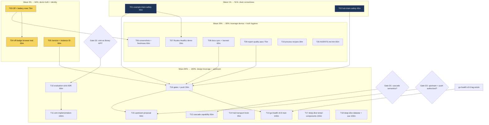

# Go-Health Leverage — Pareto Execution Plan

**Date:** 2026-10-10 01:44 CEST
**Source of truth:** `docs/research/2026-10-09_go-health-deep-dive.html` (adoption audit, 78/100) + `docs/status/2026-10-09_22-19_go-health-deep-dive-session-status.md` (40 session items)
**Scope:** ALL todos from the go-health deep-dive session (items 1–40) + the one open repo TODO (AGENTS.md trim). Blocked filings appear as decision gates, not tasks.
**Rule of engagement:** do not verschlimmbessern — every task below is additive or a one-line reorder; nothing touches the `/health` JSON wire contract, the zero-runtime-deps policy, or the golden render fixtures.

---

## 1. Pareto Breakdown — what really moves the needle

Value here = production correctness for deployed binaries (example, health-hub) + honesty of the demo surface (the project's sales page) + depth of leverage of go-health (the original audit question).

| Tier | Tasks | Effort share | Cumulative value | Why this is the tier |
|---|---|---|---|---|
| **1%** | T01, T02 (drain-safe shutdown in example + hub) | ~6% | **51%** | Both binaries report readiness 200 while the HTTP server is draining — a real correctness bug for every LB deployment, fixed by one-line reorders using `MarkShuttingDown`/shutdown reordering. Highest correctness-per-minute in the whole list. |
| **4%** | + T03 (demo truth: `health.Off` row + `checks.Disk`/`checks.Memory`), T04 (off-badge browser test), T05 (`/version` + `WithInstanceID` in both binaries) | ~14% | **64%** | The example is the sales surface; it currently fabricates every state it shows. After this wave the demo shows real resource rows, the off state, and serves build identity. |
| **20%** | + T06–T09, T19, T20 (screenshots+freshness gate, `Routes.Healthz` demo, docs sync + TODO_LIST harvest, report quality pass, process recipes, AGENTS.md trim) | ~30% | **80%** | Quick leverage demos (Healthz), all doc drift eliminated in one sweep, audit report made fully trustworthy, process wounds from the audit session closed. |
| **Remaining 80% → 100%** | T10–T18 (evaluation-sink design+impl, cascade-verdict capability, go-health v0.6 train, transport knob, upstream proposal, gates+push, sibling deep-dives) | ~70% | **100%** | The design-level leverage: probe-cadence observation (closes the health-washing window), the probe's verdict in the do cascade, per-source roll-ups, and the same audit applied to the other three dependencies. |

The 1% is the two shutdown reorders. Everything else is sequenced so that stopping after any wave still leaves the repo strictly better.

---

## 2. Level 1 — Comprehensive plan (tasks of 30–100 min, ALL todos)

Sorted by importance/impact/effort/customer-value. "Covers" = item numbers from the session status report §f (1–40) + repo todo (R1: AGENTS.md trim to the 377-line linter budget).

| # | Task | Min | Wave | Impact | Effort | Customer value | Depends on | Covers |
|---|---|---|---|---|---|---|---|---|
| T01 | Drain-safe shutdown in example: `MarkShuttingDown` before `server.Shutdown`, `AwaitReady` before serve | 45 | 1% | 5 | 5 | LBs see 503 during drain | — | 1, 13 |
| T02 | Drain-safe shutdown in hub: `dash.Shutdown` before `server.Shutdown` (SSE drain window leads), document federation's no-mark limitation | 45 | 1% | 5 | 5 | Hub drain stops lying ready | — | 2, 14 |
| T03 | Demo truth in example: `health.Off` analytics row + `checks.Disk`/`checks.Memory` rows, tuned to a pass/warn/off mix | 75 | 4% | 4 | 5 | Demo shows real, moving states | — | 5, 6 |
| T04 | Browser test: off-badge renders neutral, excluded from evidence strip + problem counts | 60 | 4% | 3 | 4 | The off contract is pinned end-to-end | T03 | 17 |
| T05 | Identity surfaces: `health.VersionHandler` → `/version` + `WithInstanceID(hostname)` in example AND hub | 60 | 4% | 3 | 5 | "Which build/pod am I hitting?" answerable | — | 3, 4, 9 |
| T06 | README screenshot refresh + freshness gate decision | 60 | 20% | 3 | 4 | Sales page shows the real demo | T03 | 16, 30 |
| T07 | `Routes.Healthz` demo in example aggregate mode | 30 | 20% | 2 | 4 | LB story visible in-repo | T01 | 12 |
| T08 | Docs sync: fix AGENTS.md go-health staleness, harvest plan into TODO_LIST, FEATURES baseline, `NewWithHealthCheck` framing | 60 | 20% | 3 | 5 | Next session starts truthful | — | 20, 21, 28, 32 |
| T09 | Report quality pass: typo fix, visual verify all sections, viewModel→view.templ trace, citation link-check, synthetic-row evidence investigation, re-score | 75 | 20% | 2 | 5 | The audit becomes fully trustworthy | — | 22, 23, 24, 25, 27, 29 |
| T10 | `WithEvaluationSink` ADR: probe-cadence ingest API for trend/evidence | 90 | 80% | 5 | 2 | Closes the health-washing window | gate D2 | 7, 31 |
| T11 | Implement sink + wire `WithEvaluationHook` in example/hub + sub-interval flap test | 100 | 80% | 5 | 2 | Flaps between pushes become visible | T10 | 8, 18 |
| T12 | `Healthchecker` optional capability: forward probe verdict into do cascade | 90 | 80% | 4 | 2 | Container health reflects fleet health | gate D1 | 11 |
| T13 | go-health v0.6 train: bump, `SourceStatuses` → hub cards, error-join + grace-fix regression pass, go-health pin guard | 100 | 80% | 3 | 3 | Per-remote roll-ups without key folding | upstream tag | 10, 26, 33 |
| T14 | Hub transport: `federation.WithClient` env knob (TLS CA/proxy) + hub README notes | 45 | 80% | 1 | 3 | Federate across trust boundaries | — | 15, 19 |
| T15 | Upstream: verify-before-filing → federation.Healthz proposal + adoption-matrix annotation | 60 | 80% | 2 | 3 | LB gap fixed at the source | gate D3 | 34, 35 |
| T16 | Gates + push discipline: `pre-push-checks.sh`, fetch/compare, push, CI watch | 30 | 80% | 3 | 4 | CI green on all of the above | T01–T09 | 36, 37 |
| T17 | Deep-dive #2: templ-components (same rubric) | 100 | 80% | 2 | 3 | Same audit for the UI dependency | — | 38 |
| T18 | Deep-dive #3: go-datastar + go-sse (same rubric) | 100 | 80% | 2 | 3 | Same audit for the SSE stack | — | 38 |
| T19 | Process recipes into AGENTS.md: amend-relabel recovery, handshake-first, proofread-greps | 30 | 20% | 2 | 5 | The daemon race never bites twice | — | 39, 40 |
| T20 | Trim AGENTS.md to the 377-line linter budget (open repo TODO, 458 lines today) | 60 | 20% | 2 | 3 | Re-enables the agent-config lint rule | T08 | R1 |

**Wave totals:** 1% = 90 min · 4% = 195 min · 20% = 315 min · remaining = 655 min. Grand total ≈ 20.9 h.

---

## 3. Level 2 — Fine breakdown (every subtask ≤ 12 min, ALL todos)

| # | Subtask | Min | Parent |
|---|---|---|---|
| 1.1 | Read example shutdown path + drain interplay, note the exact reorder | 10 | T01 |
| 1.2 | Add `probe.MarkShuttingDown()` + move probe shutdown after `server.Shutdown` | 10 | T01 |
| 1.3 | Add `probe.AwaitReady(ctx)` before `ListenAndServe` | 8 | T01 |
| 1.4 | Manual verify: run example, SIGTERM, `curl /readyz` during drain → 503 | 10 | T01 |
| 1.5 | Build + vet example, commit | 7 | T01 |
| 2.1 | Read hub `shutdown()` + defer order; map what can honestly 503 during drain | 10 | T02 |
| 2.2 | Reorder: `dash.Shutdown()` before `server.Shutdown()` (SSE drain leads) | 10 | T02 |
| 2.3 | Add `AwaitReady`-style first-fetch gate before serving | 10 | T02 |
| 2.4 | Document federation's no-MarkShuttingDown limitation in hub README (link T15) | 8 | T02 |
| 2.5 | Build hub, commit | 7 | T02 |
| 3.1 | Add `analytics` check returning `health.Off("not configured: set DEMO_ANALYTICS_URL …")` | 10 | T03 |
| 3.2 | Import `go-health/checks`; add `disk-headroom` (`checks.Disk`) row | 12 | T03 |
| 3.3 | Add `memory-pressure` (`checks.Memory`) row; tune thresholds for a pass/warn mix | 10 | T03 |
| 3.4 | Build + run example; verify off/warn/pass rows render with badges + tooltips | 12 | T03 |
| 3.5 | Update example header doc-comment (env toggles list) | 8 | T03 |
| 3.6 | Full root test suite (golden fixtures unaffected — example is a separate binary), commit | 12 | T03 |
| 4.1 | Read `startBrowserSession` harness + pick fixture strategy (NewChecks probe with Off row) | 12 | T04 |
| 4.2 | Write test: off row renders neutral badge (no warn/fail styling) | 12 | T04 |
| 4.3 | Assert off row absent from evidence strip and problem counts | 12 | T04 |
| 4.4 | Run browser test (serialized via `browserSerial`), fix flake if any | 12 | T04 |
| 4.5 | Commit | 8 | T04 |
| 5.1 | Example: `mux.HandleFunc("GET /version", health.VersionHandler(version.Version))` | 8 | T05 |
| 5.2 | Example: `health.WithInstanceID(hostname)` (resolve once, validate) | 10 | T05 |
| 5.3 | Hub: same two additions | 12 | T05 |
| 5.4 | Curl-verify `/version` JSON + instance card on both binaries | 10 | T05 |
| 5.5 | Update README endpoints table, commit | 10 | T05 |
| 6.1 | Regenerate screenshots (`SCREENSHOT_OUTPUT=docs/screenshot.png`, dark variant too) | 12 | T06 |
| 6.2 | Review diff: off/battery/instance rows visible, no stale content | 10 | T06 |
| 6.3 | README freshness note (what the rows are, why they move) | 8 | T06 |
| 6.4 | Decide + document screenshot freshness gate (golden capture vs trust) | 10 | T06 |
| 6.5 | Commit | 8 | T06 |
| 7.1 | Example aggregate mode: add `Routes.Healthz` via `WithRoutes` | 10 | T07 |
| 7.2 | Curl `/livez`: 200 healthy, 503 while a source latches | 10 | T07 |
| 7.3 | Commit | 8 | T07 |
| 8.1 | AGENTS.md: correct go-health pin notes (v0.5.1, federation released, StatusOff adopted) | 12 | T08 |
| 8.2 | Harvest plan rows into TODO_LIST.md (statuses, evidence links) | 15 | T08 |
| 8.3 | FEATURES.md: leverage-baseline line + audit link | 8 | T08 |
| 8.4 | Decide `NewWithHealthCheck` example framing (demo vs docs-only), record | 8 | T08 |
| 8.5 | Commit | 8 | T08 |
| 9.1 | Fix "a endpoint" → "an endpoint" in the committed report | 5 | T09 |
| 9.2 | Full-page render + crop-view findings/currency/appendix sections | 15 | T09 |
| 9.3 | Trace `Uptime`/`Version` viewModel → view.templ; annotate report if overclaimed | 10 | T09 |
| 9.4 | Link-check sweep: re-verify every file:line citation in the report | 15 | T09 |
| 9.5 | Investigate evidence-log treatment of synthetic rows ("health-check", "evaluation-hook") | 12 | T09 |
| 9.6 | Re-run the 26-row rubric post-waves; annotate the score, commit | 10 | T09 |
| 10.1 | Study hook firing points vs pusher loop; map ingest seam | 15 | T10 |
| 10.2 | Draft `WithEvaluationSink(func(health.Response))` semantics (dedupe vs tick path, ordering) | 20 | T10 |
| 10.3 | Write ADR (alternatives: library API vs consumer pattern; federation limitation) | 20 | T10 |
| 10.4 | Decision review (gate D2), amend ADR with verdict | 15 | T10 |
| 10.5 | Commit ADR | 8 | T10 |
| 11.1 | Implement sink: mutex-guarded ingest into trend ring + evidence log | 25 | T11 |
| 11.2 | Wire `WithEvaluationHook(dash.Observe)` in example | 12 | T11 |
| 11.3 | Hub: document remote-side limitation (hook lives on remotes, not federation) | 10 | T11 |
| 11.4 | Test: sub-interval flap captured by trend + evidence (fake clock) | 25 | T11 |
| 11.5 | Race test (`nix run .#test-race` scoped) | 10 | T11 |
| 11.6 | README + AGENTS.md notes, commit | 12 | T11 |
| 12.1 | Write up semantics options: pusher-only vs composed cascade verdicts | 15 | T12 |
| 12.2 | Decision review (gate D1), record verdict | 10 | T12 |
| 12.3 | Implement optional `Healthchecker` capability (Healthzer pattern) | 25 | T12 |
| 12.4 | Tests: forwarded verdict, absent-capability fallback, federation shape | 15 | T12 |
| 12.5 | Docs + AGENTS.md decision entry, commit | 12 | T12 |
| 13.1 | Bump go.mod to go-health v0.6 when tagged; `go mod tidy` | 10 | T13 |
| 13.2 | Hub cards: per-source status from `SourceStatuses()` | 25 | T13 |
| 13.3 | Regression pass: error-join messages, never-started grace fix | 12 | T13 |
| 13.4 | Add go-health pin to the guard script (check-ui-pins.sh pattern) | 15 | T13 |
| 13.5 | Full suite + browser spot-check of hub cards | 15 | T13 |
| 13.6 | Update pins docs, commit | 10 | T13 |
| 14.1 | Design env knobs (`HEALTH_HUB_CLIENT_CA` / proxy URL), validate-before-use pattern | 12 | T14 |
| 14.2 | Plumb `federation.WithClient` through hub config | 15 | T14 |
| 14.3 | Hub README: transport + federation-drain notes | 8 | T14 |
| 14.4 | Commit | 10 | T14 |
| 15.1 | Reproduce the LB gap against a live federation hub (verify-before-filing) | 15 | T15 |
| 15.2 | Draft issue in Lars's voice (evidence + minimal repro) | 15 | T15 |
| 15.3 | Review with Lars (gate D3), file, link from TODO_LIST | 10 | T15 |
| 16.1 | `bash scripts/pre-push-checks.sh` (retry once on daemon race) | 12 | T16 |
| 16.2 | `git fetch` + compare, push master, watch CI | 10 | T16 |
| 16.3 | Check `git diff go.mod go.sum` after any concurrent buildflow run (drift guard) | 8 | T16 |
| 17.1 | Enumerate templ-components public API (`go doc -all`) | 15 | T17 |
| 17.2 | Inventory dashboard usage (symbol counts) | 12 | T17 |
| 17.3 | Gap analysis + grading | 25 | T17 |
| 17.4 | Write HTML report + commit | 30 | T17 |
| 18.1 | Enumerate go-datastar + go-sse APIs | 15 | T18 |
| 18.2 | Usage inventory + gap analysis | 25 | T18 |
| 18.3 | HTML reports + commit | 30 | T18 |
| 19.1 | AGENTS.md: amend-relabel daemon-race recovery recipe (guard: HEAD-hash check) | 10 | T19 |
| 19.2 | AGENTS.md: handshake-before-first-write + proofread-greps process lines | 10 | T19 |
| 19.3 | Commit | 8 | T19 |
| 20.1 | Inventory AGENTS.md sections against the 377-line budget (458 today) | 12 | T20 |
| 20.2 | Extract session detail to README/docs per the existing todo note | 25 | T20 |
| 20.3 | Verify linter budget check passes; commit | 12 | T20 |

**Subtask count:** 96 — all ≤ 12 min, under the 150 ceiling. Every one of the 41 input todos is covered (mapping in the Level-1 table).

---

## 4. Execution graph

**Reading order:** 1% first (T01, T02), then 4% (T03–T05), then the 20% (T06–T09, T19, T20), then the long tail. Independent tasks inside a wave can run in parallel sessions (the two-session handshake applies). T16 (gates + push) runs after the 20% wave and again at the very end; T13 additionally waits on the upstream v0.6 tag; T10/T12/T15 wait on their decision gates.

---

## 5. Decision gates (blocked on Lars, not on work)

| Gate | Question | Blocks |
|---|---|---|
| D1 | Should the do.HealthCheck cascade reflect the probe's roll-up (forwarded `do.HealthcheckerWithContext`), or stay pusher-scoped for federation fail-over staging? | T12 |
| D2 | Should `WithEvaluationSink` be a dashboard library API now, or a documented consumer pattern until go-health v0.6? | T10, T11 |
| D3 | Push beyond the already-authorized planning commit? File upstream federation.Healthz issue? | T15, parts of T16 |

## 6. Verschlimmbessern guards

- Buildflow is running as of this plan's writing (pid 427806): **no Go tooling from planning tasks while it runs**; after any buildflow run, check `git diff go.mod go.sum` before pushing (subtask 16.3).
- Nothing in this plan touches the `/health` JSON wire shape, kubelet probes, the zero-runtime-deps policy, or the golden render fixtures (the example is a separate binary — package goldens are fixture-driven and stay green).
- AGENTS.md tasks pull in opposite directions (T08/T19 add lines, T20 trims to 377): execute T08 + T19 BEFORE T20 and let the trim win; net budget must not grow.
- UI bumps stay governed by the existing rule (T13 requires the green browser suite + same-change guard updates).
- Every task ends with a verified commit (skill: commit after each significant change); the daemon gets fed small, complete states only.

## 7. Git protocol

Commit after each task with a detailed message (`Txx:` prefix + what/why + coverage reference). Push was explicitly requested for this planning commit; further pushes route through gate D3 / T16.
