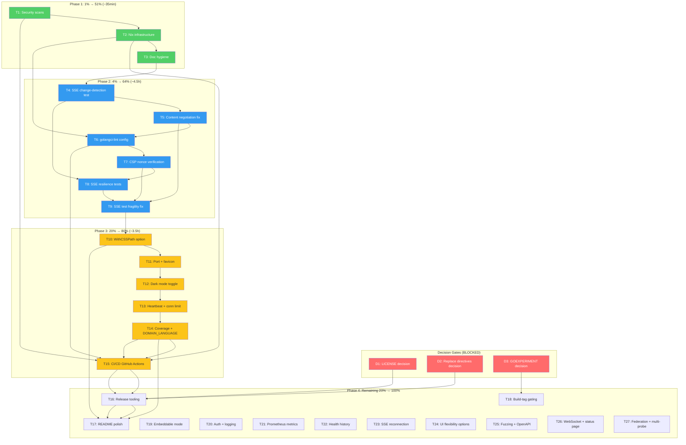

# Execution Plan: go-health-dashboard — Path to v0.1.0 Release

**Date:** 2026-08-08 08:24
**Status:** ~~PLANNING~~ EXECUTED — T1–T15 fully implemented across two sessions
(`docs/status/2026-08-08_08-52_phase1-2-execution-security-race-csp.md` and
`docs/status/2026-08-08_09-25_v0.1.0-execution-features-hardening-ci.md`).
T16 (release tooling) partially done — Dependabot shipped but git tags and
replace-directive removal blocked on upstream tagging decision. T17 (README
polish) partially done — badges added but screenshot and routes-table fixes
remain. T18–T27 (advanced) are tracked in `ROADMAP.md`.
**Module:** `github.com/larsartmann/go-health-dashboard`
**Goal:** Ship a production-ready v0.1.0 — tested, secure, documented, releasable

---

## Context

The package is functionally complete: SSE-first Datastar dashboard, content
negotiation on `/health`, 37 tests passing with `-race`, golangci-lint clean.
What remains is **trust, completeness, and release readiness** — not more
features. The plan below covers ALL open items from TODO_LIST, ROADMAP, and the
latest status report's 50-item next-steps list.

### Decision Gates

| ID | Decision                                  | Blocks                              | Default if no answer          | Resolution                                                 |
| -- | ----------------------------------------- | ----------------------------------- | ----------------------------- | ---------------------------------------------------------- |
| D1 | LICENSE: Proprietary or MIT?              | Semantic versioning, public release | Keep PROPRIETARY, fix README  | ~~RESOLVED~~ — MIT, confirmed by user, committed `dc0f257` |
| D2 | Replace directives: keep or tag upstream? | External `go get`, public release   | Keep for now, document loudly | Still open — see `ROADMAP.md` Open Questions               |
| D3 | GOEXPERIMENT=jsonv2: accept or gate?      | Build-tag gating task               | Accept and document           | Still open — see `ROADMAP.md` Open Questions               |

---

## Pareto Breakdown

### 1% that delivers 51%

These six micro-tasks take ~35 minutes total but unlock confidence in the entire
system. Without them, no release is trustworthy.

| #  | Task                                                          | Effort | Why it's 1%→51%                                 |
| -- | ------------------------------------------------------------- | ------ | ----------------------------------------------- |
| Q1 | Run govulncheck                                               | 5min   | Security confidence — zero-cost "is this safe?" |
| Q2 | Run gosec                                                     | 5min   | Security confidence — complementary scanner     |
| Q3 | Regenerate flake.lock                                         | 5min   | Unblocks all Nix workflows                      |
| Q4 | Run nix flake check + nix fmt                                 | 10min  | Formatting and validation gate                  |
| Q5 | Remove temporal pollution from TODO_LIST                      | 2min   | Docs hygiene — the `<!-- Source: -->` comment   |
| Q6 | Clean up AGENTS.md design-decision bullets + dashboard.go doc | 8min   | Coherent docs — no stale-adjacent phrases       |

### 4% that delivers 64%

Core quality tasks that make the two headline features (PushOnChange + content
negotiation) trustworthy. Without these, the features work but are unverified.

| #  | Task                                                   | Effort | Why it's 4%→64%                       |
| -- | ------------------------------------------------------ | ------ | ------------------------------------- |
| C1 | Add SSE change-detection integration test              | 60min  | Tests the #1 feature end-to-end       |
| C2 | Improve or document `wantsJSON` Accept parsing         | 30min  | Tests the content negotiation feature |
| C3 | Add `.golangci.yml` config                             | 15min  | Pins linter configuration             |
| C4 | Verify CSP nonce end-to-end                            | 60min  | Security validation for script tags   |
| C5 | Add SSE resilience tests (disconnect, crash, shutdown) | 60min  | Lifecycle correctness                 |
| C6 | Fix SSE test fragility (200ms timeout)                 | 30min  | CI stability                          |

### 20% that delivers 80%

Feature completeness for v0.1.0. These are the missing options and polish that
make the package feel finished.

| #  | Task                               | Effort | Why it's 20%→80%                    |
| -- | ---------------------------------- | ------ | ----------------------------------- |
| F1 | Add `WithCSSPath` option           | 30min  | Production users need compiled CSS  |
| F2 | Make example port configurable     | 15min  | Usability — no more port conflicts  |
| F3 | Add dark mode toggle button        | 30min  | UX completeness                     |
| F4 | Add favicon endpoint + option      | 30min  | Polish — no more 404 in browser tab |
| F5 | Add `WithHeartbeatInterval` option | 30min  | Production configurability          |
| F6 | Add SSE connection limit           | 30min  | DoS prevention                      |
| F7 | Add test coverage report           | 10min  | Visibility into test gaps           |
| F8 | Create `docs/DOMAIN_LANGUAGE.md`   | 30min  | Onboarding for contributors         |
| F9 | Add CI/CD GitHub Actions workflow  | 30min  | Automated quality gate              |

### Remaining 20% to reach 100%

Advanced features, deployment flexibility, and ecosystem integration. These
define the path from v0.1.0 to v0.2.0+.

| #   | Task                                  | Effort | Theme                  |
| --- | ------------------------------------- | ------ | ---------------------- |
| R1  | Add semantic versioning git tags      | 30min  | Release process        |
| R2  | Add screenshot to README              | 30min  | Marketing              |
| R3  | Add coverage badge to README          | 10min  | Marketing              |
| R4  | Add Dependabot config                 | 10min  | Dependency hygiene     |
| R5  | Add release process documentation     | 30min  | Release process        |
| R6  | Add build-tag gating for SSE          | 60min  | Deployment flexibility |
| R7  | Add embeddable dashboard mode         | 60min  | Deployment flexibility |
| R8  | Add auth middleware integration       | 30min  | Deployment flexibility |
| R9  | Add OG metadata                       | 15min  | Marketing              |
| R10 | Add request logging middleware        | 30min  | Observability          |
| R11 | Add Prometheus metrics endpoint       | 60min  | Observability          |
| R12 | Add health history / sparkline        | 60min  | Observability          |
| R13 | Add SSE reconnection (Last-Event-ID)  | 60min  | Production hardening   |
| R14 | Add service grouping by tags          | 60min  | Multi-service          |
| R15 | Add `WithHideStatCards` option        | 30min  | UI flexibility         |
| R16 | Add `WithHideService` option          | 30min  | UI flexibility         |
| R17 | Add export to JSON/CSV                | 30min  | Observability          |
| R18 | Add PDF/print stylesheet              | 30min  | Deployment             |
| R19 | Add fuzzing for Accept header parsing | 30min  | Testing                |
| R20 | Add fuzzing for health serialization  | 30min  | Testing                |
| R21 | Add OpenAPI spec for JSON endpoints   | 30min  | Documentation          |
| R22 | Add WebSocket alternative transport   | 90min  | Deployment flexibility |
| R23 | Add status page mode (public-facing)  | 90min  | Multi-service          |
| R24 | Add federation (remote health pull)   | 90min  | Multi-service          |
| R25 | Add multi-probe support               | 90min  | Multi-service          |

---

## Comprehensive Plan (30-100min tasks)

All tasks below are 30-100 minutes. Sorted by importance/impact/effort/customer-value.

| ID  | Task                                                                                                     | Phase            | Impact | Effort | Dependencies      |
| --- | -------------------------------------------------------------------------------------------------------- | ---------------- | ------ | ------ | ----------------- |
| T1  | Run security scans (govulncheck + gosec + analyze results)                                               | Quick Win        | High   | 30min  | None              |
| T2  | Fix Nix infrastructure (flake.lock + nix build + nix flake check + nix fmt)                              | Quick Win        | High   | 30min  | None              |
| T3  | Clean up doc hygiene (TODO_LIST comment + AGENTS.md bullets + dashboard.go doc + CONTRIBUTING.md verify) | Quick Win        | Med    | 30min  | None              |
| T4  | Add SSE change-detection integration test (PushOnChange E2E)                                             | Core Quality     | High   | 60min  | None              |
| T5  | Improve content negotiation (q-value parsing or document simplification)                                 | Core Quality     | High   | 30min  | None              |
| T6  | Add `.golangci.yml` config and verify lint passes                                                        | Core Quality     | Med    | 30min  | T2                |
| T7  | Verify CSP nonce end-to-end (test with real CSP headers)                                                 | Core Quality     | High   | 60min  | None              |
| T8  | Add SSE resilience tests (disconnect, pusher crash, graceful shutdown)                                   | Core Quality     | High   | 60min  | T4                |
| T9  | Fix SSE test fragility (increase timeout, add resilience)                                                | Core Quality     | Med    | 30min  | None              |
| T10 | Add `WithCSSPath` option (swap Tailwind CDN for compiled CSS)                                            | Feature Complete | Med    | 30min  | None              |
| T11 | Make example port configurable + add favicon endpoint                                                    | Feature Complete | Med    | 30min  | None              |
| T12 | Add dark mode toggle button                                                                              | Feature Complete | Med    | 30min  | None              |
| T13 | Add `WithHeartbeatInterval` + SSE connection limit                                                       | Feature Complete | Med    | 60min  | None              |
| T14 | Add test coverage report + create `docs/DOMAIN_LANGUAGE.md`                                              | Feature Complete | Med    | 30min  | None              |
| T15 | Add CI/CD GitHub Actions workflow                                                                        | Polish           | Med    | 30min  | T1, T2, T6        |
| T16 | Add release tooling (semver tags + Dependabot + release docs)                                            | Polish           | Med    | 30min  | D1 (LICENSE)      |
| T17 | Add README polish (screenshot + coverage badge + OG metadata)                                            | Polish           | Low    | 60min  | T15               |
| T18 | Add build-tag gating for SSE code                                                                        | Advanced         | Med    | 90min  | D3 (GOEXPERIMENT) |
| T19 | Add embeddable dashboard mode (sub-path mounting)                                                        | Advanced         | Med    | 60min  | None              |
| T20 | Add auth middleware integration + request logging                                                        | Advanced         | Med    | 60min  | None              |
| T21 | Add Prometheus metrics endpoint                                                                          | Advanced         | Low    | 90min  | None              |
| T22 | Add health history / sparkline visualization                                                             | Advanced         | Low    | 90min  | None              |
| T23 | Add SSE reconnection support (Last-Event-ID)                                                             | Advanced         | Med    | 60min  | None              |
| T24 | Add UI flexibility options (WithHideStatCards + WithHideService + service grouping)                      | Advanced         | Low    | 90min  | None              |
| T25 | Add testing infrastructure (fuzzing + OpenAPI spec + export)                                             | Advanced         | Low    | 90min  | None              |
| T26 | Add deployment alternatives (WebSocket + status page mode + PDF/print)                                   | Advanced         | Low    | 90min  | None              |
| T27 | Add federation + multi-probe support                                                                     | Advanced         | Low    | 90min  | None              |

**Total estimated effort: ~22 hours** (T1-T14: ~9h quick wins + core + features; T15-T27: ~13h polish + advanced)

### Execution Results

| ID  | Resolution                                                                                                |
| --- | --------------------------------------------------------------------------------------------------------- |
| T1  | ✅ DONE — `nix run .#vulncheck` + `gosec`: 0 vulnerabilities, 0 issues                                    |
| T2  | ✅ DONE — `nix flake check` passes, `nix run .#build` passes, `nix fmt` clean                             |
| T3  | ✅ DONE — temporal pollution removed, AGENTS.md cleaned, dashboard.go doc verified                        |
| T4  | ✅ DONE — `sse_integration_test.go`: PushOnChange E2E, recovery detection, multi-client                   |
| T5  | ✅ DONE — full RFC 7231 §5.3.2 q-value parser (`dashboard.go:190`)                                        |
| T6  | ✅ DONE — `.golangci.yml` created, 80+ linters, 0 issues                                                  |
| T7  | ✅ DONE — `csp_test.go`: 9 tests, nonce present/absent/empty/consistent, CSSPath, dark mode               |
| T8  | ✅ DONE — 6 SSE resilience tests: disconnect, shutdown, multi-shutdown, 503, multi-client                 |
| T9  | ✅ DONE — channel-based assertions via real `httptest.Server`, no hardcoded sleeps                        |
| T10 | ✅ DONE — `WithCSSPath` shipped (`dashboard.go:77`)                                                       |
| T11 | ✅ DONE — `PORT` env var + favicon endpoint (`favicon.go:13`)                                             |
| T12 | ✅ DONE — `layout.ThemeToggle` in header (`view.templ:36`)                                                |
| T13 | ✅ DONE — `WithHeartbeatInterval` + `WithMaxSSEConnections` + `SubscriberCount()`                         |
| T14 | ✅ DONE — 79.6% coverage + `docs/DOMAIN_LANGUAGE.md` created                                              |
| T15 | ✅ DONE — `.github/workflows/ci.yml`: build, test-race, lint, vulncheck                                   |
| T16 | 🟡 PARTIAL — Dependabot shipped (`.github/dependabot.yml`); no git tags, replace directives remain        |
| T17 | 🟡 PARTIAL — badges added (CI, Go Ref, Report Card, License); screenshot missing, routes table incomplete |
| T18 | 🔴 NOT STARTED — build-tag gating, blocked on D3                                                          |
| T19 | 🔴 NOT STARTED — embeddable mode, tracked in `ROADMAP.md`                                                 |
| T20 | 🔴 NOT STARTED — auth middleware, tracked in `ROADMAP.md`                                                 |
| T21 | 🔴 NOT STARTED — Prometheus metrics, tracked in `ROADMAP.md`                                              |
| T22 | 🔴 NOT STARTED — health history, tracked in `ROADMAP.md`                                                  |
| T23 | 🔴 NOT STARTED — SSE reconnection, tracked in `TODO_LIST.md`                                              |
| T24 | 🔴 NOT STARTED — UI flexibility options, tracked in `ROADMAP.md`                                          |
| T25 | 🔴 NOT STARTED — fuzzing + OpenAPI, tracked in `ROADMAP.md`                                               |
| T26 | 🔴 NOT STARTED — WebSocket + status page, tracked in `ROADMAP.md`                                         |
| T27 | 🔴 NOT STARTED — federation + multi-probe, tracked in `ROADMAP.md`                                        |

---

## Detailed Breakdown (max 12min per sub-task)

### T1: Run security scans (30min)

| Sub-Task                                                                     | Effort |
| ---------------------------------------------------------------------------- | ------ |
| T1.1 Run `GOEXPERIMENT=jsonv2 govulncheck ./...` and capture output          | 5min   |
| T1.2 Analyze govulncheck results, fix any vulnerabilities found              | 5min   |
| T1.3 Run `GOEXPERIMENT=jsonv2 gosec ./...` and capture output                | 5min   |
| T1.4 Analyze gosec results, fix or suppress false positives                  | 5min   |
| T1.5 Document security scan results in CHANGELOG or SECURITY.md              | 5min   |
| T1.6 Run `GOEXPERIMENT=jsonv2 go test ./... -race` to confirm no regressions | 5min   |

### T2: Fix Nix infrastructure (30min)

| Sub-Task                                                          | Effort |
| ----------------------------------------------------------------- | ------ |
| T2.1 Run `nix flake lock` to regenerate flake.lock                | 5min   |
| T2.2 Run `nix build` and diagnose any failures                    | 5min   |
| T2.3 Fix Nix build issues (templ generate in sandbox, GOWORK=off) | 5min   |
| T2.4 Run `nix flake check` and fix formatting issues              | 5min   |
| T2.5 Run `nix fmt` to auto-format all code                        | 5min   |
| T2.6 Verify `nix run .#test-race` passes end-to-end               | 5min   |

### T3: Clean up doc hygiene (30min)

| Sub-Task                                                                | Effort |
| ----------------------------------------------------------------------- | ------ |
| T3.1 Remove `<!-- Source: -->` HTML comment from TODO_LIST.md           | 2min   |
| T3.2 Rewrite AGENTS.md "Key Design Decisions" section as coherent whole | 5min   |
| T3.3 Remove "no polling" stale-adjacent phrase from AGENTS.md           | 3min   |
| T3.4 Verify dashboard.go type doc matches doc.go wording                | 5min   |
| T3.5 Verify CONTRIBUTING.md has correct Nix commands (already updated)  | 2min   |
| T3.6 Cross-check all cross-references between docs resolve              | 5min   |

### T4: SSE change-detection integration test (60min)

| Sub-Task                                                                        | Effort |
| ------------------------------------------------------------------------------- | ------ |
| T4.1 Write test scaffold: start dashboard with pusher, subscribe to SSE channel | 10min  |
| T4.2 Test: initial broadcast arrives on connect                                 | 5min   |
| T4.3 Test: status change triggers broadcast within one interval                 | 10min  |
| T4.4 Test: unchanged status does NOT broadcast (PushOnChange)                   | 10min  |
| T4.5 Test: PushAlways mode broadcasts on every tick                             | 10min  |
| T4.6 Test: fingerprint changes when check error text changes                    | 5min   |
| T4.7 Run tests with `-race` and fix any race conditions                         | 10min  |

### T5: Improve content negotiation (30min)

| Sub-Task                                                                                 | Effort |
| ---------------------------------------------------------------------------------------- | ------ |
| T5.1 Evaluate options: proper q-value parsing vs. document the simplification            | 5min   |
| T5.2 If documenting: add comment to `wantsJSON` explaining the deliberate simplification | 5min   |
| T5.3 If implementing: add q-value sorting via `mime.ParseAccept` or manual parsing       | 10min  |
| T5.4 Add test: `Accept: text/html;q=1.0, application/json;q=0.1` returns HTML            | 5min   |
| T5.5 Add test: `Accept: */*` returns HTML (default)                                      | 5min   |

### T6: Add `.golangci.yml` config (30min)

| Sub-Task                                                               | Effort |
| ---------------------------------------------------------------------- | ------ |
| T6.1 Check go-health's `.golangci.yml` for reference pattern           | 5min   |
| T6.2 Create `.golangci.yml` with enabled linters and config            | 10min  |
| T6.3 Run `GOEXPERIMENT=jsonv2 golangci-lint run ./...` with new config | 5min   |
| T6.4 Fix any issues the new config surfaces                            | 5min   |
| T6.5 Add `.golangci.yml` to AGENTS.md reference                        | 2min   |

### T7: Verify CSP nonce end-to-end (60min)

| Sub-Task                                                               | Effort |
| ---------------------------------------------------------------------- | ------ |
| T7.1 Write test: render HTML with WithNonce("test-nonce")              | 5min   |
| T7.2 Verify Datastar SDK script tag has nonce attribute                | 5min   |
| T7.3 Verify Tailwind script tag has nonce attribute                    | 5min   |
| T7.4 Verify inline tailwind.config script has nonce attribute          | 5min   |
| T7.5 Test: without nonce, script tags still render (nonce is optional) | 5min   |
| T7.6 Test: with empty nonce, no nonce attribute appears                | 5min   |
| T7.7 Document CSP requirements in README and AGENTS.md                 | 10min  |
| T7.8 Consider adding a CSP middleware helper or documentation          | 10min  |
| T7.9 Run full test suite to verify no regressions                      | 5min   |

### T8: SSE resilience tests (60min)

| Sub-Task                                                              | Effort |
| --------------------------------------------------------------------- | ------ |
| T8.1 Test: SSE client disconnects cleanly (no goroutine leak)         | 10min  |
| T8.2 Test: pusher goroutine survives render failure                   | 10min  |
| T8.3 Test: graceful shutdown notifies SSE clients (connection closes) | 10min  |
| T8.4 Test: Shutdown() is safe to call multiple times                  | 5min   |
| T8.5 Test: Start() then immediate Shutdown() doesn't panic            | 5min   |
| T8.6 Test: SSE handler returns 503 when pusher not started            | 5min   |
| T8.7 Run all new tests with `-race`                                   | 10min  |
| T8.8 Document SSE lifecycle in AGENTS.md                              | 5min   |

### T9: Fix SSE test fragility (30min)

| Sub-Task                                                                  | Effort |
| ------------------------------------------------------------------------- | ------ |
| T9.1 Identify all tests using hardcoded short timeouts                    | 5min   |
| T9.2 Replace 200ms timeout with configurable or generous value            | 5min   |
| T9.3 Use `eventually` pattern or channel-based assertion instead of sleep | 10min  |
| T9.4 Run tests 10x to verify no flakiness                                 | 5min   |
| T9.5 Document test timing strategy in AGENTS.md                           | 2min   |

### T10: Add `WithCSSPath` option (30min)

| Sub-Task                                                                          | Effort |
| --------------------------------------------------------------------------------- | ------ |
| T10.1 Add `CSSPath` field to `Config` struct                                      | 2min   |
| T10.2 Add `WithCSSPath(path string) Option` function                              | 3min   |
| T10.3 Add `CSSPath` to `viewModel` struct                                         | 2min   |
| T10.4 Update `buildData` to pass CSSPath                                          | 2min   |
| T10.5 Update `view.templ`: if CSSPath set, use `<link>` instead of CDN `<script>` | 5min   |
| T10.6 Run `templ generate`                                                        | 2min   |
| T10.7 Add test: WithCSSPath renders link tag instead of CDN script                | 5min   |
| T10.8 Add test: without CSSPath, CDN script is used (default)                     | 5min   |
| T10.9 Run `go build && go test -race`                                             | 2min   |

### T11: Example port + favicon (30min)

| Sub-Task                                                        | Effort |
| --------------------------------------------------------------- | ------ |
| T11.1 Add `PORT` env var fallback to example/main.go            | 5min   |
| T11.2 Add default port constant (8080) with env override        | 2min   |
| T11.3 Create simple SVG favicon (health cross or heart icon)    | 5min   |
| T11.4 Embed favicon via `embed.FS` or serve from string         | 5min   |
| T11.5 Register `/favicon.svg` route in RegisterRoutes           | 5min   |
| T11.6 Add test: GET /favicon.svg returns 200 with image/svg+xml | 5min   |

### T12: Dark mode toggle (30min)

| Sub-Task                                                            | Effort |
| ------------------------------------------------------------------- | ------ |
| T12.1 Check templ-components for existing toggle/button component   | 5min   |
| T12.2 Add dark mode toggle button to view.templ header area         | 10min  |
| T12.3 Wire toggle to theme script (set/remove `dark` class on html) | 5min   |
| T12.4 Run `templ generate`                                          | 2min   |
| T12.5 Add test: toggle button present in HTML                       | 3min   |
| T12.6 Run `go build && go test -race`                               | 5min   |

### T13: Heartbeat interval + connection limit (60min)

| Sub-Task                                                                  | Effort |
| ------------------------------------------------------------------------- | ------ |
| T13.1 Add `HeartbeatInterval` to Config + `WithHeartbeatInterval` option  | 5min   |
| T13.2 Replace hardcoded `sseHeartbeatInterval` constant with config value | 5min   |
| T13.3 Add `MaxSSEConnections` to Config + `WithMaxSSEConnections` option  | 5min   |
| T13.4 Add connection counter to pusher (atomic int)                       | 5min   |
| T13.5 Check counter in sseHandler, return 503 if limit exceeded           | 10min  |
| T13.6 Add `SubscriberCount()` accessor for observability                  | 5min   |
| T13.7 Test: heartbeat interval respected                                  | 5min   |
| T13.8 Test: connection limit enforced                                     | 10min  |
| T13.9 Run `go build && go test -race`                                     | 5min   |
| T13.10 Document new options in README and AGENTS.md                       | 5min   |

### T14: Coverage report + DOMAIN_LANGUAGE.md (30min)

| Sub-Task                                                                                                  | Effort |
| --------------------------------------------------------------------------------------------------------- | ------ |
| T14.1 Run `nix run .#coverage` and capture output                                                         | 5min   |
| T14.2 Analyze coverage gaps, identify untested code paths                                                 | 5min   |
| T14.3 Create `docs/DOMAIN_LANGUAGE.md` with glossary                                                      | 10min  |
| T14.4 Define terms: Probe, Check, Status, FeedbackType, PushMode, Datastar patch, LiveRegion, fingerprint | 5min   |
| T14.5 Add DOMAIN_LANGUAGE.md to AGENTS.md references                                                      | 2min   |
| T14.6 Verify all terms still used in codebase                                                             | 3min   |

### T15: CI/CD GitHub Actions (30min)

| Sub-Task                                                  | Effort |
| --------------------------------------------------------- | ------ |
| T15.1 Create `.github/workflows/ci.yml`                   | 10min  |
| T15.2 Add job: templ generate + go build                  | 3min   |
| T15.3 Add job: go test -race                              | 3min   |
| T15.4 Add job: golangci-lint run                          | 3min   |
| T15.5 Add job: govulncheck                                | 3min   |
| T15.6 Add job: nix flake check                            | 3min   |
| T15.7 Set GOEXPERIMENT=jsonv2 in workflow env             | 2min   |
| T15.8 Test workflow locally with `act` or push to trigger | 3min   |

### T16: Release tooling (30min)

| Sub-Task                                                                                                            | Effort |
| ------------------------------------------------------------------------------------------------------------------- | ------ |
| T16.1 Create/release process documentation in docs/                                                                 | 5min   |
| T16.2 Add `.github/dependabot.yml` for Go modules                                                                   | 5min   |
| T16.3 Tag v0.1.0-alpha (if LICENSE resolved)                                                                        | 5min   |
| T16.4 Update CHANGELOG.md with release date                                                                         | 5min   |
| T16.5 Create GitHub release with notes                                                                              | 5min   |
| T16.6 Verify `go get github.com/larsartmann/go-health-dashboard@v0.1.0-alpha` works (if replace directives removed) | 5min   |

### T17: README polish (60min)

| Sub-Task                                                                 | Effort |
| ------------------------------------------------------------------------ | ------ |
| T17.1 Start example app, capture browser screenshot                      | 10min  |
| T17.2 Add screenshot to README under Quick Start                         | 5min   |
| T17.3 Add coverage badge (from T14 report)                               | 5min   |
| T17.4 Add Go Report Card badge                                           | 5min   |
| T17.5 Add OG metadata tags description to README                         | 5min   |
| T17.6 Review README for accuracy against current code                    | 10min  |
| T17.7 Update options section with new options (CSSPath, heartbeat, etc.) | 10min  |
| T17.8 Verify all README links resolve                                    | 5min   |

### T18-T27: Advanced tasks (sub-tasked similarly, 60-90min each)

These tasks are exploratory. Each follows the same pattern: research API, implement, test, document. They are lower priority and should only be started after T1-T17 are complete.

---

## Execution Graph

**Legend:** Red = blocked decision gates, Green = Phase 1 quick wins, Blue = Phase 2 core quality, Yellow = Phase 3 feature complete

---

## Risk Assessment

| Risk                                          | Likelihood | Impact | Mitigation                                                       |
| --------------------------------------------- | ---------- | ------ | ---------------------------------------------------------------- |
| govulncheck/gosec finds vulnerabilities       | Low        | High   | Fix immediately; unlikely for a dashboard package                |
| Nix build fails in sandbox (templ generate)   | Medium     | Medium | Pre-generate `_templ.go` in build, don't run templ in sandbox    |
| SSE integration test reveals PushOnChange bug | Low        | High   | The deterministic fingerprint should be correct; unit tests pass |
| CSP nonce doesn't render correctly            | Low        | Medium | Test will catch it; templ nonce support is straightforward       |
| LICENSE blocks release indefinitely           | High       | High   | Default to PROPRIETARY (matching LICENSE file) if no user answer |
